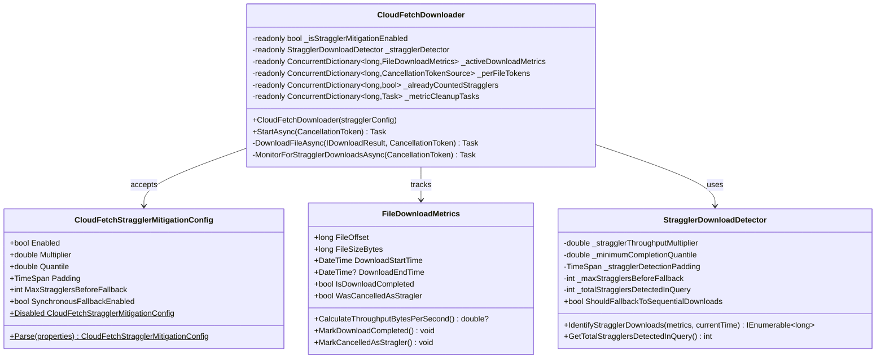

<!--
 Licensed to the Apache Software Foundation (ASF) under one or more
 contributor license agreements.  See the NOTICE file distributed with
 this work for additional information regarding copyright ownership.
 The ASF licenses this file to You under the Apache License, Version 2.0
 (the "License"); you may not use this file except in compliance with
 the License.  You may obtain a copy of the License at

    http://www.apache.org/licenses/LICENSE-2.0

 Unless required by applicable law or agreed to in writing, software
 distributed under the License is distributed on an "AS IS" BASIS,
 WITHOUT WARRANTIES OR CONDITIONS OF ANY KIND, either express or implied.
 See the License for the specific language governing permissions and
 limitations under the License.
-->

# Straggler Download Mitigation - Final Design

## Overview

This document describes the final implementation of straggler download mitigation in the ADBC CloudFetch system. Straggler mitigation automatically detects and cancels abnormally slow parallel downloads to maintain high query performance.

**Key Design Principle:** Configuration object pattern for consistency with existing CloudFetchDownloader parameters (maxRetries, retryDelayMs), enabling readonly fields, better testability, and separation of concerns.

---

## 1. Architecture Overview

### 1.1 Component Diagram



### 1.2 Key Design Improvements

| Component | Improvement | Benefit |
|-----------|-------------|---------|
| **CloudFetchStragglerMitigationConfig** | Configuration object pattern | Consistency with maxRetries/retryDelayMs parameters |
| **CloudFetchDownloader Fields** | Made readonly | Ensures immutability, thread-safety |
| **Configuration Parsing** | Moved to config class | Separation of concerns, better testability |
| **Test Structure** | Direct config instantiation | Tests can bypass property parsing, cleaner setup |

---

## 2. Configuration Object Pattern

### 2.1 CloudFetchStragglerMitigationConfig

**Purpose:** Encapsulate all straggler mitigation configuration in a single, immutable object following the pattern established by `maxRetries` and `retryDelayMs` parameters.

**Public Contract:**
```csharp
internal sealed class CloudFetchStragglerMitigationConfig
{
    // Properties (all read-only)
    public bool Enabled { get; }
    public double Multiplier { get; }
    public double Quantile { get; }
    public TimeSpan Padding { get; }
    public int MaxStragglersBeforeFallback { get; }
    public bool SynchronousFallbackEnabled { get; }

    // Constructor with defaults
    public CloudFetchStragglerMitigationConfig(
        bool enabled,
        double multiplier = 1.5,
        double quantile = 0.6,
        TimeSpan? padding = null,
        int maxStragglersBeforeFallback = 10,
        bool synchronousFallbackEnabled = false);

    // Static factory methods
    public static CloudFetchStragglerMitigationConfig Disabled { get; }
    public static CloudFetchStragglerMitigationConfig Parse(
        IReadOnlyDictionary<string, string>? properties);
}
```

**Design Decisions:**

1. **Why configuration object?**
   - Follows existing pattern: `CloudFetchDownloader(... maxRetries, retryDelayMs, stragglerConfig)`
   - Groups related configuration logically
   - Enables readonly fields in CloudFetchDownloader
   - Improves testability (tests can instantiate config directly)
   - Simplifies future parameter additions

2. **Why static Parse method?**
   - Separation of concerns: parsing logic lives with configuration
   - Connection layer (DatabricksConnection) can call Parse() and pass result
   - Alternative: parsing in CloudFetchDownloader constructor (rejected for coupling)

3. **Why Disabled static property?**
   - Convenient default when feature is off
   - Avoids null checks throughout codebase
   - Clear intent: `stragglerConfig ?? CloudFetchStragglerMitigationConfig.Disabled`

**Default Values:**
| Parameter | Default | Rationale |
|-----------|---------|-----------|
| Enabled | `false` | Conservative rollout, opt-in feature |
| Multiplier | `1.5` | Download 50% slower than median = straggler |
| Quantile | `0.6` | 60% completion provides stable median |
| Padding | `5s` | Buffer for variance in small files |
| MaxStragglersBeforeFallback | `10` | Fallback if systemic issue detected |
| SynchronousFallbackEnabled | `false` | Sequential mode is last resort |

---

## 3. CloudFetchDownloader Integration

### 3.1 Readonly Fields

**Key Improvement:** All straggler mitigation fields are now readonly, ensuring immutability and thread-safety.

```csharp
// Straggler mitigation state (all readonly)
private readonly bool _isStragglerMitigationEnabled;
private readonly StragglerDownloadDetector? _stragglerDetector;
private readonly ConcurrentDictionary<long, FileDownloadMetrics>? _activeDownloadMetrics;
private readonly ConcurrentDictionary<long, CancellationTokenSource>? _perFileDownloadCancellationTokens;
private readonly ConcurrentDictionary<long, bool>? _alreadyCountedStragglers;
private readonly ConcurrentDictionary<long, Task>? _metricCleanupTasks;
```

**Benefits:**
- Dictionary references cannot be reassigned (immutability)
- Clear intent: these are set once during construction
- Thread-safety: no risk of reference reassignment
- Better for concurrent access patterns

**Note:** `readonly` ensures the dictionary reference is immutable, but the dictionary contents can still be modified (which is desired for tracking downloads).

### 3.2 Constructor Signature

**Before:**
```csharp
public CloudFetchDownloader(
    // ... other parameters
    int maxRetries = 3,
    int retryDelayMs = 1000,
    IReadOnlyDictionary<string, string>? testProperties = null)  // ❌ Property dictionary
```

**After:**
```csharp
public CloudFetchDownloader(
    // ... other parameters
    int maxRetries = 3,
    int retryDelayMs = 1000,
    CloudFetchStragglerMitigationConfig? stragglerConfig = null)  // ✅ Config object
```

**Consistency:** All configuration parameters follow the same pattern:
- `maxRetries` (int)
- `retryDelayMs` (int)
- `stragglerConfig` (config object)

### 3.3 Initialization Logic

**Before (in constructor):**
```csharp
var hiveStatement = _statement as IHiveServer2Statement;
var properties = testProperties ?? hiveStatement?.Connection?.Properties;
InitializeStragglerMitigation(properties);  // ❌ Parsing in downloader
```

**After (in constructor):**
```csharp
var config = stragglerConfig ?? CloudFetchStragglerMitigationConfig.Disabled;
_isStragglerMitigationEnabled = config.Enabled;

if (config.Enabled)
{
    _stragglerDetector = new StragglerDownloadDetector(
        config.Multiplier,
        config.Quantile,
        config.Padding,
        config.SynchronousFallbackEnabled ? config.MaxStragglersBeforeFallback : int.MaxValue);

    _activeDownloadMetrics = new ConcurrentDictionary<long, FileDownloadMetrics>();
    _perFileDownloadCancellationTokens = new ConcurrentDictionary<long, CancellationTokenSource>();
    _alreadyCountedStragglers = new ConcurrentDictionary<long, bool>();
    _metricCleanupTasks = new ConcurrentDictionary<long, Task>();
    _hasTriggeredSequentialDownloadFallback = false;
}
```

**Key Changes:**
- Simple config object access, no parsing logic
- Clean initialization based on config properties
- All dictionaries initialized together when enabled

---

## 4. Core Components

### 4.1 FileDownloadMetrics

**Purpose:** Track timing and throughput for individual file downloads. Thread-safe for concurrent access.

**Public Contract:**
```csharp
internal class FileDownloadMetrics
{
    // Read-only properties
    public long FileOffset { get; }
    public long FileSizeBytes { get; }
    public DateTime DownloadStartTime { get; }
    public DateTime? DownloadEndTime { get; }
    public bool IsDownloadCompleted { get; }
    public bool WasCancelledAsStragler { get; }

    // Constructor
    public FileDownloadMetrics(long fileOffset, long fileSizeBytes);

    // Thread-safe methods
    public double? CalculateThroughputBytesPerSecond();
    public void MarkDownloadCompleted();
    public void MarkCancelledAsStragler();
}
```

**Behavior:**
- Captures start time on construction (DateTime.UtcNow)
- Calculates throughput: `fileSizeBytes / elapsedSeconds`
- Minimum elapsed time protection: 0.001s to avoid unrealistic throughput
- Thread-safe updates via internal locking
- State transitions: In Progress → Completed OR Cancelled

### 4.2 StragglerDownloadDetector

**Purpose:** Identify stragglers using median throughput-based detection.

**Public Contract:**
```csharp
internal class StragglerDownloadDetector
{
    // Read-only property
    public bool ShouldFallbackToSequentialDownloads { get; }

    // Constructor with validation
    public StragglerDownloadDetector(
        double stragglerThroughputMultiplier,
        double minimumCompletionQuantile,
        TimeSpan stragglerDetectionPadding,
        int maxStragglersBeforeFallback);

    // Core detection method
    public IEnumerable<long> IdentifyStragglerDownloads(
        IReadOnlyList<FileDownloadMetrics> allDownloadMetrics,
        DateTime currentTime);

    // Query metrics
    public int GetTotalStragglersDetectedInQuery();
}
```

**Detection Algorithm:**
1. **Quantile Check:** Wait for `minimumCompletionQuantile` (60%) to complete
2. **Median Calculation:** Calculate median throughput from completed downloads (excluding cancelled)
3. **Straggler Detection:** For each active download:
   - Calculate expected time: `(multiplier × fileSize / medianThroughput) + padding`
   - If `elapsed > expected`: mark as straggler
4. **Fallback Tracking:** Increment counter when stragglers detected, trigger fallback at threshold

**Why Median Instead of Mean?**
- Robust to outliers (single extremely slow download won't skew baseline)
- More stable in heterogeneous network conditions
- Better represents "typical" download performance

**Why 60% Quantile Default?**
- Ensures sufficient statistical sample (6 of 10 downloads) before detection begins
- Reduces false positives during warm-up phase
- Balances early detection vs. statistical reliability

---

## 5. Monitoring and Lifecycle

### 5.1 Background Monitoring Task

CloudFetchDownloader runs a background task that checks for stragglers every 2 seconds:

```csharp
private async Task MonitorForStragglerDownloadsAsync(CancellationToken cancellationToken)
{
    while (!cancellationToken.IsCancellationRequested)
    {
        await Task.Delay(TimeSpan.FromSeconds(2), cancellationToken);

        if (_activeDownloadMetrics.IsEmpty) continue;

        var snapshot = _activeDownloadMetrics.Values.ToList();
        var stragglers = _stragglerDetector.IdentifyStragglerDownloads(
            snapshot,
            DateTime.UtcNow);

        foreach (var offset in stragglers)
        {
            if (_perFileDownloadCancellationTokens.TryGetValue(offset, out var cts))
            {
                cts.Cancel();  // Triggers OperationCanceledException in download task
                activity?.AddEvent("cloudfetch.straggler_cancelling", [...]);
            }
        }

        if (_stragglerDetector.ShouldFallbackToSequentialDownloads)
        {
            TriggerSequentialDownloadFallback();
        }
    }
}
```

### 5.2 Download Retry Integration

Straggler cancellation integrates seamlessly with existing retry mechanism:

```csharp
private async Task DownloadFileAsync(IDownloadResult result, CancellationToken globalToken)
{
    CancellationTokenSource? perFileCts = null;
    FileDownloadMetrics? metrics = null;

    if (_isStragglerMitigationEnabled)
    {
        metrics = new FileDownloadMetrics(result.StartRowOffset, result.ByteCount);
        _activeDownloadMetrics[result.StartRowOffset] = metrics;
        perFileCts = CancellationTokenSource.CreateLinkedTokenSource(globalToken);
        _perFileDownloadCancellationTokens[result.StartRowOffset] = perFileCts;
    }

    var effectiveToken = perFileCts?.Token ?? globalToken;

    for (int retry = 0; retry < _maxRetries; retry++)
    {
        try
        {
            // Download logic
            await DownloadToStreamAsync(url, stream, effectiveToken);
            metrics?.MarkDownloadCompleted();
            break;  // Success
        }
        catch (OperationCanceledException) when (
            perFileCts?.IsCancellationRequested == true
            && !globalToken.IsCancellationRequested
            && retry < _maxRetries - 1)  // ⚠️ Last retry protection
        {
            // Straggler cancelled - this counts as one retry
            metrics?.MarkCancelledAsStragler();
            activity?.AddEvent("cloudfetch.straggler_cancelled", [...]);

            // Create fresh token for retry
            perFileCts?.Dispose();
            perFileCts = CancellationTokenSource.CreateLinkedTokenSource(globalToken);
            _perFileDownloadCancellationTokens[result.StartRowOffset] = perFileCts;
            effectiveToken = perFileCts.Token;

            // Refresh URL if expired
            if (result.IsExpired)
            {
                await RefreshUrlAsync(result);
            }

            await Task.Delay(_retryDelayMs, globalToken);
            // Continue to next retry
        }
        catch (Exception ex)
        {
            // Other errors follow normal retry logic
        }
    }

    // Cleanup
    if (_isStragglerMitigationEnabled)
    {
        _activeDownloadMetrics.TryRemove(result.StartRowOffset, out _);
        _perFileDownloadCancellationTokens.TryRemove(result.StartRowOffset, out _);
        perFileCts?.Dispose();
    }
}
```

**Last Retry Protection:**
- If `maxRetries = 3` (attempts: 0, 1, 2)
- Straggler cancellation can trigger on attempts 0 and 1
- Last attempt (2) **cannot be cancelled** via condition `retry < _maxRetries - 1`
- Prevents download failures when all downloads are legitimately slow (network congestion)

---

## 6. Configuration Parameters

### 6.1 DatabricksParameters Constants

```csharp
public class DatabricksParameters : SparkParameters
{
    /// <summary>
    /// Whether to enable straggler download detection and mitigation for CloudFetch operations.
    /// Default value is false if not specified.
    /// </summary>
    public const string CloudFetchStragglerMitigationEnabled =
        "adbc.databricks.cloudfetch.straggler_mitigation_enabled";

    /// <summary>
    /// Multiplier used to determine straggler threshold based on median throughput.
    /// Default value is 1.5 if not specified.
    /// </summary>
    public const string CloudFetchStragglerMultiplier =
        "adbc.databricks.cloudfetch.straggler_multiplier";

    /// <summary>
    /// Fraction of downloads that must complete before straggler detection begins.
    /// Valid range: 0.0 to 1.0. Default value is 0.6 (60%) if not specified.
    /// </summary>
    public const string CloudFetchStragglerQuantile =
        "adbc.databricks.cloudfetch.straggler_quantile";

    /// <summary>
    /// Extra buffer time in seconds added to the straggler threshold calculation.
    /// Default value is 5 seconds if not specified.
    /// </summary>
    public const string CloudFetchStragglerPaddingSeconds =
        "adbc.databricks.cloudfetch.straggler_padding_seconds";

    /// <summary>
    /// Maximum number of stragglers detected per query before triggering sequential download fallback.
    /// Default value is 10 if not specified.
    /// </summary>
    public const string CloudFetchMaxStragglersPerQuery =
        "adbc.databricks.cloudfetch.max_stragglers_per_query";

    /// <summary>
    /// Whether to automatically fall back to sequential downloads when max stragglers threshold is exceeded.
    /// Default value is false if not specified.
    /// </summary>
    public const string CloudFetchSynchronousFallbackEnabled =
        "adbc.databricks.cloudfetch.synchronous_fallback_enabled";
}
```

---

## 7. Testing Strategy

### 7.1 Test Structure

```
test/Drivers/Databricks/
├── Unit/CloudFetchStragglerUnitTests.cs       # Unit tests for all components
└── E2E/CloudFetch/
    ├── CloudFetchStragglerE2ETests.cs         # Configuration and basic E2E tests
    └── CloudFetchStragglerDownloaderE2ETests.cs  # Full integration E2E tests
```

### 7.2 Unit Tests (19 tests total)

**FileDownloadMetrics Tests:**
- `FileDownloadMetrics_MarkCancelledAsStragler_SetsFlag`
- `FileDownloadMetrics_CalculateThroughput_AfterCompletion_ReturnsValue`
- `FileDownloadMetrics_CalculateThroughput_BeforeCompletion_ReturnsNull`

**StragglerDownloadDetector Tests:**
- `StragglerDownloadDetector_BelowQuantileThreshold_ReturnsEmpty`
- `StragglerDownloadDetector_MedianCalculation_EvenCount`
- `StragglerDownloadDetector_MedianCalculation_OddCount`
- `StragglerDownloadDetector_NoCompletedDownloads_ReturnsEmpty`
- `StragglerDownloadDetector_AllDownloadsCancelled_ReturnsEmpty`
- `StragglerDownloadDetector_MultiplierLessThanOne_ThrowsException`
- `StragglerDownloadDetector_EmptyMetricsList_ReturnsEmpty`
- `StragglerDownloadDetector_FallbackThreshold_Triggered`
- `StragglerDownloadDetector_QuantileOutOfRange_ThrowsException`

**E2E Configuration Tests:**
- `StragglerDownloadDetector_WithDefaultConfiguration_CreatesSuccessfully`
- `StragglerMitigation_ConfigurationParameters_AreDefined`
- `StragglerMitigation_DisabledByDefault`
- `FileDownloadMetrics_CreatesSuccessfully`
- `StragglerMitigation_ConfigurationParameters_HaveCorrectNames`
- `StragglerDownloadDetector_CounterIncrementsAtomically`

**Integration Test:**
- `CleanShutdownDuringMonitoring` - Verifies graceful shutdown of monitoring task

### 7.3 E2E Tests

**Key Test: SlowDownloadIdentifiedAndCancelled**
- Creates mock HTTP handler with slow downloads
- Instantiates config object directly: `new CloudFetchStragglerMitigationConfig(enabled: true, ...)`
- Verifies straggler detection, cancellation, and retry
- Tests consumer task cleanup to prevent hanging

**Test Pattern Benefits:**
- Tests bypass property parsing (use config objects directly)
- Clean test setup without property dictionaries
- Easy to test edge cases with specific config values
- Better test isolation and clarity

**Note:** E2E tests should be run individually due to test infrastructure limitations. Individual tests pass correctly in ~5 seconds.

---

## 8. Observability

### 8.1 Activity Tracing Events

CloudFetchDownloader implements `IActivityTracer` for OpenTelemetry integration:

| Event Name | When Emitted | Key Tags |
|------------|-------------|----------|
| `cloudfetch.straggler_check` | Stragglers identified | `active_downloads`, `completed_downloads`, `stragglers_identified` |
| `cloudfetch.straggler_cancelling` | Before cancelling straggler | `offset` |
| `cloudfetch.straggler_cancelled` | In download retry loop | `offset`, `file_size_mb`, `elapsed_seconds`, `attempt` |
| `cloudfetch.url_refreshed_for_straggler_retry` | URL refreshed for retry | `offset`, `sanitized_url` |
| `cloudfetch.sequential_fallback_triggered` | Fallback triggered | `total_stragglers_in_query`, `fallback_threshold` |

---

## 9. Summary of Key Improvements

### 9.1 Configuration Object Pattern

**Before:** Property dictionary passed to constructor, parsing mixed with execution logic
**After:** `CloudFetchStragglerMitigationConfig` object encapsulates all settings

**Benefits:**
- Consistency with existing parameters (maxRetries, retryDelayMs)
- Separation of concerns (parsing in config class, execution in downloader)
- Better testability (tests use config objects directly)
- Readonly fields for immutability

### 9.2 Readonly Fields

**Before:** Nullable fields that could be reassigned
**After:** All straggler mitigation fields are readonly

**Benefits:**
- Clear immutability contract
- Thread-safety (no reference reassignment risk)
- Better for concurrent access patterns

### 9.3 Test Improvements

**Before:** Tests would need to create property dictionaries
**After:** Tests instantiate config objects directly

**Benefits:**
- Cleaner test setup
- Better test isolation
- Easier to test edge cases
- No property parsing overhead in tests

---

## 10. Future Enhancements

### 10.1 Potential Improvements

1. **Adaptive Detection Thresholds:**
   - Adjust multiplier based on historical query performance
   - Learn from past straggler patterns

2. **Network Condition Awareness:**
   - Detect global network slowdowns
   - Adjust thresholds dynamically

3. **Per-Cloud Provider Tuning:**
   - Different defaults for AWS S3, Azure Blob, GCS
   - Provider-specific optimization

4. **Advanced Metrics:**
   - Histogram of download throughputs
   - Percentile-based detection (P95, P99)
   - Time-series analysis

### 10.2 Alternative Patterns Considered

**Hedged Request Pattern:**
- Run cancelled download + new retry in parallel
- Take whichever succeeds first

**Rejected Because:**
- Increased complexity in coordination
- Double resource usage (network, memory)
- Double memory allocation for same file
- Marginal benefit over last-retry protection
- Added risk of race conditions

---

**Version:** 1.0 (Final Implementation)
**Status:** Implemented and Tested
**Last Updated:** 2025-11-05
