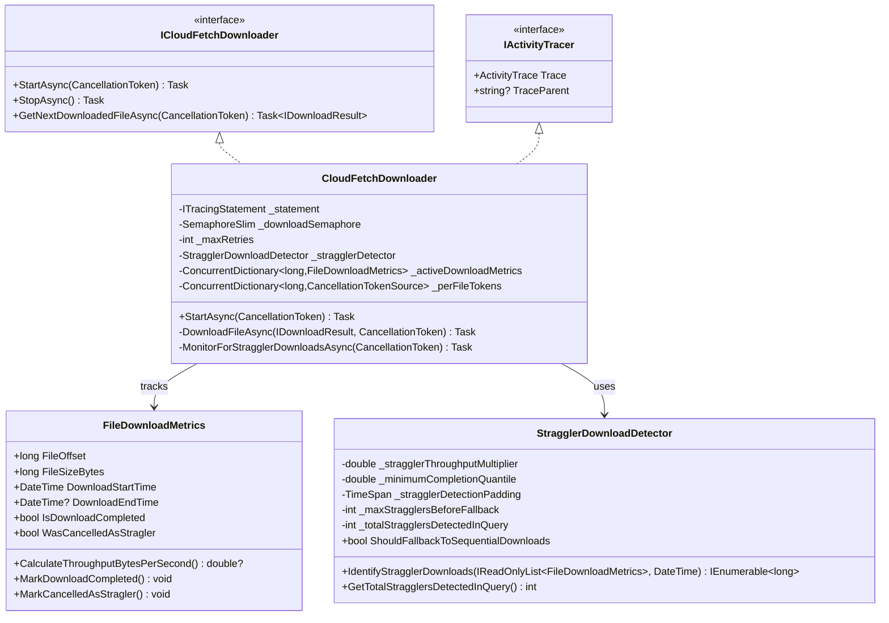
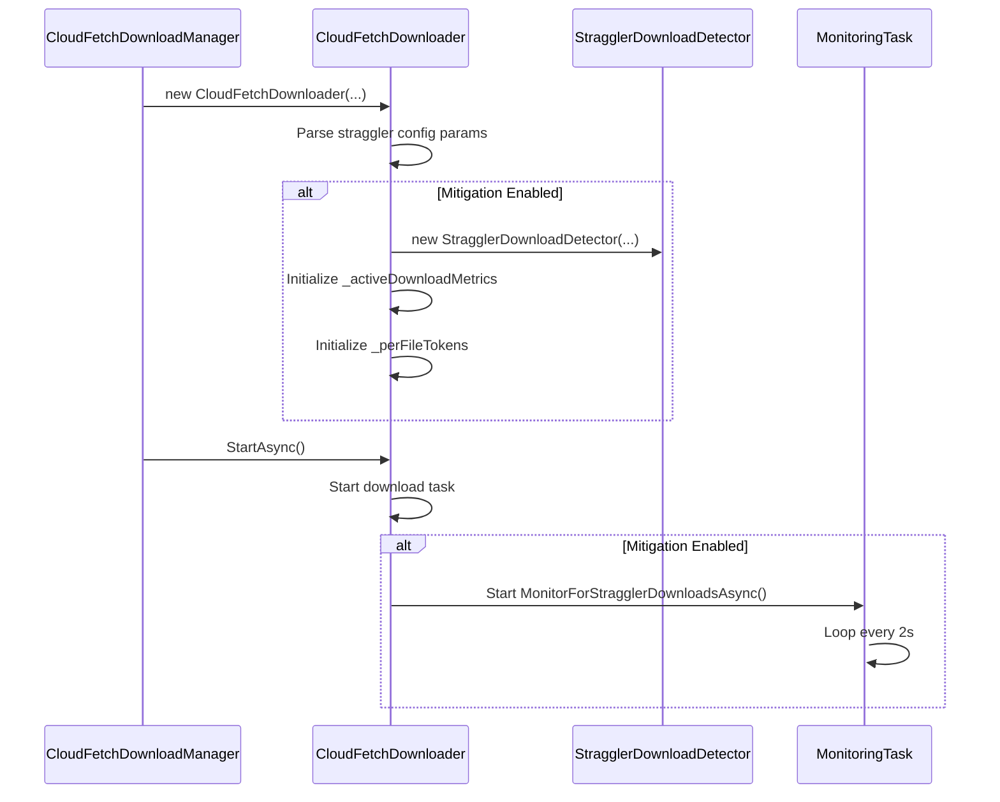
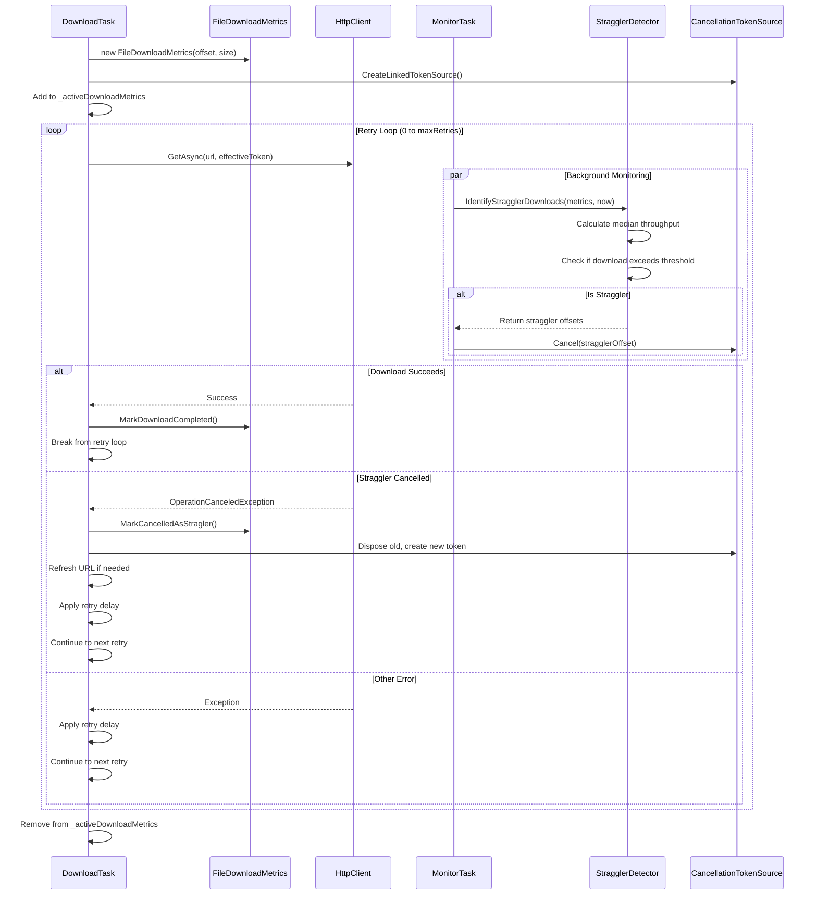
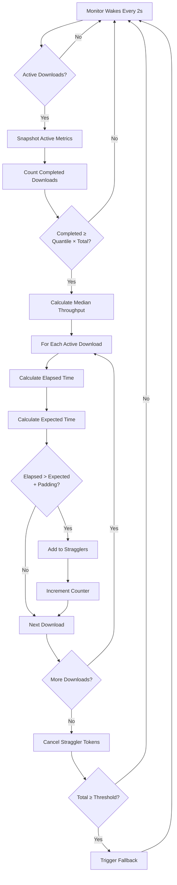

# Straggler Download Mitigation - Integration Guide

## Overview

This document provides integration guidance for straggler download mitigation in the ADBC CloudFetch system. It focuses on **class contracts, interfaces, and interaction patterns** rather than implementation details.

**Design Principle:** Minimal changes to existing architecture - integrate seamlessly with CloudFetchDownloader's existing retry mechanism.

---

## 1. Architecture Overview

### 1.1 Component Diagram



### 1.2 Key Integration Points

| Component | Change Type | Description |
|-----------|-------------|-------------|
| **DatabricksParameters** | New constants | Add 6 configuration parameters |
| **CloudFetchDownloader** | Modified | Add straggler tracking and monitoring |
| **FileDownloadMetrics** | New class | Track per-file download performance |
| **StragglerDownloadDetector** | New class | Identify stragglers using median throughput |

---

## 2. Class Contracts

### 2.1 FileDownloadMetrics

**Purpose:** Track timing and throughput for individual file downloads.

**Public Contract:**
```csharp
internal class FileDownloadMetrics
{
    // Read-only properties
    public long FileOffset { get; }
    public long FileSizeBytes { get; }
    public DateTime DownloadStartTime { get; }
    public DateTime? DownloadEndTime { get; }
    public bool IsDownloadCompleted { get; }
    public bool WasCancelledAsStragler { get; }

    // Constructor
    public FileDownloadMetrics(long fileOffset, long fileSizeBytes);

    // Methods
    public double? CalculateThroughputBytesPerSecond();
    public void MarkDownloadCompleted();
    public void MarkCancelledAsStragler();
}
```

**Behavior:**
- Captures start time on construction
- Calculates throughput as `fileSize / elapsedSeconds`
- Immutable file metadata (offset, size)
- State transitions: In Progress → Completed OR Cancelled

---

### 2.2 StragglerDownloadDetector

**Purpose:** Encapsulate straggler identification logic.

**Public Contract:**
```csharp
internal class StragglerDownloadDetector
{
    // Read-only property
    public bool ShouldFallbackToSequentialDownloads { get; }

    // Constructor
    public StragglerDownloadDetector(
        double stragglerThroughputMultiplier,
        double minimumCompletionQuantile,
        TimeSpan stragglerDetectionPadding,
        int maxStragglersBeforeFallback);

    // Core detection method
    public IEnumerable<long> IdentifyStragglerDownloads(
        IReadOnlyList<FileDownloadMetrics> allDownloadMetrics,
        DateTime currentTime);

    // Query metrics
    public int GetTotalStragglersDetectedInQuery();
}
```

**Detection Algorithm:**
```
1. Wait for minimumCompletionQuantile (e.g., 60%) to complete
2. Calculate median throughput from completed downloads
3. For each active download:
   - Calculate expected time: (multiplier × fileSize / medianThroughput) + padding
   - If elapsed > expected: mark as straggler
4. Track total stragglers for fallback decision
```

---

### 2.3 CloudFetchDownloader Modifications

**New Fields:**
```csharp
// Straggler mitigation state
private readonly bool _isStragglerMitigationEnabled;
private readonly StragglerDownloadDetector? _stragglerDetector;
private readonly ConcurrentDictionary<long, FileDownloadMetrics>? _activeDownloadMetrics;
private readonly ConcurrentDictionary<long, CancellationTokenSource>? _perFileTokens;

// Background monitoring
private Task? _stragglerMonitoringTask;
private CancellationTokenSource? _stragglerMonitoringCts;

// Fallback state
private volatile bool _hasTriggeredSequentialDownloadFallback;
```

**Modified Methods:**
- `StartAsync()` - Start background monitoring task
- `StopAsync()` - Stop and cleanup monitoring task
- `DownloadFileAsync()` - Integrate straggler cancellation handling into retry loop

**New Methods:**
- `MonitorForStragglerDownloadsAsync()` - Background task checking for stragglers every 2s
- `TriggerSequentialDownloadFallback()` - Reduce parallelism to 1

---

## 3. Interaction Flows

### 3.1 Initialization Sequence



### 3.2 Download with Straggler Detection



### 3.3 Edge Case: Last Retry Protection

**Problem:**
If all downloads are legitimately slow (e.g., network congestion, global cloud storage slowdown), straggler detection might cancel downloads that would eventually succeed. Cancelling the last retry attempt would cause unnecessary download failures.

**Solution:**
The last retry attempt is protected from straggler cancellation via the condition `retry < _maxRetries - 1` in the exception handler:

```csharp
catch (OperationCanceledException) when (
    perFileCancellationTokenSource?.IsCancellationRequested == true
    && !globalCancellationToken.IsCancellationRequested
    && retry < _maxRetries - 1)  // ← Only cancel if NOT last attempt
{
    // Straggler cancelled - this counts as one retry
    activity?.AddEvent("cloudfetch.straggler_cancelled", [...]);
    // ... retry logic ...
}
```

**Behavior:**
- If `maxRetries = 3` (attempts: 0, 1, 2)
- Straggler cancellation can trigger on attempts 0 and 1
- Last attempt (2) **cannot be cancelled** - will run to completion
- Prevents download failures when all downloads are legitimately slow

**Alternative Considered - "Hedged Request" Pattern:**
Run cancelled download + new retry in parallel, take whichever succeeds first.

**Rejected because:**
- Increased complexity in coordination logic
- Double resource usage (network, memory)
- Double memory allocation for same file
- Marginal benefit over last-retry protection
- Added risk of race conditions in result handling

### 3.4 Straggler Detection Flow



---

## 4. Configuration

### 4.1 DatabricksParameters Additions

```csharp
public class DatabricksParameters : SparkParameters
{
    /// <summary>
    /// Whether to enable straggler download detection and mitigation for CloudFetch operations.
    /// Default value is false if not specified.
    /// </summary>
    public const string CloudFetchStragglerMitigationEnabled =
        "adbc.databricks.cloudfetch.straggler_mitigation_enabled";

    /// <summary>
    /// Multiplier used to determine straggler threshold based on median throughput.
    /// Default value is 1.5 if not specified.
    /// </summary>
    public const string CloudFetchStragglerMultiplier =
        "adbc.databricks.cloudfetch.straggler_multiplier";

    /// <summary>
    /// Fraction of downloads that must complete before straggler detection begins.
    /// Valid range: 0.0 to 1.0. Default value is 0.6 (60%) if not specified.
    /// </summary>
    public const string CloudFetchStragglerQuantile =
        "adbc.databricks.cloudfetch.straggler_quantile";

    /// <summary>
    /// Extra buffer time in seconds added to the straggler threshold calculation.
    /// Default value is 5 seconds if not specified.
    /// </summary>
    public const string CloudFetchStragglerPaddingSeconds =
        "adbc.databricks.cloudfetch.straggler_padding_seconds";

    /// <summary>
    /// Maximum number of stragglers detected per query before triggering sequential download fallback.
    /// Default value is 10 if not specified.
    /// </summary>
    public const string CloudFetchMaxStragglersPerQuery =
        "adbc.databricks.cloudfetch.max_stragglers_per_query";

    /// <summary>
    /// Whether to automatically fall back to sequential downloads when max stragglers threshold is exceeded.
    /// Default value is false if not specified.
    /// </summary>
    public const string CloudFetchSynchronousFallbackEnabled =
        "adbc.databricks.cloudfetch.synchronous_fallback_enabled";
}
```

**Default Values:**
| Parameter | Default | Rationale |
|-----------|---------|-----------|
| Mitigation Enabled | `false` | Conservative rollout |
| Multiplier | `1.5` | Download 50% slower than median |
| Quantile | `0.6` | 60% completion for stable median |
| Padding | `5s` | Buffer for small file variance |
| Max Stragglers | `10` | Fallback if systemic issue |
| Fallback Enabled | `false` | Sequential mode is last resort |

---

## 5. Observability

### 5.1 Activity Tracing Integration

CloudFetchDownloader implements `IActivityTracer` and uses the extension method pattern:

**Wrap Methods:**
```csharp
await this.TraceActivityAsync(async activity =>
{
    // Method implementation
    activity?.SetTag("key", value);
}, activityName: "MethodName");
```

**Add Events:**
```csharp
activity?.AddEvent("cloudfetch.straggler_cancelled", [
    new("offset", offset),
    new("file_size_mb", sizeMb),
    new("elapsed_seconds", elapsed)
]);
```

### 5.2 Key Events

| Event Name | When Emitted | Key Tags |
|------------|-------------|----------|
| `cloudfetch.straggler_check` | When stragglers identified | `active_downloads`, `completed_downloads`, `stragglers_identified` |
| `cloudfetch.straggler_cancelling` | Before cancelling straggler | `offset` |
| `cloudfetch.straggler_cancelled` | In download retry loop | `offset`, `file_size_mb`, `elapsed_seconds`, `attempt` |
| `cloudfetch.url_refreshed_for_straggler_retry` | URL refreshed for retry | `offset`, `sanitized_url` |
| `cloudfetch.sequential_fallback_triggered` | Fallback triggered | `total_stragglers_in_query`, `fallback_threshold` |

---

## 6. Testing Strategy

### 6.1 Test Structure

Following existing CloudFetch test patterns:

```
test/Drivers/Databricks/
├── Unit/CloudFetch/
│   ├── FileDownloadMetricsTests.cs          # Test metrics calculation
│   ├── StragglerDownloadDetectorTests.cs    # Test detection logic
│   └── CloudFetchDownloaderStragglerTests.cs # Test integration with downloader
└── E2E/CloudFetch/
    └── CloudFetchStragglerE2ETests.cs       # End-to-end scenarios
```

### 6.2 Unit Test Coverage

#### FileDownloadMetricsTests

**Test Cases:**
- `Constructor_InitializesCorrectly` - Verify properties set correctly
- `CalculateThroughputBytesPerSecond_ReturnsNull_WhenNotCompleted`
- `CalculateThroughputBytesPerSecond_ReturnsCorrectValue_WhenCompleted`
- `MarkDownloadCompleted_SetsEndTime`
- `MarkCancelledAsStragler_SetsFlag`

**Pattern:**
```csharp
[Fact]
public void CalculateThroughputBytesPerSecond_ReturnsCorrectValue_WhenCompleted()
{
    // Arrange
    var metrics = new FileDownloadMetrics(offset: 0, fileSizeBytes: 1024 * 1024); // 1MB

    // Act
    metrics.MarkDownloadCompleted();
    var throughput = metrics.CalculateThroughputBytesPerSecond();

    // Assert
    Assert.NotNull(throughput);
    Assert.True(throughput > 0);
}
```

#### StragglerDownloadDetectorTests

**Test Cases:**
- `IdentifyStragglerDownloads_ReturnsEmpty_WhenBelowQuantile` - Not enough completions
- `IdentifyStragglerDownloads_ReturnsEmpty_WhenAllDownloadsNormal` - No stragglers
- `IdentifyStragglerDownloads_IdentifiesStragglers_WhenExceedsThreshold` - Core logic
- `IdentifyStragglerDownloads_CalculatesMedianCorrectly` - Median calculation
- `ShouldFallbackToSequentialDownloads_True_WhenThresholdExceeded` - Fallback trigger
- `IdentifyStragglerDownloads_ExcludesCancelledDownloads` - Skip already cancelled

**Pattern:**
```csharp
[Fact]
public void IdentifyStragglerDownloads_IdentifiesStragglers_WhenExceedsThreshold()
{
    // Arrange
    var detector = new StragglerDownloadDetector(
        stragglerThroughputMultiplier: 1.5,
        minimumCompletionQuantile: 0.6,
        stragglerDetectionPadding: TimeSpan.FromSeconds(5),
        maxStragglersBeforeFallback: 10);

    var metrics = new List<FileDownloadMetrics>
    {
        CreateCompletedMetric(0, 1MB, 1s),   // 1 MB/s
        CreateCompletedMetric(1, 1MB, 1s),   // 1 MB/s
        CreateCompletedMetric(2, 1MB, 1s),   // 1 MB/s - median
        CreateActiveMetric(3, 1MB, 10s),     // 0.1 MB/s - STRAGGLER
        CreateActiveMetric(4, 1MB, 2s)       // 0.5 MB/s - normal
    };

    // Act
    var stragglers = detector.IdentifyStragglerDownloads(metrics, DateTime.UtcNow);

    // Assert
    Assert.Single(stragglers);
    Assert.Contains(3L, stragglers); // offset 3 is straggler
}
```

#### CloudFetchDownloaderStragglerTests

**Test Cases:**
- `MonitorForStragglerDownloads_CancelsStraggler_WhenDetected` - Monitor cancels correctly
- `DownloadFileAsync_RetriesAfterStragglerCancellation` - Integrates with retry loop
- `DownloadFileAsync_RefreshesUrlForStragglerRetry_WhenExpired` - URL refresh logic
- `DownloadFileAsync_CreatesNewTokenForRetry` - Fresh token per retry
- `MonitorForStragglerDownloads_TriggersFallback_WhenThresholdExceeded` - Fallback behavior
- `DownloadFileAsync_ContinuesRetries_WhenStragglerRetryFails` - Remaining retries available

**Pattern (using Moq):**
```csharp
[Fact]
public async Task MonitorForStragglerDownloads_CancelsStraggler_WhenDetected()
{
    // Arrange
    var mockHttpHandler = CreateMockHttpHandler(delayMs: 10000); // Slow download
    var httpClient = new HttpClient(mockHttpHandler.Object);

    var downloader = new CloudFetchDownloader(
        _mockStatement.Object,
        _downloadQueue,
        _resultQueue,
        _mockMemoryManager.Object,
        httpClient,
        _mockResultFetcher.Object,
        maxParallelDownloads: 3,
        isLz4Compressed: false,
        maxRetries: 3,
        retryDelayMs: 100);

    // Configure for straggler mitigation
    _mockStatement.Setup(s => s.Connection.Properties)
        .Returns(new Dictionary<string, string>
        {
            ["adbc.databricks.cloudfetch.straggler_mitigation_enabled"] = "true",
            ["adbc.databricks.cloudfetch.straggler_multiplier"] = "1.5",
            ["adbc.databricks.cloudfetch.straggler_quantile"] = "0.6"
        });

    // Act
    await downloader.StartAsync(CancellationToken.None);

    // Add slow download to queue
    _downloadQueue.Add(CreateDownloadResult(offset: 0, size: 1MB));

    // Wait for monitoring to detect and cancel
    await Task.Delay(3000);

    // Assert
    // Verify cancellation occurred (check event logs or metrics)
}
```

### 6.3 Integration Test Coverage

**Test Scenarios:**
1. **No Stragglers** - Normal downloads complete successfully
2. **Single Straggler** - Detected, cancelled, retried successfully
3. **Multiple Stragglers** - All detected and retried
4. **Straggler Retry Fails** - Uses remaining retries
5. **Excessive Stragglers** - Triggers fallback (if enabled)
6. **URL Refresh** - Expired URLs refreshed on straggler retry
7. **Mitigation Disabled** - No overhead, normal behavior

### 6.4 Mock Setup Helpers

```csharp
private Mock<HttpMessageHandler> CreateMockHttpHandler(int delayMs)
{
    var handler = new Mock<HttpMessageHandler>();
    handler.Protected()
        .Setup<Task<HttpResponseMessage>>(
            "SendAsync",
            ItExpr.IsAny<HttpRequestMessage>(),
            ItExpr.IsAny<CancellationToken>())
        .ReturnsAsync(() =>
        {
            Thread.Sleep(delayMs); // Simulate slow download
            return new HttpResponseMessage(HttpStatusCode.OK)
            {
                Content = new ByteArrayContent(new byte[1024 * 1024])
            };
        });
    return handler;
}

private IDownloadResult CreateDownloadResult(long offset, long size)
{
    return new DownloadResult(
        new TSparkArrowResultLink
        {
            StartRowOffset = offset,
            ByteCount = size,
            FileLink = $"http://test.com/file{offset}",
            ExpiryTime = DateTimeOffset.UtcNow.AddMinutes(30).ToUnixTimeMilliseconds()
        },
        _mockMemoryManager.Object,
        new SystemClock());
}
```

---

## 7. Implementation Checklist

- [ ] Add configuration parameters to `DatabricksParameters.cs`
- [ ] Implement `FileDownloadMetrics` class
- [ ] Implement `StragglerDownloadDetector` class
- [ ] Modify `CloudFetchDownloader`:
  - [ ] Add fields for straggler tracking
  - [ ] Parse configuration in constructor
  - [ ] Integrate straggler handling in retry loop
  - [ ] Add monitoring background task
  - [ ] Add fallback mechanism
  - [ ] Update `StartAsync()` and `StopAsync()`
- [ ] Add activity tracing events
- [ ] Write unit tests:
  - [ ] `FileDownloadMetricsTests`
  - [ ] `StragglerDownloadDetectorTests`
  - [ ] `CloudFetchDownloaderStragglerTests`
- [ ] Write integration tests
- [ ] Performance testing with realistic scenarios
- [ ] Documentation updates

---

**Version:** 2.0
**Status:** Design Review
**Last Updated:** 2025-10-28
