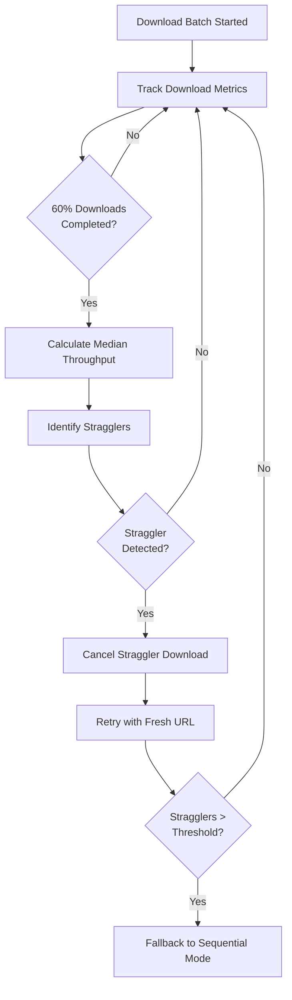
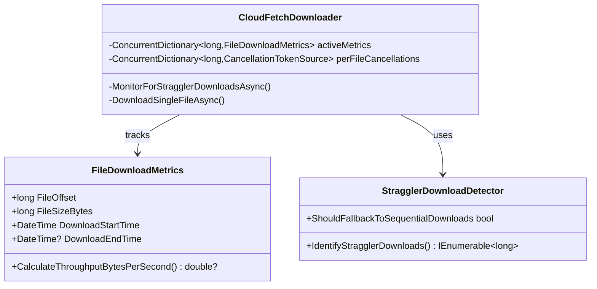

# Straggler Download Mitigation - Summary

## Purpose

Address rare cases in CloudFetch where a single file download experiences abnormally slow speeds (10x slower than concurrent downloads), causing query performance degradation. This feature enables detection and automatic retry of straggling downloads.

---

## Problem Statement

**Observed Behavior:**
- Single file downloads occasionally experience KB/s speeds while concurrent downloads achieve MB/s
- Issue isolated to individual files; subsequent batches typically unaffected
- Cannot be reproduced consistently but causes noticeable customer impact
- Primarily observed with Azure cloud storage

**Current Limitation:**
- Driver lacks timeout enforcement for slow downloads
- No mechanism to detect or cancel abnormally slow transfers
- Straggler files block batch completion, degrading overall query performance

---

## Solution Overview

Implement runtime detection of straggler downloads based on throughput analysis, with automatic cancellation and retry.

### Core Strategy



### Detection Algorithm

**Straggler Identification:**
```
median_throughput = median(completed_downloads.throughput)
expected_time = (file_size / median_throughput) × multiplier
threshold = expected_time + padding_seconds

IF download_elapsed_time > threshold THEN
    mark_as_straggler()
END IF
```

**Key Parameters:**
- **Multiplier:** 1.5× (download 50% slower than median)
- **Quantile:** 0.6 (60% completion required for stable median)
- **Padding:** 5 seconds (buffer for variance)

---

## Architecture

### Component Overview



### Key Components

| Component | Responsibility | Lines of Code |
|-----------|---------------|---------------|
| **FileDownloadMetrics** | Track per-file download timing and throughput | ~60 |
| **StragglerDownloadDetector** | Identify stragglers using median throughput analysis | ~140 |
| **CloudFetchDownloader** (modified) | Integrate monitoring, cancellation, and retry logic | +~250 |

**Total:** ~450 lines of new production code

---

## Configuration

### Parameters

All parameters follow the ADBC naming convention: `adbc.databricks.cloudfetch.*`

| Parameter | Default | Description |
|-----------|---------|-------------|
| `adbc.databricks.cloudfetch.straggler_mitigation_enabled` | `false` | Master switch for straggler detection |
| `adbc.databricks.cloudfetch.straggler_multiplier` | `1.5` | Throughput multiplier for straggler threshold |
| `adbc.databricks.cloudfetch.straggler_quantile` | `0.6` | Fraction of completions required before detection |
| `adbc.databricks.cloudfetch.straggler_padding_seconds` | `5` | Extra buffer in seconds before declaring straggler |
| `adbc.databricks.cloudfetch.max_stragglers_per_query` | `10` | Threshold to trigger sequential fallback |
| `adbc.databricks.cloudfetch.synchronous_fallback_enabled` | `false` | Enable automatic fallback to sequential mode |

### Example Configuration

```csharp
// C# Connection Properties Dictionary
var properties = new Dictionary<string, string>
{
    ["adbc.databricks.cloudfetch.straggler_mitigation_enabled"] = "true",
    ["adbc.databricks.cloudfetch.straggler_multiplier"] = "1.5",
    ["adbc.databricks.cloudfetch.max_stragglers_per_query"] = "10"
};
```

---

## Behavior

### When Disabled (Default)
- Zero overhead
- No additional memory allocations
- Existing parallel download behavior unchanged

### When Enabled

**Normal Case (No Stragglers):**
1. Downloads proceed in parallel
2. Background monitor checks every 2 seconds
3. No action taken if all downloads within threshold
4. Minimal overhead (~64 bytes/download)

**Straggler Detected:**
1. Monitor identifies download exceeding threshold
2. Download cancelled via per-file cancellation token
3. Download catches cancellation in retry loop
4. Creates fresh cancellation token for retry
5. Refreshes URL if expired/expiring
6. Applies standard retry delay (with backoff)
7. Continues with next retry attempt (counts as one of N retries)
8. If retry succeeds: download completes
9. If retry fails: remaining retries still available

**Excessive Stragglers (Fallback):**
1. If total stragglers ≥ `MaximumStragglersPerQuery`
2. AND `EnableSynchronousDownloadFallback=true`
3. Switch to sequential downloads (parallelism=1)
4. Applies only to current query

---

## Performance Impact

### Overhead When Enabled

| Aspect | Impact |
|--------|--------|
| **Memory** | ~64 bytes × active parallel downloads (typically 3-10) |
| **CPU** | Background task wakes every 2s, O(n) scan of active downloads |
| **Network** | Cancelled downloads retried once |
| **Latency** | Detection occurs after 60% completion + padding |

### Benefits

- **Eliminates 10x slowdowns** from straggler files
- **Automatic recovery** without manual intervention
- **Query completion time improvement** in affected scenarios
- **Isolated mitigation** - only impacts queries experiencing stragglers

---

## Observability

### Activity Tracing Events

All events follow CloudFetch conventions using `activity?.AddEvent()`:

```csharp
// Detection check event
activity?.AddEvent("cloudfetch.straggler_check", [
    new("active_downloads", 5),
    new("completed_downloads", 8),
    new("stragglers_identified", 2)
]);

// Cancellation event
activity?.AddEvent("cloudfetch.straggler_cancelled", [
    new("offset", 12345),
    new("file_size_mb", 18.5),
    new("elapsed_seconds", 45.2)
]);

// Fallback triggered event
activity?.AddEvent("cloudfetch.sequential_fallback_triggered", [
    new("total_stragglers_in_query", 10),
    new("fallback_threshold", 10)
]);
```

### OpenTelemetry Activities

Wrapped methods using `this.TraceActivityAsync()`:

- **`MonitorStragglerDownloads`** - Background monitoring activity
  - Tags: `monitoring.interval_seconds`, `straggler.multiplier`, `straggler.quantile`
  - Events: `cloudfetch.straggler_check`, `cloudfetch.straggler_cancelling`

- **`DownloadFile`** - Existing activity (modified to include straggler events)
  - Events: `cloudfetch.straggler_cancelled`

---

## Safety & Compatibility

### Backward Compatibility
- **Default disabled** - no behavior change for existing users
- **Additive configuration** - no breaking parameter changes
- **Graceful degradation** - failures in detection don't impact downloads

### Safety Mechanisms
- Per-file cancellation tokens prevent global disruption
- Integrates with existing retry limit (maxRetries) - no infinite loops
- Fresh cancellation token per retry prevents re-cancelling same attempt
- Fallback is opt-in via separate flag
- Monitoring errors logged but don't stop downloads

---

## Key Design Decisions

### Why Median Instead of Mean?
- **Robust to outliers** - stragglers don't skew baseline
- **Stable metric** - less sensitive to variance than mean

### Why 60% Completion Threshold?
- **Sufficient sample size** - enough data for reliable median
- **Early detection** - identifies stragglers before batch completion
- **Balance** - not too early (unstable) or late (limited benefit)

### Why Per-File Cancellation?
- **Isolation** - cancelling one download doesn't affect others
- **Granular control** - can retry specific files
- **Thread safety** - avoids race conditions with global tokens

### Why Integrate with Existing Retry Loop?
- **Reuses proven logic** - leverages existing retry mechanism with exponential backoff
- **Handles compound failures** - if straggler retry fails for other reasons, remaining retries available
- **Simpler implementation** - no separate retry path to maintain
- **Consistent behavior** - all retries follow same patterns (delay, URL refresh, error handling)
- **Prevents retry storms** - bounded by maxRetries limit (typically 3)

---

## Testing

### Test Structure

Following repository conventions:

```
test/Drivers/Databricks/
├── Unit/CloudFetch/
│   ├── FileDownloadMetricsTests.cs
│   ├── StragglerDownloadDetectorTests.cs
│   └── CloudFetchDownloaderStragglerTests.cs
└── E2E/CloudFetch/
    └── CloudFetchStragglerE2ETests.cs
```

### Key Test Scenarios

| Category | Test Scenario | Validation |
|----------|--------------|------------|
| **Detection** | Normal downloads (no stragglers) | No false positives |
| **Detection** | Single slow download detected | Correctly identified as straggler |
| **Detection** | Below quantile threshold | Detection deferred until 60% complete |
| **Cancellation** | Straggler cancelled and retried | Retry succeeds |
| **Cancellation** | Straggler retry fails | Uses remaining retries |
| **Retry Integration** | Straggler on attempt 1 of 3 | Attempts 2 and 3 still available |
| **Fallback** | Exceed max stragglers threshold | Triggers sequential mode (if enabled) |
| **URL Refresh** | Expired URL on straggler retry | URL refreshed before retry |
| **Disabled** | Mitigation flag=false | Zero overhead, normal behavior |

### Test Framework

- **Framework:** Xunit
- **Mocking:** Moq (for HttpMessageHandler, dependencies)
- **Pattern:** Arrange-Act-Assert
- **Async:** All async tests use `async Task` pattern

### Example Test Pattern

```csharp
[Fact]
public void IdentifyStragglerDownloads_IdentifiesStragglers_WhenExceedsThreshold()
{
    // Arrange
    var detector = new StragglerDownloadDetector(multiplier: 1.5, ...);
    var metrics = CreateMetricsWithStragglers();

    // Act
    var stragglers = detector.IdentifyStragglerDownloads(metrics, DateTime.UtcNow);

    // Assert
    Assert.Single(stragglers);
    Assert.Contains(expectedOffset, stragglers);
}
```

---

## Future Considerations

- **Adaptive thresholds** - learn optimal multiplier from query history
- **Cloud-specific tuning** - different thresholds for S3/Azure/GCS
- **Predictive cancellation** - estimate completion time earlier
- **Telemetry aggregation** - collect metrics on straggler prevalence

---

## References

- **ODBC Implementation:** [SIMBA] Addressing the Straggling File Download Issue for Cloud Fetch (Bogdan Ionut Ghit, Apr 2022)
- **Related PR:** [ADBC Telemetry PR #3624](https://github.com/apache/arrow-adbc/pull/3624) - Design document review feedback
- **Existing Infrastructure:** CloudFetch parallel download system in `CloudFetchDownloader.cs`

---

**Version:** 1.0
**Status:** Design Review
**Last Updated:** 2025-10-28
