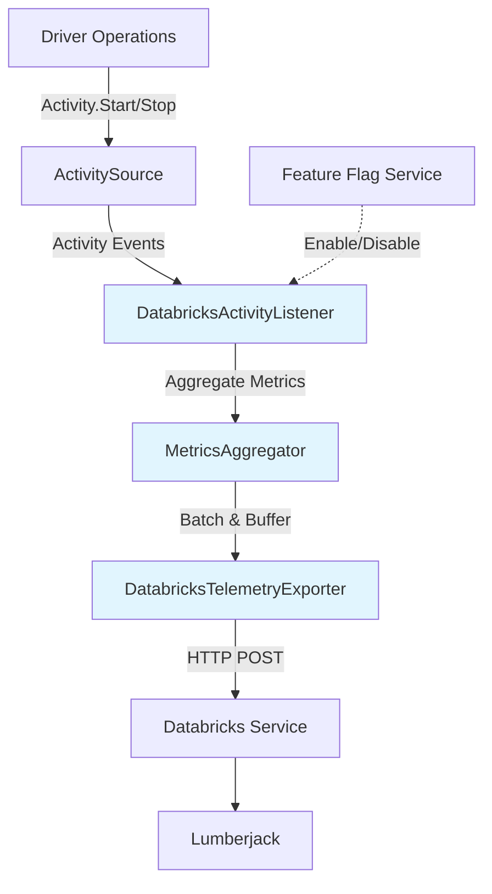
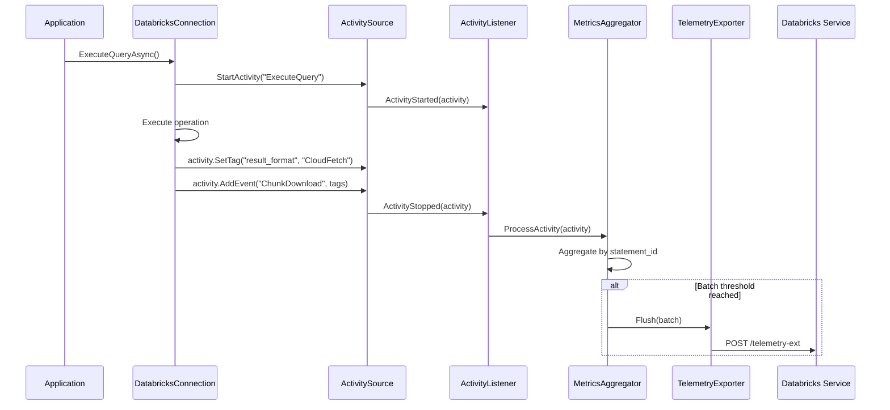
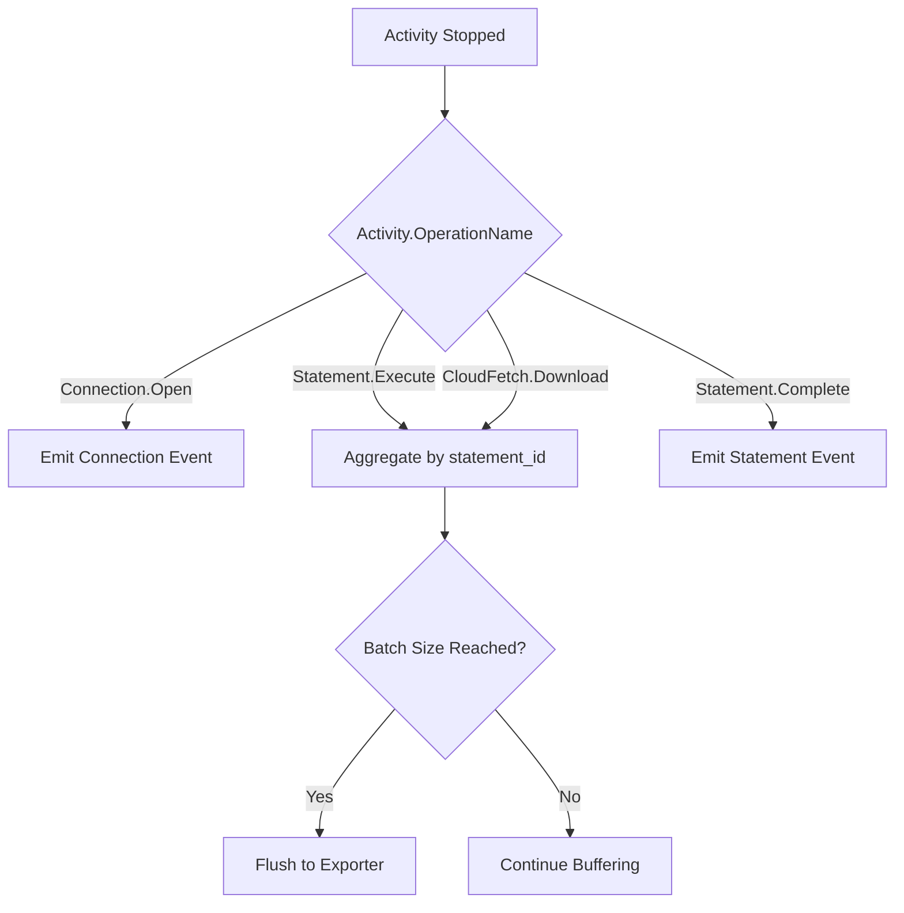
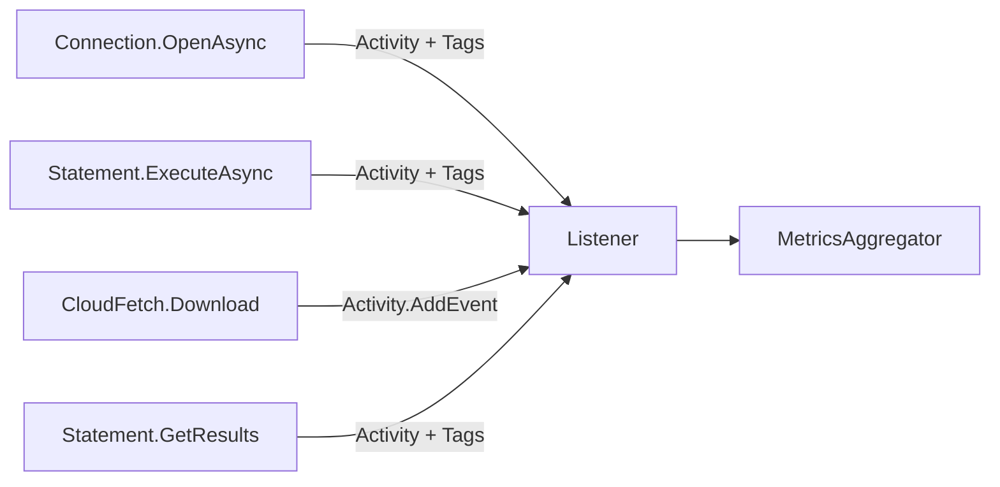
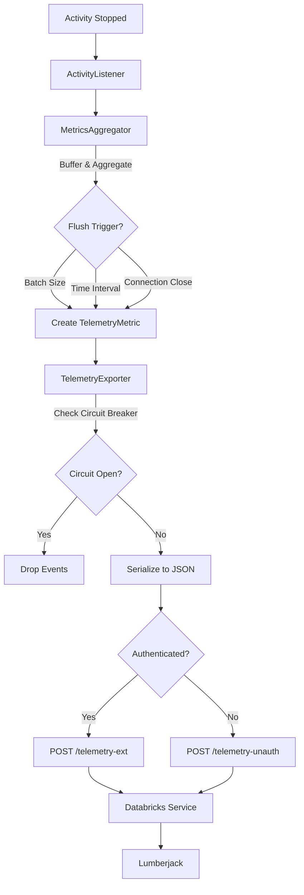
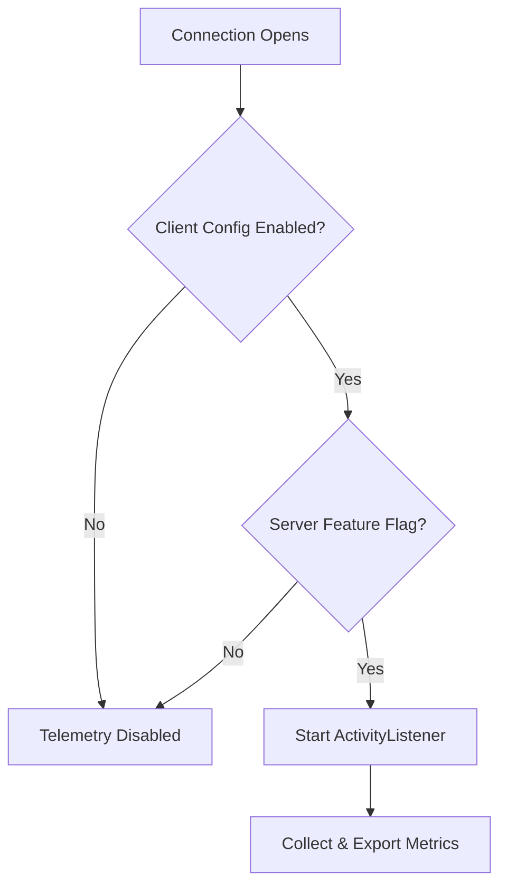

# Databricks ADBC Driver: Activity-Based Telemetry Design

## Executive Summary

This document outlines an **Activity-based telemetry design** that leverages the existing Activity/ActivitySource infrastructure in the Databricks ADBC driver. Instead of creating a parallel telemetry system, we extend the current tracing infrastructure to collect metrics and export them to Databricks telemetry service.

**Key Objectives:**
- Reuse existing Activity instrumentation points
- Add metrics collection without duplicating code
- Export aggregated metrics to Databricks service
- Maintain server-side feature flag control
- Preserve backward compatibility with OpenTelemetry

**Design Principles:**
- **Build on existing infrastructure**: Leverage ActivitySource/ActivityListener
- **Single instrumentation point**: Don't duplicate tracing and metrics
- **Non-blocking**: All operations async and non-blocking
- **Privacy-first**: No PII or query data collected
- **Server-controlled**: Feature flag support for enable/disable

**Key Difference from Original Design:**
- ❌ **OLD**: Separate TelemetryCollector + TelemetryExporter alongside Activity
- ✅ **NEW**: Activity-based with custom ActivityListener + aggregation

---

## Table of Contents

1. [Background & Motivation](#1-background--motivation)
2. [Architecture Overview](#2-architecture-overview)
3. [Core Components](#3-core-components)
4. [Data Collection](#4-data-collection)
5. [Export Mechanism](#5-export-mechanism)
6. [Configuration](#6-configuration)
7. [Privacy & Compliance](#7-privacy--compliance)
8. [Error Handling](#8-error-handling)
9. [Testing Strategy](#9-testing-strategy)
10. [Migration & Rollout](#10-migration--rollout)
11. [Comparison with Separate Telemetry System](#11-comparison-with-separate-telemetry-system)

---

## 1. Background & Motivation

### 1.1 Current State

The Databricks ADBC driver already has:
- ✅ **ActivitySource**: `DatabricksAdbcActivitySource`
- ✅ **Activity instrumentation**: Connection, statement execution, result fetching
- ✅ **W3C Trace Context**: Distributed tracing support
- ✅ **ActivityTrace utility**: Helper for creating activities

### 1.2 The Problem

The original design proposed creating a separate telemetry system alongside Activity infrastructure:
- ❌ Duplicate instrumentation in driver code
- ❌ Two data models (Activity vs TelemetryEvent)
- ❌ Two export mechanisms
- ❌ Maintenance burden

### 1.3 The Solution

**Extend Activity infrastructure** instead of creating parallel system:
- ✅ Single instrumentation point (Activity)
- ✅ Custom ActivityListener for metrics aggregation
- ✅ Export aggregated data to Databricks service
- ✅ Reuse Activity context, correlation, and timing

---

## 2. Architecture Overview

### 2.1 High-Level Architecture



**Key Components:**
1. **ActivitySource** (existing): Emits activities for all operations
2. **DatabricksActivityListener** (new): Listens to activities, extracts metrics
3. **MetricsAggregator** (new): Aggregates by statement, batches events
4. **DatabricksTelemetryExporter** (new): Exports to Databricks service

### 2.2 Activity Flow



### 2.3 Comparison with Existing Activity Usage

**Before (Tracing Only)**:
```csharp
using var activity = ActivityTrace.Start("ExecuteQuery");
try {
    // operation
    activity?.SetTag("success", true);
} catch {
    activity?.SetTag("error", true);
}
```

**After (Tracing + Metrics)**:
```csharp
using var activity = ActivityTrace.Start("ExecuteQuery");
try {
    // operation
    activity?.SetTag("result_format", resultFormat);  // ← Picked up by listener
    activity?.SetTag("chunk_count", chunkCount);       // ← Picked up by listener
    activity?.SetTag("success", true);
} catch {
    activity?.SetTag("error", errorCode);
}
// Listener automatically aggregates metrics from activity
```

**No duplicate instrumentation - same code path!**

---

## 3. Core Components

### 3.1 DatabricksActivityListener

**Purpose**: Listen to Activity events and extract metrics for Databricks telemetry.

**Location**: `Apache.Arrow.Adbc.Drivers.Databricks.Telemetry.DatabricksActivityListener`

#### Interface

```csharp
namespace Apache.Arrow.Adbc.Drivers.Databricks.Telemetry
{
    /// <summary>
    /// Custom ActivityListener that aggregates metrics from Activity events
    /// and exports them to Databricks telemetry service.
    /// </summary>
    public sealed class DatabricksActivityListener : IDisposable
    {
        public DatabricksActivityListener(
            DatabricksConnection connection,
            ITelemetryExporter exporter,
            TelemetryConfiguration config);

        // Start listening to activities
        public void Start();

        // Stop listening and flush pending metrics
        public Task StopAsync();

        public void Dispose();
    }
}
```

#### Activity Listener Configuration

```csharp
// Internal setup
private ActivityListener CreateListener()
{
    return new ActivityListener
    {
        ShouldListenTo = source =>
            source.Name == "Databricks.Adbc.Driver",

        ActivityStarted = OnActivityStarted,
        ActivityStopped = OnActivityStopped,

        Sample = (ref ActivityCreationOptions<ActivityContext> options) =>
            _config.Enabled ? ActivitySamplingResult.AllDataAndRecorded
                            : ActivitySamplingResult.None
    };
}
```

#### Contracts

**Activity Filtering**:
- Only listen to `"Databricks.Adbc.Driver"` ActivitySource
- Respects feature flag via `Sample` callback

**Metric Extraction**:
- Extract metrics from Activity tags
- Aggregate by `statement_id` tag
- Aggregate by `session_id` tag

**Non-Blocking**:
- All processing async
- Never blocks Activity completion
- Failures logged but don't propagate

---

### 3.2 MetricsAggregator

**Purpose**: Aggregate Activity data into metrics suitable for Databricks telemetry.

**Location**: `Apache.Arrow.Adbc.Drivers.Databricks.Telemetry.MetricsAggregator`

#### Interface

```csharp
namespace Apache.Arrow.Adbc.Drivers.Databricks.Telemetry
{
    /// <summary>
    /// Aggregates metrics from activities by statement and session.
    /// </summary>
    internal sealed class MetricsAggregator : IDisposable
    {
        public MetricsAggregator(
            ITelemetryExporter exporter,
            TelemetryConfiguration config);

        // Process completed activity
        public void ProcessActivity(Activity activity);

        // Mark statement complete and emit aggregated metrics
        public void CompleteStatement(string statementId);

        // Flush all pending metrics
        public Task FlushAsync(CancellationToken ct = default);

        public void Dispose();
    }
}
```

#### Aggregation Logic



#### Contracts

**Statement Aggregation**:
- Activities with same `statement_id` tag aggregated together
- Aggregation includes: execution latency, chunk downloads, poll count
- Emitted when statement marked complete

**Connection-Level Events**:
- Connection.Open emitted immediately
- Driver configuration collected once per connection

**Error Handling**:
- Activity errors (tags with `error.type`) captured
- Never throws exceptions

---

### 3.3 DatabricksTelemetryExporter

**Purpose**: Export aggregated metrics to Databricks telemetry service.

**Location**: `Apache.Arrow.Adbc.Drivers.Databricks.Telemetry.DatabricksTelemetryExporter`

#### Interface

```csharp
namespace Apache.Arrow.Adbc.Drivers.Databricks.Telemetry
{
    public interface ITelemetryExporter
    {
        /// <summary>
        /// Export metrics to Databricks service. Never throws.
        /// </summary>
        Task ExportAsync(
            IReadOnlyList<TelemetryMetric> metrics,
            CancellationToken ct = default);
    }

    internal sealed class DatabricksTelemetryExporter : ITelemetryExporter
    {
        public DatabricksTelemetryExporter(
            HttpClient httpClient,
            DatabricksConnection connection,
            TelemetryConfiguration config);

        public Task ExportAsync(
            IReadOnlyList<TelemetryMetric> metrics,
            CancellationToken ct = default);
    }
}
```

**Same implementation as original design**: Circuit breaker, retry logic, endpoints.

---

## 4. Data Collection

### 4.1 Activity Tags for Metrics

**Standard Activity Tags** (already exist):
- `operation.name`: e.g., "Connection.Open", "Statement.Execute"
- `db.operation`: SQL operation type
- `db.statement`: Statement ID (not query text)
- `server.address`: Databricks workspace host

**New Tags for Metrics** (add to existing activities):
- `result.format`: "inline" | "cloudfetch"
- `result.chunk_count`: Number of CloudFetch chunks
- `result.bytes_downloaded`: Total bytes downloaded
- `result.compression_enabled`: true/false
- `poll.count`: Number of status poll requests
- `poll.latency_ms`: Total polling latency

**Driver Configuration Tags** (Connection.Open activity):
- `driver.version`: Driver version string
- `driver.os`: Operating system
- `driver.runtime`: .NET runtime version
- `feature.cloudfetch`: CloudFetch enabled?
- `feature.lz4`: LZ4 decompression enabled?
- `feature.direct_results`: Direct results enabled?

### 4.2 Activity Events for Fine-Grained Data

Use `Activity.AddEvent()` for per-chunk metrics:

```csharp
activity?.AddEvent(new ActivityEvent("CloudFetch.ChunkDownloaded",
    tags: new ActivityTagsCollection
    {
        { "chunk.index", chunkIndex },
        { "chunk.latency_ms", latency.TotalMilliseconds },
        { "chunk.bytes", bytesDownloaded },
        { "chunk.compressed", compressed }
    }));
```

### 4.3 Collection Points



**Key Point**: No new instrumentation code! Just add tags to existing activities.

---

## 5. Export Mechanism

### 5.1 Export Flow



### 5.2 Data Model

**TelemetryMetric** (aggregated from multiple activities):

```csharp
public sealed class TelemetryMetric
{
    // Common fields
    public string MetricType { get; set; }  // "connection", "statement", "error"
    public DateTimeOffset Timestamp { get; set; }
    public long WorkspaceId { get; set; }
    public string SessionId { get; set; }

    // Statement metrics (aggregated from activities)
    public string StatementId { get; set; }
    public long ExecutionLatencyMs { get; set; }
    public string ResultFormat { get; set; }
    public int ChunkCount { get; set; }
    public long TotalBytesDownloaded { get; set; }
    public int PollCount { get; set; }

    // Driver config (from connection activity)
    public DriverConfiguration DriverConfig { get; set; }
}
```

**Derived from Activity**:
- `Timestamp`: `activity.StartTimeUtc`
- `ExecutionLatencyMs`: `activity.Duration.TotalMilliseconds`
- `StatementId`: `activity.GetTagItem("db.statement")`
- `ResultFormat`: `activity.GetTagItem("result.format")`

### 5.3 Batching Strategy

Same as original design:
- **Batch size**: Default 100 metrics
- **Flush interval**: Default 5 seconds
- **Force flush**: On connection close

---

## 6. Configuration

### 6.1 Configuration Model

```csharp
public sealed class TelemetryConfiguration
{
    // Enable/disable
    public bool Enabled { get; set; } = true;

    // Batching
    public int BatchSize { get; set; } = 100;
    public int FlushIntervalMs { get; set; } = 5000;

    // Export
    public int MaxRetries { get; set; } = 3;
    public int RetryDelayMs { get; set; } = 100;

    // Circuit breaker
    public bool CircuitBreakerEnabled { get; set; } = true;
    public int CircuitBreakerThreshold { get; set; } = 5;
    public TimeSpan CircuitBreakerTimeout { get; set; } = TimeSpan.FromMinutes(1);

    // Feature flag
    public const string FeatureFlagName =
        "databricks.partnerplatform.clientConfigsFeatureFlags.enableTelemetryForAdbc";
}
```

### 6.2 Initialization

```csharp
// In DatabricksConnection.OpenAsync()
if (_telemetryConfig.Enabled && serverFeatureFlag.Enabled)
{
    _activityListener = new DatabricksActivityListener(
        connection: this,
        exporter: new DatabricksTelemetryExporter(_httpClient, this, _telemetryConfig),
        config: _telemetryConfig);

    _activityListener.Start();
}
```

### 6.3 Feature Flag Integration



**Priority Order**:
1. Server feature flag (highest)
2. Client connection string
3. Environment variable
4. Default value

---

## 7. Privacy & Compliance

### 7.1 Data Privacy

**Never Collected from Activities**:
- ❌ SQL query text (only statement ID)
- ❌ Query results or data values
- ❌ Table/column names from queries
- ❌ User identities (only workspace ID)

**Always Collected**:
- ✅ Operation latency (from `Activity.Duration`)
- ✅ Error codes (from `activity.GetTagItem("error.type")`)
- ✅ Feature flags (boolean settings)
- ✅ Statement IDs (UUIDs)

### 7.2 Activity Tag Filtering

The listener filters which tags to export:

```csharp
private static readonly HashSet<string> AllowedTags = new()
{
    "result.format",
    "result.chunk_count",
    "result.bytes_downloaded",
    "poll.count",
    "error.type",
    "feature.cloudfetch",
    // ... safe tags only
};

private void ProcessActivity(Activity activity)
{
    var metrics = new TelemetryMetric();

    foreach (var tag in activity.Tags)
    {
        if (AllowedTags.Contains(tag.Key))
        {
            // Export this tag
            metrics.AddTag(tag.Key, tag.Value);
        }
        // Sensitive tags silently dropped
    }
}
```

### 7.3 Compliance

Same as original design:
- **GDPR**: No personal data
- **CCPA**: No personal information
- **SOC 2**: Encrypted in transit
- **Data Residency**: Regional control plane

---

## 8. Error Handling

### 8.1 Error Handling Principles

Same as original design:
1. Never block driver operations
2. Fail silently (log only)
3. Circuit breaker for service failures
4. No retry storms

### 8.2 Activity Listener Error Handling

```csharp
private void OnActivityStopped(Activity activity)
{
    try
    {
        _aggregator.ProcessActivity(activity);
    }
    catch (Exception ex)
    {
        // Log but never throw - must not impact driver
        Debug.WriteLine($"Telemetry processing error: {ex.Message}");
    }
}
```

### 8.3 Failure Modes

| Failure | Behavior |
|---------|----------|
| Listener throws | Caught, logged, activity continues |
| Aggregator throws | Caught, logged, skip this activity |
| Exporter fails | Circuit breaker, retry with backoff |
| Circuit breaker open | Drop metrics immediately |
| Out of memory | Disable listener, stop collecting |

---

## 9. Testing Strategy

### 9.1 Unit Tests

**DatabricksActivityListener Tests**:
- `Listener_FiltersCorrectActivitySource`
- `Listener_ExtractsTagsFromActivity`
- `Listener_HandlesActivityWithoutTags`
- `Listener_DoesNotThrowOnError`
- `Listener_RespectsFeatureFlag`

**MetricsAggregator Tests**:
- `Aggregator_CombinesActivitiesByStatementId`
- `Aggregator_EmitsOnStatementComplete`
- `Aggregator_HandlesConnectionActivity`
- `Aggregator_FlushesOnBatchSize`
- `Aggregator_FlushesOnTimeInterval`

**TelemetryExporter Tests**:
- Same as original design (endpoints, retry, circuit breaker)

### 9.2 Integration Tests

**End-to-End with Activity**:
- `ActivityBased_ConnectionOpen_ExportedSuccessfully`
- `ActivityBased_StatementWithChunks_AggregatedCorrectly`
- `ActivityBased_ErrorActivity_CapturedInMetrics`
- `ActivityBased_FeatureFlagDisabled_NoExport`

**Compatibility Tests**:
- `ActivityBased_CoexistsWithOpenTelemetry`
- `ActivityBased_CorrelationIdPreserved`
- `ActivityBased_ParentChildSpansWork`

### 9.3 Performance Tests

**Overhead Measurement**:
- `ActivityListener_Overhead_LessThan1Percent`
- `MetricExtraction_Completes_UnderOneMicrosecond`

Compare:
- Baseline: Activity with no listener
- With listener but disabled: Should be ~0% overhead
- With listener enabled: Should be < 1% overhead

### 9.4 Test Coverage Goals

| Component | Unit Test Coverage | Integration Test Coverage |
|-----------|-------------------|---------------------------|
| DatabricksActivityListener | > 90% | > 80% |
| MetricsAggregator | > 90% | > 80% |
| TelemetryExporter | > 90% | > 80% |
| Activity Tag Filtering | 100% | N/A |

---

## 10. Migration & Rollout

### 10.1 Rollout Phases

#### Phase 1: Implementation (Weeks 1-2)

**Goals**:
- Implement ActivityListener, MetricsAggregator, Exporter
- Add necessary tags to existing activities
- Unit tests with 90%+ coverage

**Key Activities**:
- Identify which activities need additional tags
- Implement listener with filtering logic
- Implement aggregator with batching
- Add feature flag integration

#### Phase 2: Internal Testing (Week 3)

**Goals**:
- Deploy to internal Databricks environments
- Validate metrics in Lumberjack
- Performance testing

**Success Criteria**:
- < 1% performance overhead
- Metrics appear in Lumberjack table
- No driver failures due to telemetry

#### Phase 3: Beta Rollout (Weeks 4-5)

**Goals**:
- Enable for 10% of workspaces via feature flag
- Monitor error rates and performance
- Collect feedback

#### Phase 4: Full Rollout (Week 6)

**Goals**:
- Enable for 100% of workspaces
- Monitor at scale

### 10.2 Backward Compatibility

**Guarantees**:
- ✅ Existing Activity-based tracing continues to work
- ✅ OpenTelemetry exporters still receive activities
- ✅ W3C Trace Context propagation unchanged
- ✅ No breaking API changes

**Migration Path**:
- No migration needed for applications
- Listener is transparent to existing code
- Only adds tags to existing activities

---

## 11. Comparison with Separate Telemetry System

### 11.1 Side-by-Side Comparison

| Aspect | **Separate Telemetry** (Original) | **Activity-Based** (This Design) |
|--------|----------------------------------|----------------------------------|
| **Instrumentation** | Duplicate: Activity + TelemetryCollector.Record*() | Single: Activity only |
| **Data Model** | Two: Activity + TelemetryEvent | One: Activity tags |
| **Correlation** | Manual correlation between systems | Built-in via Activity context |
| **Code Changes** | New instrumentation points | Add tags to existing activities |
| **Maintenance** | Two systems to maintain | One system |
| **Complexity** | Higher | Lower |
| **Performance Overhead** | Activity + Telemetry overhead | Activity + Listener overhead |
| **OpenTelemetry Compat** | Parallel systems | Seamless integration |

### 11.2 Code Comparison

**Separate Telemetry Approach**:
```csharp
// Instrumentation point
using var activity = ActivityTrace.Start("ExecuteQuery");  // For tracing
var sw = Stopwatch.StartNew();                            // For telemetry

try
{
    var result = await ExecuteAsync();

    activity?.SetTag("success", true);                    // For tracing
    _telemetryCollector?.RecordStatementExecute(          // For telemetry
        statementId, sw.Elapsed, resultFormat);
}
catch (Exception ex)
{
    activity?.SetTag("error", true);                      // For tracing
    _telemetryCollector?.RecordError(                     // For telemetry
        ex.GetType().Name, ex.Message, statementId);
}
```

**Activity-Based Approach**:
```csharp
// Single instrumentation point
using var activity = ActivityTrace.Start("ExecuteQuery");

try
{
    var result = await ExecuteAsync();

    // Tags automatically picked up by listener for metrics
    activity?.SetTag("result.format", resultFormat);
    activity?.SetTag("statement.id", statementId);
    activity?.SetTag("success", true);
}
catch (Exception ex)
{
    activity?.SetTag("error.type", ex.GetType().Name);
}
// Listener automatically extracts metrics from activity
```

### 11.3 Pros and Cons

**Activity-Based Approach Pros**:
- ✅ **Less Code**: No duplicate instrumentation
- ✅ **Single Source of Truth**: Activity is the only data model
- ✅ **Better Correlation**: Activity context automatically propagates
- ✅ **Standards-Based**: Activity is the .NET standard for instrumentation
- ✅ **Easier Maintenance**: One system instead of two
- ✅ **OpenTelemetry Ready**: Works with any OTEL exporter

**Activity-Based Approach Cons**:
- ⚠️ **Activity Dependency**: Coupled to Activity API (but it's standard .NET)
- ⚠️ **Tag Limits**: Activities have tag size limits (but adequate for metrics)
- ⚠️ **Learning Curve**: Team needs to understand Activity API (but simpler than two systems)

**Separate Telemetry Approach Pros**:
- ✅ **Independent**: Not coupled to Activity
- ✅ **JDBC Parity**: Matches JDBC driver design

**Separate Telemetry Approach Cons**:
- ❌ **Duplicate Code**: Two instrumentation points
- ❌ **Two Data Models**: Activity + TelemetryEvent
- ❌ **Harder to Correlate**: Manual correlation needed
- ❌ **More Maintenance**: Two systems to maintain
- ❌ **More Complexity**: Understanding both systems

---

## 12. Implementation Checklist

### Phase 1: Core Implementation
- [ ] Create `DatabricksActivityListener` class
- [ ] Create `MetricsAggregator` class
- [ ] Create `DatabricksTelemetryExporter` class (reuse from original design)
- [ ] Add necessary tags to existing activities
- [ ] Implement activity tag filtering (allowlist)
- [ ] Add feature flag integration

### Phase 2: Integration
- [ ] Initialize listener in `DatabricksConnection.OpenAsync()`
- [ ] Stop listener in `DatabricksConnection.CloseAsync()`
- [ ] Add configuration parsing from connection string
- [ ] Add server feature flag check

### Phase 3: Testing
- [ ] Unit tests for ActivityListener
- [ ] Unit tests for MetricsAggregator
- [ ] Integration tests with real activities
- [ ] Performance tests (overhead measurement)
- [ ] Compatibility tests with OpenTelemetry

### Phase 4: Documentation
- [ ] Update Activity instrumentation docs
- [ ] Document new activity tags
- [ ] Update configuration guide
- [ ] Add troubleshooting guide

---

## 13. Open Questions

### 13.1 Activity Tag Naming Conventions

**Question**: Should we use OpenTelemetry semantic conventions for tag names?

**Recommendation**: Yes, use OTEL conventions where applicable:
- `db.statement.id` instead of `statement.id`
- `http.response.body.size` instead of `bytes_downloaded`
- `error.type` instead of `error_code`

This ensures compatibility with OTEL ecosystem.

### 13.2 Statement Completion Detection

**Question**: How do we know when a statement is complete for aggregation?

**Options**:
1. **Activity completion**: When statement activity stops (recommended)
2. **Explicit marker**: Call `CompleteStatement(id)` explicitly
3. **Timeout-based**: Emit after N seconds of inactivity

**Recommendation**: Use activity completion - cleaner and automatic.

### 13.3 Performance Impact on Existing Activity Users

**Question**: Will adding tags impact applications that already use Activity for tracing?

**Answer**: Minimal impact:
- Tags are cheap (< 1μs to set)
- Listener is optional (only activated when telemetry enabled)
- Activity overhead already exists

---

## 14. References

### 14.1 Related Documentation

- [.NET Activity API](https://learn.microsoft.com/en-us/dotnet/core/diagnostics/distributed-tracing)
- [OpenTelemetry .NET](https://opentelemetry.io/docs/languages/net/)
- [ActivityListener Documentation](https://learn.microsoft.com/en-us/dotnet/api/system.diagnostics.activitylistener)

### 14.2 Existing Code References

- `ActivityTrace.cs`: Existing Activity helper
- `DatabricksAdbcActivitySource`: Existing ActivitySource
- Connection/Statement activities: Already instrumented

---

## Summary

This **Activity-based design** provides a cleaner, simpler approach to telemetry by:

1. **Leveraging existing infrastructure** instead of building parallel systems
2. **Single instrumentation point** via Activity
3. **Standard .NET patterns** (Activity/ActivityListener)
4. **Less code to maintain** (no duplicate instrumentation)
5. **Better compatibility** with OpenTelemetry and APM tools

**Recommendation**: Use this Activity-based approach unless there's a compelling reason to maintain separate systems.
