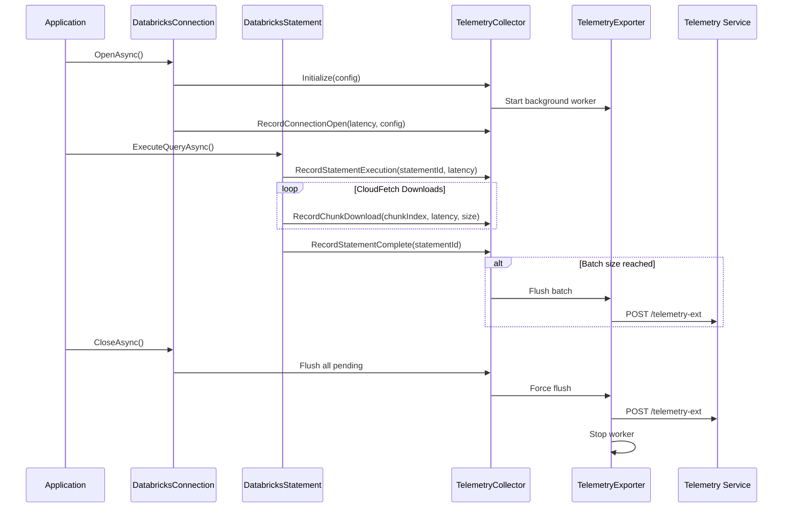

# Databricks ADBC Driver: Client Telemetry Integration

## Executive Summary

This document outlines the design for integrating client-side telemetry into the Databricks ADBC driver for C#. The telemetry system will collect operational metrics, performance data, and error information from the driver to enable proactive monitoring, usage analytics, and faster issue resolution.

**Key Objectives:**
- Enable comprehensive observability of driver operations without impacting performance
- Collect usage insights (CloudFetch vs inline, driver configurations, error patterns)
- Track adoption of new features and configurations
- Provide proactive error monitoring to identify issues before customer reports
- Maintain compatibility with existing OpenTelemetry/Activity-based tracing

**Design Principles:**
- **Non-blocking**: Telemetry operations must never block driver functionality
- **Privacy-first**: No PII or query data collected; schema curated for data residency compliance
- **Opt-out capable**: Users can disable telemetry via configuration
- **Server-controlled**: Feature flag support for server-side enable/disable
- **Backward compatible**: No breaking changes to existing driver API
- **OpenTelemetry aligned**: Leverage existing Activity infrastructure where possible

---

## Table of Contents

1. [Background & Motivation](#1-background--motivation)
2. [Requirements](#2-requirements)
3. [Architecture Overview](#3-architecture-overview)
4. [Telemetry Components](#4-telemetry-components)
5. [Data Schema](#5-data-schema)
6. [Collection Points](#6-collection-points)
7. [Export Mechanism](#7-export-mechanism)
8. [Configuration](#8-configuration)
9. [Privacy & Data Residency](#9-privacy--data-residency)
10. [Error Handling](#10-error-handling)
11. [Testing Strategy](#11-testing-strategy)
12. [Migration & Rollout](#12-migration--rollout)
13. [Alternatives Considered](#13-alternatives-considered)
14. [Open Questions](#14-open-questions)
15. [References](#15-references)

---

## 1. Background & Motivation

### 1.1 Current State

The Databricks ADBC driver currently implements:
- **Activity-based tracing** via `ActivityTrace` and `ActivitySource`
- **W3C Trace Context propagation** for distributed tracing
- **Local file exporter** for debugging traces

However, this approach has limitations:
- **No centralized aggregation**: Traces are local-only unless connected to external APM
- **Limited usage insights**: No visibility into driver configuration patterns
- **Reactive debugging**: Relies on customer-reported issues with trace files
- **No feature adoption metrics**: Cannot track usage of CloudFetch, Direct Results, etc.

### 1.2 JDBC Driver Precedent

The Databricks JDBC driver successfully implemented client telemetry with:
- **Comprehensive metrics**: Operation latency, chunk downloads, error rates
- **Configuration tracking**: Driver settings, auth types, proxy usage
- **Server-side control**: Feature flag to enable/disable telemetry
- **Centralized storage**: Data flows to `main.eng_lumberjack.prod_frontend_log_sql_driver_log`
- **Privacy compliance**: No PII, curated schema, Lumberjack data residency

### 1.3 Key Gaps to Address

1. **Proactive Monitoring**: Identify errors before customer escalation
2. **Usage Analytics**: Understand driver configuration patterns across customer base
3. **Feature Adoption**: Track uptake of CloudFetch, Direct Results, OAuth flows
4. **Performance Insights**: Client-side latency vs server-side metrics
5. **Error Patterns**: Common configuration mistakes, auth failures, network issues

---

## 2. Requirements

### 2.1 Functional Requirements

| ID | Requirement | Priority |
|:---|:---|:---:|
| FR-1 | Collect driver configuration metadata (auth type, CloudFetch settings, etc.) | P0 |
| FR-2 | Track operation latency (connection open, statement execution, result fetching) | P0 |
| FR-3 | Record error events with error codes and context | P0 |
| FR-4 | Capture CloudFetch metrics (chunk downloads, retries, compression status) | P0 |
| FR-5 | Track result format usage (inline vs CloudFetch) | P1 |
| FR-6 | Support server-side feature flag to enable/disable telemetry | P0 |
| FR-7 | Provide client-side opt-out mechanism | P1 |
| FR-8 | Batch telemetry events to reduce network overhead | P0 |
| FR-9 | Export telemetry to Databricks telemetry service | P0 |
| FR-10 | Support both authenticated and unauthenticated telemetry endpoints | P0 |

### 2.2 Non-Functional Requirements

| ID | Requirement | Target | Priority |
|:---|:---|:---:|:---:|
| NFR-1 | Telemetry overhead < 1% of operation latency | < 1% | P0 |
| NFR-2 | Memory overhead < 10MB per connection | < 10MB | P0 |
| NFR-3 | Zero impact on driver operation if telemetry fails | 0 failures | P0 |
| NFR-4 | Telemetry export success rate | > 95% | P1 |
| NFR-5 | Batch flush latency | < 5s | P1 |
| NFR-6 | Support workspace-level disable | 100% | P0 |
| NFR-7 | No PII or query data collected | 0 PII | P0 |
| NFR-8 | Compatible with existing Activity tracing | 100% | P0 |

### 2.3 Out of Scope

- Distributed tracing (already covered by Activity/OpenTelemetry)
- Query result data collection
- Real-time alerting (server-side responsibility)
- Custom telemetry endpoints (only Databricks service)

---

## 3. Architecture Overview

### 3.1 High-Level Design

```
┌─────────────────────────────────────────────────────────────────┐
│                    ADBC Driver Operations                        │
│  (Connection, Statement Execution, Result Fetching)              │
└─────────────────────────────────────────────────────────────────┘
                              │
                              │ Emit Events
                              ▼
┌─────────────────────────────────────────────────────────────────┐
│                   TelemetryCollector                             │
│  - Per-connection singleton                                      │
│  - Aggregates events by statement ID                             │
│  - Non-blocking event ingestion                                  │
└─────────────────────────────────────────────────────────────────┘
                              │
                              │ Batch Events
                              ▼
┌─────────────────────────────────────────────────────────────────┐
│                   TelemetryExporter                              │
│  - Background export worker                                      │
│  - Periodic flush (configurable interval)                        │
│  - Size-based flush (batch threshold)                            │
│  - Connection close flush                                        │
└─────────────────────────────────────────────────────────────────┘
                              │
                              │ HTTP POST
                              ▼
┌─────────────────────────────────────────────────────────────────┐
│              Databricks Telemetry Service                        │
│  Endpoints:                                                      │
│  - /telemetry-ext (authenticated)                                │
│  - /telemetry-unauth (unauthenticated - connection errors)       │
└─────────────────────────────────────────────────────────────────┘
                              │
                              ▼
┌─────────────────────────────────────────────────────────────────┐
│                    Lumberjack Pipeline                           │
│  Table: main.eng_lumberjack.prod_frontend_log_sql_driver_log    │
└─────────────────────────────────────────────────────────────────┘
```

### 3.2 Component Interaction Flow



### 3.3 Integration with Existing Components

The telemetry system will integrate with existing driver components:

1. **DatabricksConnection**:
   - Initialize telemetry collector on open
   - Record connection configuration
   - Flush telemetry on close
   - Handle feature flag from server

2. **DatabricksStatement**:
   - Record statement execution metrics
   - Track result format (inline vs CloudFetch)
   - Capture operation latency

3. **CloudFetchDownloader**:
   - Record chunk download latency
   - Track retry attempts
   - Report compression status

4. **Activity Infrastructure**:
   - Leverage existing Activity context for correlation
   - Add telemetry as Activity events for unified observability
   - Maintain W3C trace context propagation

---

## 4. Telemetry Components

### 4.1 TelemetryCollector

**Purpose**: Aggregate and buffer telemetry events per connection.

**Location**: `Apache.Arrow.Adbc.Drivers.Databricks.Telemetry.TelemetryCollector`

**Responsibilities**:
- Accept telemetry events from driver operations
- Aggregate events by statement ID
- Buffer events for batching
- Provide non-blocking event ingestion
- Trigger flush on batch size or time threshold

**Interface**:
```csharp
namespace Apache.Arrow.Adbc.Drivers.Databricks.Telemetry
{
    /// <summary>
    /// Collects and aggregates telemetry events for a connection.
    /// Thread-safe and non-blocking.
    /// </summary>
    internal sealed class TelemetryCollector : IDisposable
    {
        // Constructor
        public TelemetryCollector(
            DatabricksConnection connection,
            ITelemetryExporter exporter,
            TelemetryConfiguration config);

        // Event recording methods
        public void RecordConnectionOpen(
            TimeSpan latency,
            DriverConfiguration driverConfig);

        public void RecordStatementExecute(
            string statementId,
            TimeSpan latency,
            ExecutionResultFormat resultFormat);

        public void RecordChunkDownload(
            string statementId,
            int chunkIndex,
            TimeSpan latency,
            long bytesDownloaded,
            bool compressed);

        public void RecordOperationStatus(
            string statementId,
            int pollCount,
            TimeSpan totalLatency);

        public void RecordStatementComplete(string statementId);

        public void RecordError(
            string errorCode,
            string errorMessage,
            string? statementId = null,
            int? chunkIndex = null);

        // Flush methods
        public Task FlushAsync(CancellationToken cancellationToken = default);

        public Task FlushAllPendingAsync();

        // IDisposable
        public void Dispose();
    }
}
```

**Implementation Details**:

```csharp
internal sealed class TelemetryCollector : IDisposable
{
    private readonly DatabricksConnection _connection;
    private readonly ITelemetryExporter _exporter;
    private readonly TelemetryConfiguration _config;
    private readonly ConcurrentDictionary<string, StatementTelemetryData> _statementData;
    private readonly ConcurrentQueue<TelemetryEvent> _eventQueue;
    private readonly Timer _flushTimer;
    private readonly SemaphoreSlim _flushLock;
    private long _lastFlushTime;
    private int _eventCount;
    private bool _disposed;

    public TelemetryCollector(
        DatabricksConnection connection,
        ITelemetryExporter exporter,
        TelemetryConfiguration config)
    {
        _connection = connection ?? throw new ArgumentNullException(nameof(connection));
        _exporter = exporter ?? throw new ArgumentNullException(nameof(exporter));
        _config = config ?? throw new ArgumentNullException(nameof(config));

        _statementData = new ConcurrentDictionary<string, StatementTelemetryData>();
        _eventQueue = new ConcurrentQueue<TelemetryEvent>();
        _flushLock = new SemaphoreSlim(1, 1);
        _lastFlushTime = DateTimeOffset.UtcNow.ToUnixTimeMilliseconds();

        // Start periodic flush timer
        if (_config.FlushIntervalMilliseconds > 0)
        {
            _flushTimer = new Timer(
                OnTimerFlush,
                null,
                _config.FlushIntervalMilliseconds,
                _config.FlushIntervalMilliseconds);
        }
    }

    public void RecordConnectionOpen(TimeSpan latency, DriverConfiguration driverConfig)
    {
        if (!_config.Enabled) return;

        var telemetryEvent = new TelemetryEvent
        {
            EventType = TelemetryEventType.ConnectionOpen,
            Timestamp = DateTimeOffset.UtcNow,
            OperationLatencyMs = (long)latency.TotalMilliseconds,
            DriverConfig = driverConfig,
            SessionId = _connection.SessionId,
            WorkspaceId = _connection.WorkspaceId
        };

        EnqueueEvent(telemetryEvent);
    }

    public void RecordStatementExecute(
        string statementId,
        TimeSpan latency,
        ExecutionResultFormat resultFormat)
    {
        if (!_config.Enabled || string.IsNullOrEmpty(statementId)) return;

        var stmtData = _statementData.GetOrAdd(
            statementId,
            _ => new StatementTelemetryData { StatementId = statementId });

        stmtData.ExecutionLatencyMs = (long)latency.TotalMilliseconds;
        stmtData.ResultFormat = resultFormat;
        stmtData.Timestamp = DateTimeOffset.UtcNow;
    }

    public void RecordChunkDownload(
        string statementId,
        int chunkIndex,
        TimeSpan latency,
        long bytesDownloaded,
        bool compressed)
    {
        if (!_config.Enabled || string.IsNullOrEmpty(statementId)) return;

        var stmtData = _statementData.GetOrAdd(
            statementId,
            _ => new StatementTelemetryData { StatementId = statementId });

        stmtData.ChunkDownloads.Add(new ChunkDownloadData
        {
            ChunkIndex = chunkIndex,
            LatencyMs = (long)latency.TotalMilliseconds,
            BytesDownloaded = bytesDownloaded,
            Compressed = compressed
        });

        stmtData.TotalChunks = Math.Max(stmtData.TotalChunks, chunkIndex + 1);
    }

    public void RecordStatementComplete(string statementId)
    {
        if (!_config.Enabled || string.IsNullOrEmpty(statementId)) return;

        if (_statementData.TryRemove(statementId, out var stmtData))
        {
            // Convert statement data to telemetry event
            var telemetryEvent = CreateStatementEvent(stmtData);
            EnqueueEvent(telemetryEvent);
        }
    }

    public void RecordError(
        string errorCode,
        string errorMessage,
        string? statementId = null,
        int? chunkIndex = null)
    {
        if (!_config.Enabled) return;

        var telemetryEvent = new TelemetryEvent
        {
            EventType = TelemetryEventType.Error,
            Timestamp = DateTimeOffset.UtcNow,
            ErrorCode = errorCode,
            ErrorMessage = errorMessage,
            StatementId = statementId,
            ChunkIndex = chunkIndex,
            SessionId = _connection.SessionId,
            WorkspaceId = _connection.WorkspaceId
        };

        EnqueueEvent(telemetryEvent);
    }

    private void EnqueueEvent(TelemetryEvent telemetryEvent)
    {
        _eventQueue.Enqueue(telemetryEvent);
        var count = Interlocked.Increment(ref _eventCount);

        // Trigger flush if batch size reached
        if (count >= _config.BatchSize)
        {
            _ = Task.Run(() => FlushAsync(CancellationToken.None));
        }
    }

    public async Task FlushAsync(CancellationToken cancellationToken = default)
    {
        if (_eventCount == 0) return;

        await _flushLock.WaitAsync(cancellationToken);
        try
        {
            var events = DequeueEvents();
            if (events.Count > 0)
            {
                await _exporter.ExportAsync(events, cancellationToken);
                _lastFlushTime = DateTimeOffset.UtcNow.ToUnixTimeMilliseconds();
            }
        }
        catch (Exception ex)
        {
            // Log but don't throw - telemetry must not break driver
            Debug.WriteLine($"Telemetry flush failed: {ex.Message}");
        }
        finally
        {
            _flushLock.Release();
        }
    }

    public async Task FlushAllPendingAsync()
    {
        // Export all pending statement data
        foreach (var kvp in _statementData)
        {
            if (_statementData.TryRemove(kvp.Key, out var stmtData))
            {
                var telemetryEvent = CreateStatementEvent(stmtData);
                EnqueueEvent(telemetryEvent);
            }
        }

        // Flush event queue
        await FlushAsync(CancellationToken.None);
    }

    private List<TelemetryEvent> DequeueEvents()
    {
        var events = new List<TelemetryEvent>(_config.BatchSize);
        while (_eventQueue.TryDequeue(out var telemetryEvent) && events.Count < _config.BatchSize)
        {
            events.Add(telemetryEvent);
            Interlocked.Decrement(ref _eventCount);
        }
        return events;
    }

    private void OnTimerFlush(object? state)
    {
        var now = DateTimeOffset.UtcNow.ToUnixTimeMilliseconds();
        if (now - _lastFlushTime >= _config.FlushIntervalMilliseconds && _eventCount > 0)
        {
            _ = Task.Run(() => FlushAsync(CancellationToken.None));
        }
    }

    public void Dispose()
    {
        if (_disposed) return;
        _disposed = true;

        _flushTimer?.Dispose();

        // Flush all pending data synchronously on dispose
        FlushAllPendingAsync().GetAwaiter().GetResult();

        _flushLock?.Dispose();
    }
}
```

### 4.2 TelemetryExporter

**Purpose**: Export telemetry events to Databricks telemetry service.

**Location**: `Apache.Arrow.Adbc.Drivers.Databricks.Telemetry.TelemetryExporter`

**Responsibilities**:
- Serialize telemetry events to JSON
- Send HTTP POST requests to telemetry endpoints
- Handle authentication (OAuth tokens)
- Implement retry logic for transient failures
- Support circuit breaker pattern

**Interface**:
```csharp
namespace Apache.Arrow.Adbc.Drivers.Databricks.Telemetry
{
    /// <summary>
    /// Exports telemetry events to Databricks telemetry service.
    /// </summary>
    internal interface ITelemetryExporter
    {
        Task ExportAsync(
            IReadOnlyList<TelemetryEvent> events,
            CancellationToken cancellationToken = default);
    }

    internal sealed class TelemetryExporter : ITelemetryExporter
    {
        public TelemetryExporter(
            HttpClient httpClient,
            DatabricksConnection connection,
            TelemetryConfiguration config);

        public Task ExportAsync(
            IReadOnlyList<TelemetryEvent> events,
            CancellationToken cancellationToken = default);
    }
}
```

**Implementation Details**:

```csharp
internal sealed class TelemetryExporter : ITelemetryExporter
{
    private readonly HttpClient _httpClient;
    private readonly DatabricksConnection _connection;
    private readonly TelemetryConfiguration _config;
    private readonly JsonSerializerOptions _jsonOptions;
    private readonly CircuitBreaker? _circuitBreaker;

    private const string AuthenticatedPath = "/telemetry-ext";
    private const string UnauthenticatedPath = "/telemetry-unauth";

    public TelemetryExporter(
        HttpClient httpClient,
        DatabricksConnection connection,
        TelemetryConfiguration config)
    {
        _httpClient = httpClient ?? throw new ArgumentNullException(nameof(httpClient));
        _connection = connection ?? throw new ArgumentNullException(nameof(connection));
        _config = config ?? throw new ArgumentNullException(nameof(config));

        _jsonOptions = new JsonSerializerOptions
        {
            PropertyNamingPolicy = JsonNamingPolicy.SnakeCaseLower,
            DefaultIgnoreCondition = JsonIgnoreCondition.WhenWritingNull,
            WriteIndented = false
        };

        if (_config.CircuitBreakerEnabled)
        {
            _circuitBreaker = new CircuitBreaker(
                _config.CircuitBreakerThreshold,
                _config.CircuitBreakerTimeout);
        }
    }

    public async Task ExportAsync(
        IReadOnlyList<TelemetryEvent> events,
        CancellationToken cancellationToken = default)
    {
        if (events == null || events.Count == 0) return;

        try
        {
            // Check circuit breaker
            if (_circuitBreaker != null && _circuitBreaker.IsOpen)
            {
                Debug.WriteLine("Telemetry circuit breaker is open, dropping events");
                return;
            }

            // Determine endpoint based on authentication status
            var isAuthenticated = _connection.IsAuthenticated;
            var path = isAuthenticated ? AuthenticatedPath : UnauthenticatedPath;
            var uri = new Uri(_connection.Host, path);

            // Create request payload
            var request = CreateTelemetryRequest(events);
            var json = JsonSerializer.Serialize(request, _jsonOptions);
            var content = new StringContent(json, Encoding.UTF8, "application/json");

            // Create HTTP request
            using var httpRequest = new HttpRequestMessage(HttpMethod.Post, uri)
            {
                Content = content
            };

            // Add authentication headers if authenticated
            if (isAuthenticated)
            {
                await AddAuthenticationHeadersAsync(httpRequest, cancellationToken);
            }

            // Send request with retry
            var response = await SendWithRetryAsync(httpRequest, cancellationToken);

            // Handle response
            if (response.IsSuccessStatusCode)
            {
                _circuitBreaker?.RecordSuccess();

                // Parse response for partial failures
                var responseContent = await response.Content.ReadAsStringAsync(cancellationToken);
                var telemetryResponse = JsonSerializer.Deserialize<TelemetryResponse>(
                    responseContent,
                    _jsonOptions);

                if (telemetryResponse?.Errors?.Count > 0)
                {
                    Debug.WriteLine(
                        $"Telemetry partial failure: {telemetryResponse.Errors.Count} errors");
                }
            }
            else
            {
                _circuitBreaker?.RecordFailure();
                Debug.WriteLine(
                    $"Telemetry export failed: {response.StatusCode} - {response.ReasonPhrase}");
            }
        }
        catch (Exception ex)
        {
            _circuitBreaker?.RecordFailure();
            Debug.WriteLine($"Telemetry export exception: {ex.Message}");
            // Don't rethrow - telemetry must not break driver operations
        }
    }

    private TelemetryRequest CreateTelemetryRequest(IReadOnlyList<TelemetryEvent> events)
    {
        var protoLogs = events.Select(e => new TelemetryFrontendLog
        {
            WorkspaceId = e.WorkspaceId,
            FrontendLogEventId = Guid.NewGuid().ToString(),
            Context = new FrontendLogContext
            {
                ClientContext = new TelemetryClientContext
                {
                    TimestampMillis = e.Timestamp.ToUnixTimeMilliseconds(),
                    UserAgent = _connection.UserAgent
                }
            },
            Entry = new FrontendLogEntry
            {
                SqlDriverLog = CreateSqlDriverLog(e)
            }
        }).ToList();

        return new TelemetryRequest
        {
            ProtoLogs = protoLogs
        };
    }

    private SqlDriverLog CreateSqlDriverLog(TelemetryEvent e)
    {
        var log = new SqlDriverLog
        {
            SessionId = e.SessionId,
            SqlStatementId = e.StatementId,
            OperationLatencyMs = e.OperationLatencyMs,
            SystemConfiguration = e.DriverConfig != null
                ? CreateSystemConfiguration(e.DriverConfig)
                : null,
            DriverConnectionParams = e.DriverConfig != null
                ? CreateConnectionParameters(e.DriverConfig)
                : null
        };

        // Add SQL operation data if present
        if (e.SqlOperationData != null)
        {
            log.SqlOperation = new SqlExecutionEvent
            {
                ExecutionResult = e.SqlOperationData.ResultFormat.ToString(),
                RetryCount = e.SqlOperationData.RetryCount,
                ChunkDetails = e.SqlOperationData.ChunkDownloads?.Count > 0
                    ? CreateChunkDetails(e.SqlOperationData.ChunkDownloads)
                    : null
            };
        }

        // Add error info if present
        if (!string.IsNullOrEmpty(e.ErrorCode))
        {
            log.ErrorInfo = new DriverErrorInfo
            {
                ErrorName = e.ErrorCode,
                StackTrace = e.ErrorMessage
            };
        }

        return log;
    }

    private async Task<HttpResponseMessage> SendWithRetryAsync(
        HttpRequestMessage request,
        CancellationToken cancellationToken)
    {
        var retryCount = 0;
        var maxRetries = _config.MaxRetries;

        while (true)
        {
            try
            {
                var response = await _httpClient.SendAsync(
                    request,
                    HttpCompletionOption.ResponseHeadersRead,
                    cancellationToken);

                // Don't retry on client errors (4xx)
                if ((int)response.StatusCode < 500)
                {
                    return response;
                }

                // Retry on server errors (5xx) if retries remaining
                if (retryCount >= maxRetries)
                {
                    return response;
                }
            }
            catch (HttpRequestException) when (retryCount < maxRetries)
            {
                // Retry on network errors
            }
            catch (TaskCanceledException) when (!cancellationToken.IsCancellationRequested && retryCount < maxRetries)
            {
                // Retry on timeout (not user cancellation)
            }

            retryCount++;
            var delay = TimeSpan.FromMilliseconds(_config.RetryDelayMs * Math.Pow(2, retryCount - 1));
            await Task.Delay(delay, cancellationToken);
        }
    }

    private async Task AddAuthenticationHeadersAsync(
        HttpRequestMessage request,
        CancellationToken cancellationToken)
    {
        // Use connection's authentication mechanism
        var authHeaders = await _connection.GetAuthenticationHeadersAsync(cancellationToken);
        foreach (var header in authHeaders)
        {
            request.Headers.TryAddWithoutValidation(header.Key, header.Value);
        }
    }
}
```

### 4.3 CircuitBreaker

**Purpose**: Prevent telemetry storms when service is unavailable.

**Location**: `Apache.Arrow.Adbc.Drivers.Databricks.Telemetry.CircuitBreaker`

**Implementation**:
```csharp
namespace Apache.Arrow.Adbc.Drivers.Databricks.Telemetry
{
    /// <summary>
    /// Circuit breaker to prevent telemetry storms.
    /// </summary>
    internal sealed class CircuitBreaker
    {
        private readonly int _failureThreshold;
        private readonly TimeSpan _timeout;
        private int _failureCount;
        private DateTime _lastFailureTime;
        private CircuitState _state;
        private readonly object _lock = new object();

        private enum CircuitState
        {
            Closed,  // Normal operation
            Open,    // Blocking requests
            HalfOpen // Testing if service recovered
        }

        public CircuitBreaker(int failureThreshold, TimeSpan timeout)
        {
            _failureThreshold = failureThreshold;
            _timeout = timeout;
            _state = CircuitState.Closed;
        }

        public bool IsOpen
        {
            get
            {
                lock (_lock)
                {
                    // Auto-transition from Open to HalfOpen after timeout
                    if (_state == CircuitState.Open)
                    {
                        if (DateTime.UtcNow - _lastFailureTime > _timeout)
                        {
                            _state = CircuitState.HalfOpen;
                            return false;
                        }
                        return true;
                    }
                    return false;
                }
            }
        }

        public void RecordSuccess()
        {
            lock (_lock)
            {
                _failureCount = 0;
                _state = CircuitState.Closed;
            }
        }

        public void RecordFailure()
        {
            lock (_lock)
            {
                _failureCount++;
                _lastFailureTime = DateTime.UtcNow;

                if (_failureCount >= _failureThreshold)
                {
                    _state = CircuitState.Open;
                }
            }
        }
    }
}
```

### 4.4 TelemetryConfiguration

**Purpose**: Centralize all telemetry configuration.

**Location**: `Apache.Arrow.Adbc.Drivers.Databricks.Telemetry.TelemetryConfiguration`

**Implementation**:
```csharp
namespace Apache.Arrow.Adbc.Drivers.Databricks.Telemetry
{
    /// <summary>
    /// Configuration for telemetry collection and export.
    /// </summary>
    public sealed class TelemetryConfiguration
    {
        // Enable/disable flags
        public bool Enabled { get; set; } = true;
        public bool ForceEnable { get; set; } = false; // Bypass feature flag

        // Batch configuration
        public int BatchSize { get; set; } = 50;
        public int FlushIntervalMilliseconds { get; set; } = 30000; // 30 seconds

        // Retry configuration
        public int MaxRetries { get; set; } = 3;
        public int RetryDelayMs { get; set; } = 500;

        // Circuit breaker configuration
        public bool CircuitBreakerEnabled { get; set; } = true;
        public int CircuitBreakerThreshold { get; set; } = 5;
        public TimeSpan CircuitBreakerTimeout { get; set; } = TimeSpan.FromMinutes(1);

        // Log level filtering
        public TelemetryLogLevel LogLevel { get; set; } = TelemetryLogLevel.Info;

        // Feature flag name
        public const string FeatureFlagName =
            "databricks.partnerplatform.clientConfigsFeatureFlags.enableTelemetryForAdbc";

        // Create from connection properties
        public static TelemetryConfiguration FromProperties(
            IReadOnlyDictionary<string, string> properties)
        {
            var config = new TelemetryConfiguration();

            if (properties.TryGetValue(DatabricksParameters.TelemetryEnabled, out var enabled))
            {
                config.Enabled = bool.Parse(enabled);
            }

            if (properties.TryGetValue(DatabricksParameters.TelemetryBatchSize, out var batchSize))
            {
                config.BatchSize = int.Parse(batchSize);
            }

            if (properties.TryGetValue(DatabricksParameters.TelemetryFlushIntervalMs, out var flushInterval))
            {
                config.FlushIntervalMilliseconds = int.Parse(flushInterval);
            }

            return config;
        }
    }

    public enum TelemetryLogLevel
    {
        Off = 0,
        Error = 1,
        Warn = 2,
        Info = 3,
        Debug = 4,
        Trace = 5
    }
}
```

---

## 5. Data Schema

### 5.1 Telemetry Event Model

```csharp
namespace Apache.Arrow.Adbc.Drivers.Databricks.Telemetry.Models
{
    /// <summary>
    /// Base telemetry event.
    /// </summary>
    internal sealed class TelemetryEvent
    {
        public TelemetryEventType EventType { get; set; }
        public DateTimeOffset Timestamp { get; set; }
        public long? WorkspaceId { get; set; }
        public string? SessionId { get; set; }
        public string? StatementId { get; set; }
        public long? OperationLatencyMs { get; set; }

        // Driver configuration (connection events only)
        public DriverConfiguration? DriverConfig { get; set; }

        // SQL operation data (statement events only)
        public SqlOperationData? SqlOperationData { get; set; }

        // Error information (error events only)
        public string? ErrorCode { get; set; }
        public string? ErrorMessage { get; set; }
        public int? ChunkIndex { get; set; }
    }

    public enum TelemetryEventType
    {
        ConnectionOpen,
        StatementExecution,
        Error
    }
}
```

### 5.2 Driver Configuration Model

```csharp
namespace Apache.Arrow.Adbc.Drivers.Databricks.Telemetry.Models
{
    /// <summary>
    /// Driver configuration snapshot (collected once per connection).
    /// </summary>
    internal sealed class DriverConfiguration
    {
        // System information
        public string? DriverName { get; set; } = "Databricks.ADBC.CSharp";
        public string? DriverVersion { get; set; }
        public string? OsName { get; set; }
        public string? OsVersion { get; set; }
        public string? RuntimeVersion { get; set; }
        public string? ProcessName { get; set; }

        // Connection configuration
        public string? AuthType { get; set; }
        public string? HostUrl { get; set; }
        public string? HttpPath { get; set; }

        // Feature flags
        public bool CloudFetchEnabled { get; set; }
        public bool Lz4DecompressionEnabled { get; set; }
        public bool DirectResultsEnabled { get; set; }
        public bool TracePropagationEnabled { get; set; }
        public bool MultipleCatalogSupport { get; set; }
        public bool PrimaryKeyForeignKeyEnabled { get; set; }

        // CloudFetch configuration
        public long MaxBytesPerFile { get; set; }
        public long MaxBytesPerFetchRequest { get; set; }
        public int MaxParallelDownloads { get; set; }
        public int PrefetchCount { get; set; }
        public int MemoryBufferSizeMb { get; set; }

        // Proxy configuration
        public bool UseProxy { get; set; }
        public string? ProxyHost { get; set; }
        public int? ProxyPort { get; set; }

        // Statement configuration
        public long BatchSize { get; set; }
        public int PollTimeMs { get; set; }

        // Direct results limits
        public long DirectResultMaxBytes { get; set; }
        public long DirectResultMaxRows { get; set; }
    }
}
```

### 5.3 SQL Operation Data Model

```csharp
namespace Apache.Arrow.Adbc.Drivers.Databricks.Telemetry.Models
{
    /// <summary>
    /// SQL operation metrics.
    /// </summary>
    internal sealed class SqlOperationData
    {
        public string? StatementId { get; set; }
        public ExecutionResultFormat ResultFormat { get; set; }
        public long ExecutionLatencyMs { get; set; }
        public int RetryCount { get; set; }
        public int PollCount { get; set; }
        public long TotalPollLatencyMs { get; set; }

        // CloudFetch specific
        public List<ChunkDownloadData>? ChunkDownloads { get; set; }
        public int TotalChunks { get; set; }
    }

    public enum ExecutionResultFormat
    {
        Unknown = 0,
        InlineArrow = 1,
        InlineJson = 2,
        ExternalLinks = 3  // CloudFetch
    }

    internal sealed class ChunkDownloadData
    {
        public int ChunkIndex { get; set; }
        public long LatencyMs { get; set; }
        public long BytesDownloaded { get; set; }
        public bool Compressed { get; set; }
    }
}
```

### 5.4 Server Payload Schema

The exported JSON payload matches JDBC format for consistency:

```json
{
  "proto_logs": [
    {
      "workspace_id": 1234567890,
      "frontend_log_event_id": "550e8400-e29b-41d4-a716-446655440000",
      "context": {
        "client_context": {
          "timestamp_millis": 1698765432000,
          "user_agent": "Databricks-ADBC-CSharp/1.0.0"
        }
      },
      "entry": {
        "sql_driver_log": {
          "session_id": "01234567-89ab-cdef-0123-456789abcdef",
          "sql_statement_id": "01234567-89ab-cdef-0123-456789abcdef",
          "operation_latency_ms": 1234,
          "system_configuration": {
            "driver_name": "Databricks.ADBC.CSharp",
            "driver_version": "1.0.0",
            "os_name": "Windows",
            "os_version": "10.0.19042",
            "runtime_version": ".NET 8.0.0",
            "process_name": "PowerBI.Desktop"
          },
          "driver_connection_params": {
            "auth_type": "oauth_client_credentials",
            "cloudfetch_enabled": true,
            "lz4_decompression_enabled": true,
            "direct_results_enabled": true,
            "max_bytes_per_file": 20971520,
            "max_parallel_downloads": 3,
            "batch_size": 2000000
          },
          "sql_operation": {
            "execution_result": "EXTERNAL_LINKS",
            "retry_count": 0,
            "chunk_details": {
              "total_chunks": 10,
              "chunks_downloaded": 10,
              "total_download_latency_ms": 5432,
              "avg_chunk_size_bytes": 15728640,
              "compressed": true
            }
          },
          "error_info": null
        }
      }
    }
  ]
}
```

---

## 6. Collection Points

### 6.1 Connection Lifecycle Events

#### 6.1.1 Connection Open

**Location**: `DatabricksConnection.OpenAsync()`

**What to Collect**:
- Connection open latency
- Driver configuration snapshot
- Session ID
- Workspace ID

**Implementation**:
```csharp
public override async Task OpenAsync(CancellationToken cancellationToken = default)
{
    var sw = Stopwatch.StartNew();

    try
    {
        await base.OpenAsync(cancellationToken);

        // Initialize telemetry after successful connection
        InitializeTelemetry();

        sw.Stop();

        // Record connection open event
        _telemetryCollector?.RecordConnectionOpen(
            sw.Elapsed,
            CreateDriverConfiguration());
    }
    catch (Exception)
    {
        sw.Stop();
        // Error will be recorded by exception handler
        throw;
    }
}

private DriverConfiguration CreateDriverConfiguration()
{
    return new DriverConfiguration
    {
        DriverName = "Databricks.ADBC.CSharp",
        DriverVersion = GetType().Assembly.GetName().Version?.ToString(),
        OsName = Environment.OSVersion.Platform.ToString(),
        OsVersion = Environment.OSVersion.Version.ToString(),
        RuntimeVersion = Environment.Version.ToString(),
        ProcessName = Process.GetCurrentProcess().ProcessName,

        AuthType = DetermineAuthType(),
        HostUrl = Host?.Host,
        HttpPath = HttpPath,

        CloudFetchEnabled = UseCloudFetch,
        Lz4DecompressionEnabled = CanDecompressLz4,
        DirectResultsEnabled = _enableDirectResults,
        TracePropagationEnabled = _tracePropagationEnabled,
        MultipleCatalogSupport = _enableMultipleCatalogSupport,
        PrimaryKeyForeignKeyEnabled = _enablePKFK,

        MaxBytesPerFile = _maxBytesPerFile,
        MaxBytesPerFetchRequest = _maxBytesPerFetchRequest,
        MaxParallelDownloads = GetIntProperty(
            DatabricksParameters.CloudFetchParallelDownloads,
            3),
        PrefetchCount = GetIntProperty(
            DatabricksParameters.CloudFetchPrefetchCount,
            2),
        MemoryBufferSizeMb = GetIntProperty(
            DatabricksParameters.CloudFetchMemoryBufferSizeMb,
            200),

        UseProxy = Properties.ContainsKey(ApacheParameters.ProxyHost),
        ProxyHost = Properties.TryGetValue(ApacheParameters.ProxyHost, out var host)
            ? host
            : null,
        ProxyPort = Properties.TryGetValue(ApacheParameters.ProxyPort, out var port)
            ? int.Parse(port)
            : (int?)null,

        BatchSize = DatabricksStatement.DatabricksBatchSizeDefault,
        PollTimeMs = GetIntProperty(
            ApacheParameters.PollTimeMilliseconds,
            DatabricksConstants.DefaultAsyncExecPollIntervalMs),

        DirectResultMaxBytes = _directResultMaxBytes,
        DirectResultMaxRows = _directResultMaxRows
    };
}
```

#### 6.1.2 Connection Close

**Location**: `DatabricksConnection.Dispose()`

**What to Do**:
- Flush all pending telemetry
- Dispose telemetry collector

**Implementation**:
```csharp
public override void Dispose()
{
    try
    {
        // Flush telemetry before closing connection
        _telemetryCollector?.FlushAllPendingAsync().GetAwaiter().GetResult();
    }
    catch (Exception ex)
    {
        Debug.WriteLine($"Error flushing telemetry on connection close: {ex.Message}");
    }
    finally
    {
        _telemetryCollector?.Dispose();
        _telemetryCollector = null;

        base.Dispose();
    }
}
```

### 6.2 Statement Execution Events

#### 6.2.1 Statement Execute

**Location**: `DatabricksStatement.ExecuteQueryAsync()`

**What to Collect**:
- Statement execution latency
- Result format (inline vs CloudFetch)
- Statement ID

**Implementation**:
```csharp
protected override async Task<QueryResult> ExecuteQueryAsync(
    string? sqlQuery,
    CancellationToken cancellationToken = default)
{
    var sw = Stopwatch.StartNew();
    string? statementId = null;

    try
    {
        var result = await base.ExecuteQueryAsync(sqlQuery, cancellationToken);

        sw.Stop();
        statementId = result.StatementHandle?.ToSQLExecStatementId();

        // Determine result format
        var resultFormat = DetermineResultFormat(result);

        // Record statement execution
        Connection.TelemetryCollector?.RecordStatementExecute(
            statementId ?? Guid.NewGuid().ToString(),
            sw.Elapsed,
            resultFormat);

        return result;
    }
    catch (Exception ex)
    {
        sw.Stop();

        // Record error
        Connection.TelemetryCollector?.RecordError(
            DetermineErrorCode(ex),
            ex.Message,
            statementId);

        throw;
    }
}

private ExecutionResultFormat DetermineResultFormat(QueryResult result)
{
    if (result.DirectResult != null)
    {
        return ExecutionResultFormat.InlineArrow;
    }
    else if (result.ResultLinks != null && result.ResultLinks.Count > 0)
    {
        return ExecutionResultFormat.ExternalLinks;
    }
    else
    {
        return ExecutionResultFormat.Unknown;
    }
}
```

#### 6.2.2 Statement Close

**Location**: `DatabricksStatement.Dispose()`

**What to Do**:
- Mark statement as complete in telemetry

**Implementation**:
```csharp
public override void Dispose()
{
    try
    {
        // Mark statement complete (triggers export of aggregated metrics)
        if (!string.IsNullOrEmpty(_statementId))
        {
            Connection.TelemetryCollector?.RecordStatementComplete(_statementId);
        }
    }
    finally
    {
        base.Dispose();
    }
}
```

### 6.3 CloudFetch Events

#### 6.3.1 Chunk Download

**Location**: `CloudFetchDownloader.DownloadFileAsync()`

**What to Collect**:
- Download latency per chunk
- Bytes downloaded
- Compression status
- Retry attempts

**Implementation**:
```csharp
private async Task DownloadFileAsync(
    IDownloadResult downloadResult,
    CancellationToken cancellationToken)
{
    var sw = Stopwatch.StartNew();
    var retryCount = 0;

    while (retryCount <= _maxRetries)
    {
        try
        {
            using var response = await _httpClient.GetAsync(
                downloadResult.Url,
                HttpCompletionOption.ResponseHeadersRead,
                cancellationToken);

            response.EnsureSuccessStatusCode();

            var contentLength = response.Content.Headers.ContentLength ?? 0;
            var stream = await response.Content.ReadAsStreamAsync(cancellationToken);

            // Decompress if needed
            if (_isLz4Compressed)
            {
                stream = LZ4Stream.Decode(stream);
            }

            // Copy to memory buffer
            await _memoryManager.ReserveAsync(contentLength, cancellationToken);
            var memoryStream = new MemoryStream();
            await stream.CopyToAsync(memoryStream, cancellationToken);

            sw.Stop();

            // Record successful download
            _statement.Connection.TelemetryCollector?.RecordChunkDownload(
                _statement.StatementId,
                downloadResult.ChunkIndex,
                sw.Elapsed,
                contentLength,
                _isLz4Compressed);

            downloadResult.SetData(memoryStream);
            return;
        }
        catch (Exception ex)
        {
            retryCount++;

            if (retryCount > _maxRetries)
            {
                sw.Stop();

                // Record download error
                _statement.Connection.TelemetryCollector?.RecordError(
                    "CHUNK_DOWNLOAD_ERROR",
                    ex.Message,
                    _statement.StatementId,
                    downloadResult.ChunkIndex);

                downloadResult.SetError(ex);
                throw;
            }

            await Task.Delay(_retryDelayMs * retryCount, cancellationToken);
        }
    }
}
```

#### 6.3.2 Operation Status Polling

**Location**: `DatabricksOperationStatusPoller.PollForCompletionAsync()`

**What to Collect**:
- Number of polls
- Total polling latency

**Implementation**:
```csharp
public async Task<TGetOperationStatusResp> PollForCompletionAsync(
    TOperationHandle operationHandle,
    CancellationToken cancellationToken = default)
{
    var sw = Stopwatch.StartNew();
    var pollCount = 0;

    try
    {
        TGetOperationStatusResp? statusResp = null;

        while (!cancellationToken.IsCancellationRequested)
        {
            statusResp = await GetOperationStatusAsync(operationHandle, cancellationToken);
            pollCount++;

            if (IsComplete(statusResp.OperationState))
            {
                break;
            }

            await Task.Delay(_pollIntervalMs, cancellationToken);
        }

        sw.Stop();

        // Record polling metrics
        _connection.TelemetryCollector?.RecordOperationStatus(
            operationHandle.OperationId?.Guid.ToString() ?? string.Empty,
            pollCount,
            sw.Elapsed);

        return statusResp!;
    }
    catch (Exception)
    {
        sw.Stop();
        throw;
    }
}
```

### 6.4 Error Events

#### 6.4.1 Exception Handler Integration

**Location**: Throughout driver code

**What to Collect**:
- Error code/type
- Error message (sanitized)
- Statement ID (if available)
- Chunk index (for download errors)

**Implementation Pattern**:
```csharp
try
{
    // Driver operation
}
catch (DatabricksException ex)
{
    Connection.TelemetryCollector?.RecordError(
        ex.ErrorCode,
        SanitizeErrorMessage(ex.Message),
        statementId,
        chunkIndex);

    throw;
}
catch (AdbcException ex)
{
    Connection.TelemetryCollector?.RecordError(
        ex.Status.ToString(),
        SanitizeErrorMessage(ex.Message),
        statementId);

    throw;
}
catch (Exception ex)
{
    Connection.TelemetryCollector?.RecordError(
        "UNKNOWN_ERROR",
        SanitizeErrorMessage(ex.Message),
        statementId);

    throw;
}

private static string SanitizeErrorMessage(string message)
{
    // Remove potential PII from error messages
    // - Remove connection strings
    // - Remove auth tokens
    // - Remove file paths containing usernames
    // - Keep only first 500 characters

    var sanitized = message;

    // Remove anything that looks like a connection string
    sanitized = Regex.Replace(
        sanitized,
        @"token=[^;]+",
        "token=***",
        RegexOptions.IgnoreCase);

    // Remove Bearer tokens
    sanitized = Regex.Replace(
        sanitized,
        @"Bearer\s+[A-Za-z0-9\-._~+/]+=*",
        "Bearer ***",
        RegexOptions.IgnoreCase);

    // Truncate to 500 characters
    if (sanitized.Length > 500)
    {
        sanitized = sanitized.Substring(0, 500) + "...";
    }

    return sanitized;
}
```

---

## 7. Export Mechanism

### 7.1 Export Flow

```
┌─────────────────────────────────────────────────────────────────┐
│                    Driver Operations                             │
│            (Emit events to TelemetryCollector)                   │
└─────────────────────────────────────────────────────────────────┘
                              │
                              ▼
┌─────────────────────────────────────────────────────────────────┐
│                   TelemetryCollector                             │
│  - Buffer events in ConcurrentQueue                              │
│  - Aggregate statement metrics in ConcurrentDictionary           │
│  - Track batch size and time since last flush                    │
└─────────────────────────────────────────────────────────────────┘
                              │
                ┌─────────────┼─────────────┐
                │             │             │
                ▼             ▼             ▼
         Batch Size      Time Based    Connection Close
         Threshold        Periodic          Flush
         Reached          Flush
                │             │             │
                └─────────────┼─────────────┘
                              ▼
┌─────────────────────────────────────────────────────────────────┐
│                   TelemetryExporter                              │
│  1. Check circuit breaker state                                  │
│  2. Serialize events to JSON                                     │
│  3. Create HTTP POST request                                     │
│  4. Add authentication headers (if authenticated)                │
│  5. Send with retry logic                                        │
│  6. Update circuit breaker on success/failure                    │
└─────────────────────────────────────────────────────────────────┘
                              │
                              ▼ HTTP POST
┌─────────────────────────────────────────────────────────────────┐
│            Databricks Telemetry Service                          │
│  Endpoints:                                                      │
│  - POST /telemetry-ext (authenticated)                           │
│    Auth: OAuth token from connection                             │
│  - POST /telemetry-unauth (unauthenticated)                      │
│    For pre-authentication errors only                            │
└─────────────────────────────────────────────────────────────────┘
                              │
                              ▼
┌─────────────────────────────────────────────────────────────────┐
│                    Lumberjack Pipeline                           │
│  - Regional Logfood                                              │
│  - Central Logfood                                               │
│  - Table: main.eng_lumberjack.prod_frontend_log_sql_driver_log  │
└─────────────────────────────────────────────────────────────────┘
```

### 7.2 Export Triggers

#### 7.2.1 Batch Size Threshold

```csharp
private void EnqueueEvent(TelemetryEvent telemetryEvent)
{
    _eventQueue.Enqueue(telemetryEvent);
    var count = Interlocked.Increment(ref _eventCount);

    // Trigger flush if batch size reached
    if (count >= _config.BatchSize)
    {
        _ = Task.Run(() => FlushAsync(CancellationToken.None));
    }
}
```

**Default**: 50 events per batch
**Rationale**: Balance between export frequency and network overhead

#### 7.2.2 Time-Based Periodic Flush

```csharp
private void OnTimerFlush(object? state)
{
    var now = DateTimeOffset.UtcNow.ToUnixTimeMilliseconds();
    if (now - _lastFlushTime >= _config.FlushIntervalMilliseconds && _eventCount > 0)
    {
        _ = Task.Run(() => FlushAsync(CancellationToken.None));
    }
}
```

**Default**: 30 seconds
**Rationale**: Ensure events are exported even with low event rate

#### 7.2.3 Connection Close Flush

```csharp
public void Dispose()
{
    if (_disposed) return;
    _disposed = true;

    _flushTimer?.Dispose();

    // Flush all pending data synchronously on dispose
    FlushAllPendingAsync().GetAwaiter().GetResult();

    _flushLock?.Dispose();
}
```

**Behavior**: Synchronous flush to ensure no data loss on connection close

### 7.3 Retry Strategy

**Exponential Backoff with Jitter**:

```csharp
private async Task<HttpResponseMessage> SendWithRetryAsync(
    HttpRequestMessage request,
    CancellationToken cancellationToken)
{
    var retryCount = 0;
    var maxRetries = _config.MaxRetries;
    var random = new Random();

    while (true)
    {
        try
        {
            var response = await _httpClient.SendAsync(
                request,
                HttpCompletionOption.ResponseHeadersRead,
                cancellationToken);

            // Don't retry on client errors (4xx)
            if ((int)response.StatusCode < 500)
            {
                return response;
            }

            // Retry on server errors (5xx) if retries remaining
            if (retryCount >= maxRetries)
            {
                return response;
            }
        }
        catch (HttpRequestException) when (retryCount < maxRetries)
        {
            // Retry on network errors
        }
        catch (TaskCanceledException) when (!cancellationToken.IsCancellationRequested && retryCount < maxRetries)
        {
            // Retry on timeout (not user cancellation)
        }

        retryCount++;

        // Exponential backoff with jitter
        var baseDelay = _config.RetryDelayMs * Math.Pow(2, retryCount - 1);
        var jitter = random.Next(0, (int)(baseDelay * 0.1)); // 10% jitter
        var delay = TimeSpan.FromMilliseconds(baseDelay + jitter);

        await Task.Delay(delay, cancellationToken);
    }
}
```

**Parameters**:
- Base delay: 500ms
- Max retries: 3
- Exponential multiplier: 2
- Jitter: 10% of base delay

**Retry Conditions**:
- ✅ 5xx server errors
- ✅ Network errors (HttpRequestException)
- ✅ Timeouts (TaskCanceledException, not user cancellation)
- ❌ 4xx client errors (don't retry)
- ❌ User cancellation

### 7.4 Circuit Breaker

**Purpose**: Prevent telemetry storms when service is degraded

**State Transitions**:

```
       Closed ──────────────────┐
         │                      │
         │ Failure threshold    │ Success
         │ reached              │
         ▼                      │
       Open ◄────┐              │
         │       │              │
         │       │ Failure      │
         │       │ during       │
         │       │ half-open    │
         │       │              │
         │ Timeout              │
         │ expired              │
         ▼       │              │
      HalfOpen ──┴──────────────┘
```

**Configuration**:
- Failure threshold: 5 consecutive failures
- Timeout: 60 seconds
- State check: On every export attempt

**Behavior**:
- **Closed**: Normal operation, all exports attempted
- **Open**: Drop all events, no export attempts
- **HalfOpen**: Allow one export to test if service recovered

---

## 8. Configuration

### 8.1 Connection Parameters

Add new ADBC connection parameters in `DatabricksParameters.cs`:

```csharp
namespace Apache.Arrow.Adbc.Drivers.Databricks
{
    public static partial class DatabricksParameters
    {
        // Telemetry enable/disable
        public const string TelemetryEnabled = "adbc.databricks.telemetry.enabled";

        // Force enable (bypass feature flag)
        public const string TelemetryForceEnable = "adbc.databricks.telemetry.force_enable";

        // Batch configuration
        public const string TelemetryBatchSize = "adbc.databricks.telemetry.batch_size";
        public const string TelemetryFlushIntervalMs = "adbc.databricks.telemetry.flush_interval_ms";

        // Retry configuration
        public const string TelemetryMaxRetries = "adbc.databricks.telemetry.max_retries";
        public const string TelemetryRetryDelayMs = "adbc.databricks.telemetry.retry_delay_ms";

        // Circuit breaker configuration
        public const string TelemetryCircuitBreakerEnabled = "adbc.databricks.telemetry.circuit_breaker.enabled";
        public const string TelemetryCircuitBreakerThreshold = "adbc.databricks.telemetry.circuit_breaker.threshold";
        public const string TelemetryCircuitBreakerTimeoutSec = "adbc.databricks.telemetry.circuit_breaker.timeout_sec";

        // Log level filtering
        public const string TelemetryLogLevel = "adbc.databricks.telemetry.log_level";
    }
}
```

### 8.2 Default Values

| Parameter | Default | Description |
|:---|:---|:---|
| `adbc.databricks.telemetry.enabled` | `true` | Enable/disable telemetry collection |
| `adbc.databricks.telemetry.force_enable` | `false` | Bypass server-side feature flag |
| `adbc.databricks.telemetry.batch_size` | `50` | Number of events per batch |
| `adbc.databricks.telemetry.flush_interval_ms` | `30000` | Flush interval in milliseconds |
| `adbc.databricks.telemetry.max_retries` | `3` | Maximum retry attempts |
| `adbc.databricks.telemetry.retry_delay_ms` | `500` | Base retry delay in milliseconds |
| `adbc.databricks.telemetry.circuit_breaker.enabled` | `true` | Enable circuit breaker |
| `adbc.databricks.telemetry.circuit_breaker.threshold` | `5` | Failure threshold |
| `adbc.databricks.telemetry.circuit_breaker.timeout_sec` | `60` | Open state timeout in seconds |
| `adbc.databricks.telemetry.log_level` | `Info` | Minimum log level (Off/Error/Warn/Info/Debug/Trace) |

### 8.3 Example Configuration

#### JSON Configuration File

```json
{
  "adbc.connection.host": "https://my-workspace.databricks.com",
  "adbc.connection.auth_type": "oauth",
  "adbc.databricks.oauth.client_id": "my-client-id",
  "adbc.databricks.oauth.client_secret": "my-secret",

  "adbc.databricks.telemetry.enabled": "true",
  "adbc.databricks.telemetry.batch_size": "100",
  "adbc.databricks.telemetry.flush_interval_ms": "60000",
  "adbc.databricks.telemetry.log_level": "Info"
}
```

#### Programmatic Configuration

```csharp
var properties = new Dictionary<string, string>
{
    [DatabricksParameters.HostName] = "https://my-workspace.databricks.com",
    [DatabricksParameters.AuthType] = "oauth",
    [DatabricksParameters.OAuthClientId] = "my-client-id",
    [DatabricksParameters.OAuthClientSecret] = "my-secret",

    [DatabricksParameters.TelemetryEnabled] = "true",
    [DatabricksParameters.TelemetryBatchSize] = "100",
    [DatabricksParameters.TelemetryFlushIntervalMs] = "60000",
    [DatabricksParameters.TelemetryLogLevel] = "Info"
};

using var driver = new DatabricksDriver();
using var database = driver.Open(properties);
using var connection = database.Connect();
```

#### Disable Telemetry

```csharp
var properties = new Dictionary<string, string>
{
    // ... other properties ...
    [DatabricksParameters.TelemetryEnabled] = "false"
};
```

### 8.4 Server-Side Feature Flag

**Feature Flag Name**: `databricks.partnerplatform.clientConfigsFeatureFlags.enableTelemetryForAdbc`

**Checking Logic**:

```csharp
private async Task<bool> IsTelemetryEnabledByServerAsync(CancellationToken cancellationToken)
{
    // Check client-side force enable first
    if (_config.ForceEnable)
    {
        return true;
    }

    try
    {
        // Query server for feature flag
        // This happens during ApplyServerSidePropertiesAsync()
        var query = $"SELECT * FROM databricks_client_config WHERE key = '{TelemetryConfiguration.FeatureFlagName}'";

        using var statement = Connection.CreateStatement();
        using var reader = await statement.ExecuteQueryAsync(query, cancellationToken);

        if (await reader.ReadAsync(cancellationToken))
        {
            var value = reader.GetString(1); // value column
            return bool.TryParse(value, out var enabled) && enabled;
        }
    }
    catch (Exception ex)
    {
        Debug.WriteLine($"Failed to check telemetry feature flag: {ex.Message}");
        // Default to enabled if check fails
        return true;
    }

    // Default to enabled
    return true;
}
```

**Integration in Connection**:

```csharp
internal async Task ApplyServerSidePropertiesAsync(CancellationToken cancellationToken = default)
{
    await base.ApplyServerSidePropertiesAsync(cancellationToken);

    // Check telemetry feature flag
    if (_telemetryConfig != null && _telemetryConfig.Enabled)
    {
        var serverEnabled = await IsTelemetryEnabledByServerAsync(cancellationToken);
        if (!serverEnabled)
        {
            _telemetryConfig.Enabled = false;
            _telemetryCollector?.Dispose();
            _telemetryCollector = null;
        }
    }
}
```

---

## 9. Privacy & Data Residency

### 9.1 Privacy Principles

**No PII Collection**:
- ❌ Query text
- ❌ Query results
- ❌ Table names
- ❌ Column names
- ❌ User identifiers (beyond workspace/session IDs)
- ❌ IP addresses
- ❌ File paths with usernames
- ❌ Authentication credentials

**What We Collect**:
- ✅ Operation latency metrics
- ✅ Driver configuration settings
- ✅ Error codes and sanitized messages
- ✅ Result format (inline vs CloudFetch)
- ✅ System information (OS, runtime version)
- ✅ Session and statement IDs (UUIDs)

### 9.2 Data Sanitization

**Error Message Sanitization**:

```csharp
private static string SanitizeErrorMessage(string message)
{
    // Remove connection strings
    message = Regex.Replace(
        message,
        @"token=[^;]+",
        "token=***",
        RegexOptions.IgnoreCase);

    // Remove Bearer tokens
    message = Regex.Replace(
        message,
        @"Bearer\s+[A-Za-z0-9\-._~+/]+=*",
        "Bearer ***",
        RegexOptions.IgnoreCase);

    // Remove client secrets
    message = Regex.Replace(
        message,
        @"client_secret=[^&\s]+",
        "client_secret=***",
        RegexOptions.IgnoreCase);

    // Remove basic auth
    message = Regex.Replace(
        message,
        @"Basic\s+[A-Za-z0-9+/]+=*",
        "Basic ***",
        RegexOptions.IgnoreCase);

    // Remove file paths with usernames (Windows/Unix)
    message = Regex.Replace(
        message,
        @"C:\\Users\\[^\\]+",
        "C:\\Users\\***",
        RegexOptions.IgnoreCase);

    message = Regex.Replace(
        message,
        @"/home/[^/]+",
        "/home/***");

    message = Regex.Replace(
        message,
        @"/Users/[^/]+",
        "/Users/***");

    // Truncate to 500 characters
    if (message.Length > 500)
    {
        message = message.Substring(0, 500) + "...";
    }

    return message;
}
```

**Configuration Sanitization**:

```csharp
private DriverConfiguration CreateDriverConfiguration()
{
    var config = new DriverConfiguration
    {
        // ... populate config ...

        // Sanitize sensitive fields
        HostUrl = SanitizeUrl(_connection.Host?.Host),
        ProxyHost = SanitizeUrl(_connection.ProxyHost)
    };

    return config;
}

private static string? SanitizeUrl(string? url)
{
    if (string.IsNullOrEmpty(url)) return url;

    try
    {
        var uri = new Uri(url);
        // Return only host and scheme, no credentials or query params
        return $"{uri.Scheme}://{uri.Host}";
    }
    catch
    {
        return "***";
    }
}
```

### 9.3 Data Residency Compliance

**Lumberjack Integration**:

The Databricks telemetry service integrates with Lumberjack, which handles:
- **Data residency**: Logs stored in region-appropriate storage
- **Encryption**: At-rest and in-transit encryption
- **Retention**: Automated retention policies
- **Compliance**: GDPR, CCPA, HIPAA compliance

**Regional Processing**:

```
┌────────────────────────────────────────────────────────────┐
│  US-based Client                                           │
└────────────────────────────────────────────────────────────┘
                    │
                    ▼ POST /telemetry-ext
┌────────────────────────────────────────────────────────────┐
│  US Control Plane                                          │
│  - Telemetry Service                                       │
└────────────────────────────────────────────────────────────┘
                    │
                    ▼
┌────────────────────────────────────────────────────────────┐
│  US Regional Logfood                                       │
│  (US-based storage)                                        │
└────────────────────────────────────────────────────────────┘
                    │
                    ▼
┌────────────────────────────────────────────────────────────┐
│  Central Logfood                                           │
│  (Global aggregation)                                      │
└────────────────────────────────────────────────────────────┘
```

**No Cross-Region Data Transfer**:
- Telemetry sent to workspace's control plane region
- Processed and stored within that region
- Central aggregation respects data residency rules

### 9.4 Opt-Out Mechanisms

**Client-Side Opt-Out**:

```csharp
// Disable via connection properties
properties[DatabricksParameters.TelemetryEnabled] = "false";

// Or via JSON config
{
  "adbc.databricks.telemetry.enabled": "false"
}
```

**Server-Side Opt-Out**:

```sql
-- Workspace administrator can disable
SET databricks.partnerplatform.clientConfigsFeatureFlags.enableTelemetryForAdbc = false;
```

**Environment Variable Opt-Out**:

```bash
# Set environment variable to disable globally
export DATABRICKS_TELEMETRY_ENABLED=false
```

**Implementation**:

```csharp
private static bool IsTelemetryEnabled(IReadOnlyDictionary<string, string> properties)
{
    // Check environment variable first
    var envVar = Environment.GetEnvironmentVariable("DATABRICKS_TELEMETRY_ENABLED");
    if (!string.IsNullOrEmpty(envVar) && bool.TryParse(envVar, out var envEnabled))
    {
        return envEnabled;
    }

    // Check connection properties
    if (properties.TryGetValue(DatabricksParameters.TelemetryEnabled, out var propValue))
    {
        return bool.TryParse(propValue, out var propEnabled) && propEnabled;
    }

    // Default to enabled
    return true;
}
```

---

## 10. Error Handling

### 10.1 Principles

1. **Never Block Driver Operations**: Telemetry failures must not impact driver functionality
2. **Fail Silently**: Log errors but don't throw exceptions
3. **Degrade Gracefully**: Circuit breaker prevents cascading failures
4. **No Retry Storms**: Exponential backoff with circuit breaker

### 10.2 Error Scenarios

#### 10.2.1 Telemetry Service Unavailable

**Scenario**: Telemetry endpoint returns 503 Service Unavailable

**Handling**:
```csharp
try
{
    var response = await _httpClient.SendAsync(request, cancellationToken);

    if (response.StatusCode == HttpStatusCode.ServiceUnavailable)
    {
        _circuitBreaker?.RecordFailure();
        Debug.WriteLine("Telemetry service unavailable, will retry");
        return;
    }
}
catch (HttpRequestException ex)
{
    _circuitBreaker?.RecordFailure();
    Debug.WriteLine($"Telemetry HTTP error: {ex.Message}");
    // Don't throw - fail silently
}
```

**Result**: Circuit breaker opens after threshold, drops subsequent events until service recovers

#### 10.2.2 Network Timeout

**Scenario**: HTTP request times out

**Handling**:
```csharp
try
{
    using var cts = CancellationTokenSource.CreateLinkedTokenSource(cancellationToken);
    cts.CancelAfter(TimeSpan.FromSeconds(10)); // 10 second timeout

    var response = await _httpClient.SendAsync(request, cts.Token);
}
catch (TaskCanceledException ex) when (!cancellationToken.IsCancellationRequested)
{
    // Timeout, not user cancellation
    Debug.WriteLine("Telemetry request timeout, will retry");
    // Retry logic handles this
}
```

**Result**: Retry with exponential backoff, eventually give up if persistent

#### 10.2.3 Serialization Error

**Scenario**: JSON serialization fails for telemetry event

**Handling**:
```csharp
try
{
    var json = JsonSerializer.Serialize(request, _jsonOptions);
}
catch (JsonException ex)
{
    Debug.WriteLine($"Telemetry serialization error: {ex.Message}");
    // Skip this batch, don't crash
    return;
}
```

**Result**: Drop problematic events, continue with next batch

#### 10.2.4 Out of Memory

**Scenario**: Too many telemetry events buffered in memory

**Handling**:
```csharp
private void EnqueueEvent(TelemetryEvent telemetryEvent)
{
    // Check queue size limit
    if (_eventQueue.Count >= _config.MaxQueueSize)
    {
        Debug.WriteLine("Telemetry queue full, dropping oldest event");
        _eventQueue.TryDequeue(out _); // Drop oldest
    }

    _eventQueue.Enqueue(telemetryEvent);
}
```

**Configuration**: `MaxQueueSize = 1000` (default)

**Result**: FIFO queue with bounded size, drops oldest events when full

#### 10.2.5 Partial Failure Response

**Scenario**: Server accepts some events but rejects others

**Handling**:
```csharp
var telemetryResponse = JsonSerializer.Deserialize<TelemetryResponse>(
    responseContent,
    _jsonOptions);

if (telemetryResponse?.Errors?.Count > 0)
{
    Debug.WriteLine(
        $"Telemetry partial failure: {telemetryResponse.NumProtoSuccess} succeeded, " +
        $"{telemetryResponse.Errors.Count} failed");

    // Log details about failures
    foreach (var error in telemetryResponse.Errors)
    {
        Debug.WriteLine($"  - Event {error.Index}: {error.Message}");
    }

    // Don't retry individual events - too complex
    // Accept partial success
}
```

**Result**: Accept partial success, log details for debugging

### 10.3 Error Logging

**Debug Output**:
```csharp
// Use Debug.WriteLine for telemetry errors (not visible in production)
Debug.WriteLine($"Telemetry error: {ex.Message}");
```

**Activity Integration**:
```csharp
try
{
    await ExportAsync(events, cancellationToken);
}
catch (Exception ex)
{
    // Add telemetry error as Activity event (if tracing enabled)
    Activity.Current?.AddEvent(new ActivityEvent(
        "telemetry.export.failed",
        tags: new ActivityTagsCollection
        {
            { "error.type", ex.GetType().Name },
            { "error.message", ex.Message },
            { "event.count", events.Count }
        }));

    Debug.WriteLine($"Telemetry export failed: {ex.Message}");
}
```

**Result**: Telemetry errors captured in traces (if enabled) but don't affect driver

---

## 11. Testing Strategy

### 11.1 Unit Tests

#### 11.1.1 TelemetryCollector Tests

**File**: `TelemetryCollectorTests.cs`

```csharp
[TestClass]
public class TelemetryCollectorTests
{
    private Mock<ITelemetryExporter> _mockExporter;
    private Mock<DatabricksConnection> _mockConnection;
    private TelemetryConfiguration _config;
    private TelemetryCollector _collector;

    [TestInitialize]
    public void Setup()
    {
        _mockExporter = new Mock<ITelemetryExporter>();
        _mockConnection = new Mock<DatabricksConnection>();
        _config = new TelemetryConfiguration
        {
            Enabled = true,
            BatchSize = 10,
            FlushIntervalMilliseconds = 1000
        };

        _collector = new TelemetryCollector(
            _mockConnection.Object,
            _mockExporter.Object,
            _config);
    }

    [TestMethod]
    public void RecordConnectionOpen_AddsEventToQueue()
    {
        // Arrange
        var latency = TimeSpan.FromMilliseconds(100);
        var driverConfig = new DriverConfiguration();

        // Act
        _collector.RecordConnectionOpen(latency, driverConfig);

        // Assert
        // Verify event was queued (internal queue is private, so check via flush)
        _collector.FlushAsync().Wait();
        _mockExporter.Verify(
            e => e.ExportAsync(
                It.Is<IReadOnlyList<TelemetryEvent>>(list => list.Count == 1),
                It.IsAny<CancellationToken>()),
            Times.Once);
    }

    [TestMethod]
    public void RecordStatementExecute_AggregatesMetrics()
    {
        // Arrange
        var statementId = Guid.NewGuid().ToString();
        var latency = TimeSpan.FromMilliseconds(200);
        var resultFormat = ExecutionResultFormat.ExternalLinks;

        // Act
        _collector.RecordStatementExecute(statementId, latency, resultFormat);
        _collector.RecordStatementComplete(statementId);

        // Assert
        _collector.FlushAsync().Wait();
        _mockExporter.Verify(
            e => e.ExportAsync(
                It.Is<IReadOnlyList<TelemetryEvent>>(list =>
                    list.Count == 1 &&
                    list[0].SqlOperationData.ExecutionLatencyMs == 200),
                It.IsAny<CancellationToken>()),
            Times.Once);
    }

    [TestMethod]
    public async Task FlushAsync_TriggeredOnBatchSizeThreshold()
    {
        // Arrange - BatchSize is 10
        var driverConfig = new DriverConfiguration();

        // Act - Add 10 events
        for (int i = 0; i < 10; i++)
        {
            _collector.RecordConnectionOpen(TimeSpan.FromMilliseconds(i), driverConfig);
        }

        // Wait for async flush to complete
        await Task.Delay(100);

        // Assert
        _mockExporter.Verify(
            e => e.ExportAsync(
                It.Is<IReadOnlyList<TelemetryEvent>>(list => list.Count == 10),
                It.IsAny<CancellationToken>()),
            Times.Once);
    }

    [TestMethod]
    public async Task FlushAsync_TriggeredOnTimeInterval()
    {
        // Arrange - FlushIntervalMilliseconds is 1000
        var driverConfig = new DriverConfiguration();
        _collector.RecordConnectionOpen(TimeSpan.FromMilliseconds(100), driverConfig);

        // Act - Wait for timer to trigger flush
        await Task.Delay(1500);

        // Assert
        _mockExporter.Verify(
            e => e.ExportAsync(
                It.IsAny<IReadOnlyList<TelemetryEvent>>(),
                It.IsAny<CancellationToken>()),
            Times.AtLeastOnce);
    }

    [TestMethod]
    public void Dispose_FlushesAllPendingEvents()
    {
        // Arrange
        var driverConfig = new DriverConfiguration();
        _collector.RecordConnectionOpen(TimeSpan.FromMilliseconds(100), driverConfig);

        // Act
        _collector.Dispose();

        // Assert
        _mockExporter.Verify(
            e => e.ExportAsync(
                It.Is<IReadOnlyList<TelemetryEvent>>(list => list.Count > 0),
                It.IsAny<CancellationToken>()),
            Times.Once);
    }

    [TestMethod]
    public void RecordError_CreatesErrorEvent()
    {
        // Arrange
        var errorCode = "CONNECTION_ERROR";
        var errorMessage = "Failed to connect";
        var statementId = Guid.NewGuid().ToString();

        // Act
        _collector.RecordError(errorCode, errorMessage, statementId);

        // Assert
        _collector.FlushAsync().Wait();
        _mockExporter.Verify(
            e => e.ExportAsync(
                It.Is<IReadOnlyList<TelemetryEvent>>(list =>
                    list.Count == 1 &&
                    list[0].ErrorCode == errorCode),
                It.IsAny<CancellationToken>()),
            Times.Once);
    }
}
```

#### 11.1.2 TelemetryExporter Tests

**File**: `TelemetryExporterTests.cs`

```csharp
[TestClass]
public class TelemetryExporterTests
{
    private Mock<HttpMessageHandler> _mockHttpHandler;
    private HttpClient _httpClient;
    private Mock<DatabricksConnection> _mockConnection;
    private TelemetryConfiguration _config;
    private TelemetryExporter _exporter;

    [TestInitialize]
    public void Setup()
    {
        _mockHttpHandler = new Mock<HttpMessageHandler>();
        _httpClient = new HttpClient(_mockHttpHandler.Object);
        _mockConnection = new Mock<DatabricksConnection>();
        _mockConnection.Setup(c => c.Host).Returns(new Uri("https://test.databricks.com"));
        _mockConnection.Setup(c => c.IsAuthenticated).Returns(true);

        _config = new TelemetryConfiguration
        {
            Enabled = true,
            MaxRetries = 3,
            RetryDelayMs = 100,
            CircuitBreakerEnabled = true
        };

        _exporter = new TelemetryExporter(_httpClient, _mockConnection.Object, _config);
    }

    [TestMethod]
    public async Task ExportAsync_SendsEventsToCorrectEndpoint()
    {
        // Arrange
        var events = new List<TelemetryEvent>
        {
            new TelemetryEvent { EventType = TelemetryEventType.ConnectionOpen }
        };

        _mockHttpHandler
            .Protected()
            .Setup<Task<HttpResponseMessage>>(
                "SendAsync",
                ItExpr.IsAny<HttpRequestMessage>(),
                ItExpr.IsAny<CancellationToken>())
            .ReturnsAsync(new HttpResponseMessage
            {
                StatusCode = HttpStatusCode.OK,
                Content = new StringContent("{\"num_proto_success\": 1, \"errors\": []}")
            });

        // Act
        await _exporter.ExportAsync(events);

        // Assert
        _mockHttpHandler.Protected().Verify(
            "SendAsync",
            Times.Once(),
            ItExpr.Is<HttpRequestMessage>(req =>
                req.Method == HttpMethod.Post &&
                req.RequestUri.AbsolutePath == "/telemetry-ext"),
            ItExpr.IsAny<CancellationToken>());
    }

    [TestMethod]
    public async Task ExportAsync_RetriesOnServerError()
    {
        // Arrange
        var events = new List<TelemetryEvent>
        {
            new TelemetryEvent { EventType = TelemetryEventType.ConnectionOpen }
        };

        var callCount = 0;
        _mockHttpHandler
            .Protected()
            .Setup<Task<HttpResponseMessage>>(
                "SendAsync",
                ItExpr.IsAny<HttpRequestMessage>(),
                ItExpr.IsAny<CancellationToken>())
            .ReturnsAsync(() =>
            {
                callCount++;
                if (callCount < 3)
                {
                    return new HttpResponseMessage(HttpStatusCode.ServiceUnavailable);
                }
                return new HttpResponseMessage
                {
                    StatusCode = HttpStatusCode.OK,
                    Content = new StringContent("{\"num_proto_success\": 1, \"errors\": []}")
                };
            });

        // Act
        await _exporter.ExportAsync(events);

        // Assert
        Assert.AreEqual(3, callCount, "Should retry twice before succeeding");
    }

    [TestMethod]
    public async Task ExportAsync_DoesNotRetryOnClientError()
    {
        // Arrange
        var events = new List<TelemetryEvent>
        {
            new TelemetryEvent { EventType = TelemetryEventType.ConnectionOpen }
        };

        _mockHttpHandler
            .Protected()
            .Setup<Task<HttpResponseMessage>>(
                "SendAsync",
                ItExpr.IsAny<HttpRequestMessage>(),
                ItExpr.IsAny<CancellationToken>())
            .ReturnsAsync(new HttpResponseMessage(HttpStatusCode.BadRequest));

        // Act
        await _exporter.ExportAsync(events);

        // Assert - Should only try once
        _mockHttpHandler.Protected().Verify(
            "SendAsync",
            Times.Once(),
            ItExpr.IsAny<HttpRequestMessage>(),
            ItExpr.IsAny<CancellationToken>());
    }

    [TestMethod]
    public async Task ExportAsync_DoesNotThrowOnFailure()
    {
        // Arrange
        var events = new List<TelemetryEvent>
        {
            new TelemetryEvent { EventType = TelemetryEventType.ConnectionOpen }
        };

        _mockHttpHandler
            .Protected()
            .Setup<Task<HttpResponseMessage>>(
                "SendAsync",
                ItExpr.IsAny<HttpRequestMessage>(),
                ItExpr.IsAny<CancellationToken>())
            .ThrowsAsync(new HttpRequestException("Network error"));

        // Act & Assert - Should not throw
        await _exporter.ExportAsync(events);
    }
}
```

#### 11.1.3 CircuitBreaker Tests

**File**: `CircuitBreakerTests.cs`

```csharp
[TestClass]
public class CircuitBreakerTests
{
    [TestMethod]
    public void IsOpen_ReturnsFalseInitially()
    {
        // Arrange
        var cb = new CircuitBreaker(failureThreshold: 3, timeout: TimeSpan.FromSeconds(60));

        // Assert
        Assert.IsFalse(cb.IsOpen);
    }

    [TestMethod]
    public void IsOpen_ReturnsTrueAfterThresholdFailures()
    {
        // Arrange
        var cb = new CircuitBreaker(failureThreshold: 3, timeout: TimeSpan.FromSeconds(60));

        // Act
        cb.RecordFailure();
        cb.RecordFailure();
        cb.RecordFailure();

        // Assert
        Assert.IsTrue(cb.IsOpen);
    }

    [TestMethod]
    public void IsOpen_TransitionsToHalfOpenAfterTimeout()
    {
        // Arrange
        var cb = new CircuitBreaker(failureThreshold: 3, timeout: TimeSpan.FromMilliseconds(100));

        // Act
        cb.RecordFailure();
        cb.RecordFailure();
        cb.RecordFailure();
        Assert.IsTrue(cb.IsOpen);

        // Wait for timeout
        Thread.Sleep(150);

        // Assert
        Assert.IsFalse(cb.IsOpen); // Transitions to HalfOpen, returns false
    }

    [TestMethod]
    public void RecordSuccess_ResetsCircuitBreaker()
    {
        // Arrange
        var cb = new CircuitBreaker(failureThreshold: 3, timeout: TimeSpan.FromSeconds(60));

        // Act
        cb.RecordFailure();
        cb.RecordFailure();
        cb.RecordSuccess(); // Reset
        cb.RecordFailure();

        // Assert - Should still be closed (only 1 failure after reset)
        Assert.IsFalse(cb.IsOpen);
    }
}
```

### 11.2 Integration Tests

#### 11.2.1 End-to-End Telemetry Flow

**File**: `TelemetryIntegrationTests.cs`

```csharp
[TestClass]
public class TelemetryIntegrationTests
{
    private const string TestConnectionString = "..."; // Real Databricks workspace

    [TestMethod]
    [TestCategory("Integration")]
    public async Task ConnectionOpen_SendsTelemetry()
    {
        // Arrange
        var properties = new Dictionary<string, string>
        {
            // ... connection properties ...
            [DatabricksParameters.TelemetryEnabled] = "true",
            [DatabricksParameters.TelemetryBatchSize] = "1", // Immediate flush
        };

        // Act
        using var driver = new DatabricksDriver();
        using var database = driver.Open(properties);
        using var connection = (DatabricksConnection)database.Connect();

        // Give telemetry time to export
        await Task.Delay(1000);

        // Assert - Check that telemetry was sent (via logs or server-side query)
        // This requires access to telemetry table or mock endpoint
    }

    [TestMethod]
    [TestCategory("Integration")]
    public async Task StatementExecution_SendsTelemetry()
    {
        // Arrange
        var properties = new Dictionary<string, string>
        {
            // ... connection properties ...
            [DatabricksParameters.TelemetryEnabled] = "true",
        };

        // Act
        using var driver = new DatabricksDriver();
        using var database = driver.Open(properties);
        using var connection = database.Connect();
        using var statement = connection.CreateStatement();

        var reader = await statement.ExecuteQueryAsync("SELECT 1 AS test");
        await reader.ReadAsync();

        // Close to flush telemetry
        connection.Dispose();

        // Assert - Verify telemetry sent
    }

    [TestMethod]
    [TestCategory("Integration")]
    public async Task CloudFetchDownload_SendsTelemetry()
    {
        // Arrange - Query that returns CloudFetch results
        var properties = new Dictionary<string, string>
        {
            // ... connection properties ...
            [DatabricksParameters.TelemetryEnabled] = "true",
            [DatabricksParameters.CloudFetchEnabled] = "true",
        };

        // Act
        using var driver = new DatabricksDriver();
        using var database = driver.Open(properties);
        using var connection = database.Connect();
        using var statement = connection.CreateStatement();

        // Query large result set to trigger CloudFetch
        var reader = await statement.ExecuteQueryAsync("SELECT * FROM large_table LIMIT 1000000");

        while (await reader.ReadAsync())
        {
            // Consume results
        }

        connection.Dispose();

        // Assert - Verify chunk download telemetry sent
    }
}
```

### 11.3 Performance Tests

#### 11.3.1 Telemetry Overhead

**File**: `TelemetryPerformanceTests.cs`

```csharp
[TestClass]
public class TelemetryPerformanceTests
{
    [TestMethod]
    [TestCategory("Performance")]
    public async Task TelemetryOverhead_LessThan1Percent()
    {
        // Arrange
        var propertiesWithTelemetry = new Dictionary<string, string>
        {
            // ... connection properties ...
            [DatabricksParameters.TelemetryEnabled] = "true",
        };

        var propertiesWithoutTelemetry = new Dictionary<string, string>
        {
            // ... connection properties ...
            [DatabricksParameters.TelemetryEnabled] = "false",
        };

        const int iterations = 100;

        // Act - Measure with telemetry
        var swWithTelemetry = Stopwatch.StartNew();
        for (int i = 0; i < iterations; i++)
        {
            using var driver = new DatabricksDriver();
            using var database = driver.Open(propertiesWithTelemetry);
            using var connection = database.Connect();
            using var statement = connection.CreateStatement();
            var reader = await statement.ExecuteQueryAsync("SELECT 1");
            await reader.ReadAsync();
        }
        swWithTelemetry.Stop();

        // Act - Measure without telemetry
        var swWithoutTelemetry = Stopwatch.StartNew();
        for (int i = 0; i < iterations; i++)
        {
            using var driver = new DatabricksDriver();
            using var database = driver.Open(propertiesWithoutTelemetry);
            using var connection = database.Connect();
            using var statement = connection.CreateStatement();
            var reader = await statement.ExecuteQueryAsync("SELECT 1");
            await reader.ReadAsync();
        }
        swWithoutTelemetry.Stop();

        // Assert - Overhead should be < 1%
        var overhead = (double)(swWithTelemetry.ElapsedMilliseconds - swWithoutTelemetry.ElapsedMilliseconds)
                       / swWithoutTelemetry.ElapsedMilliseconds;

        Console.WriteLine($"Telemetry overhead: {overhead:P2}");
        Assert.IsTrue(overhead < 0.01, $"Overhead {overhead:P2} exceeds 1% threshold");
    }

    [TestMethod]
    [TestCategory("Performance")]
    public void MemoryUsage_LessThan10MB()
    {
        // Arrange
        var properties = new Dictionary<string, string>
        {
            // ... connection properties ...
            [DatabricksParameters.TelemetryEnabled] = "true",
            [DatabricksParameters.TelemetryBatchSize] = "10000", // Large batch to accumulate memory
        };

        var initialMemory = GC.GetTotalMemory(forceFullCollection: true);

        // Act - Generate lots of telemetry events
        using var driver = new DatabricksDriver();
        using var database = driver.Open(properties);
        using var connection = (DatabricksConnection)database.Connect();

        for (int i = 0; i < 1000; i++)
        {
            connection.TelemetryCollector?.RecordError(
                "TEST_ERROR",
                "Test error message",
                Guid.NewGuid().ToString());
        }

        var finalMemory = GC.GetTotalMemory(forceFullCollection: false);
        var memoryUsed = (finalMemory - initialMemory) / (1024 * 1024); // MB

        // Assert
        Console.WriteLine($"Memory used: {memoryUsed}MB");
        Assert.IsTrue(memoryUsed < 10, $"Memory usage {memoryUsed}MB exceeds 10MB threshold");
    }
}
```

### 11.4 Mock Endpoint Testing

**File**: `MockTelemetryEndpointTests.cs`

```csharp
[TestClass]
public class MockTelemetryEndpointTests
{
    private TestServer _testServer;
    private HttpClient _httpClient;

    [TestInitialize]
    public void Setup()
    {
        // Create in-memory test server
        _testServer = new TestServer(new WebHostBuilder()
            .ConfigureServices(services => { })
            .Configure(app =>
            {
                app.Run(async context =>
                {
                    if (context.Request.Path == "/telemetry-ext")
                    {
                        // Mock telemetry endpoint
                        var body = await new StreamReader(context.Request.Body).ReadToEndAsync();

                        // Validate request structure
                        var request = JsonSerializer.Deserialize<TelemetryRequest>(body);

                        // Return success response
                        context.Response.StatusCode = 200;
                        await context.Response.WriteAsJsonAsync(new TelemetryResponse
                        {
                            NumProtoSuccess = request?.ProtoLogs?.Count ?? 0,
                            Errors = new List<TelemetryError>()
                        });
                    }
                });
            }));

        _httpClient = _testServer.CreateClient();
    }

    [TestCleanup]
    public void Cleanup()
    {
        _httpClient?.Dispose();
        _testServer?.Dispose();
    }

    [TestMethod]
    public async Task ExportAsync_SendsCorrectPayload()
    {
        // Arrange
        var mockConnection = new Mock<DatabricksConnection>();
        mockConnection.Setup(c => c.Host).Returns(new Uri(_testServer.BaseAddress, "/"));
        mockConnection.Setup(c => c.IsAuthenticated).Returns(true);

        var config = new TelemetryConfiguration { Enabled = true };
        var exporter = new TelemetryExporter(_httpClient, mockConnection.Object, config);

        var events = new List<TelemetryEvent>
        {
            new TelemetryEvent
            {
                EventType = TelemetryEventType.ConnectionOpen,
                WorkspaceId = 123456,
                SessionId = Guid.NewGuid().ToString(),
                OperationLatencyMs = 100,
                DriverConfig = new DriverConfiguration
                {
                    DriverName = "Test",
                    DriverVersion = "1.0.0"
                }
            }
        };

        // Act
        await exporter.ExportAsync(events);

        // Assert - Test server validated request structure
    }
}
```

---

## 12. Migration & Rollout

### 12.1 Rollout Phases

#### Phase 1: Development & Testing (Weeks 1-3)

**Goals**:
- Implement core telemetry components
- Add unit tests (80% coverage target)
- Test with mock endpoints

**Deliverables**:
- `TelemetryCollector` implementation
- `TelemetryExporter` implementation
- `CircuitBreaker` implementation
- Unit test suite
- Mock endpoint tests

**Success Criteria**:
- All unit tests pass
- Code coverage > 80%
- Performance overhead < 1%
- Memory usage < 10MB

#### Phase 2: Internal Dogfooding (Weeks 4-5)

**Goals**:
- Deploy to internal staging environment
- Test with real Databricks workspaces
- Validate telemetry data in Lumberjack

**Configuration**:
```json
{
  "adbc.databricks.telemetry.enabled": "true",
  "adbc.databricks.telemetry.force_enable": "true"
}
```

**Monitoring**:
- Query Lumberjack table for telemetry data
- Validate schema correctness
- Check for any data quality issues

**Success Criteria**:
- Telemetry data visible in Lumberjack
- No driver functionality issues
- No performance regressions

#### Phase 3: Opt-In Beta (Weeks 6-8)

**Goals**:
- Release to select beta customers
- Gather feedback on telemetry value
- Monitor telemetry service load

**Configuration**:
- Default: `telemetry.enabled = false`
- Beta customers opt-in via config

**Monitoring**:
- Track opt-in rate
- Monitor telemetry service QPS
- Watch for any issues

**Success Criteria**:
- 10+ beta customers opted in
- No critical issues reported
- Positive feedback on value

#### Phase 4: Default On with Feature Flag (Weeks 9-12)

**Goals**:
- Enable telemetry by default for new connections
- Gradual rollout via server-side feature flag

**Configuration**:
- Client-side: `telemetry.enabled = true` (default)
- Server-side: Feature flag controls actual enablement

**Rollout Schedule**:
- Week 9: 10% of workspaces
- Week 10: 25% of workspaces
- Week 11: 50% of workspaces
- Week 12: 100% of workspaces

**Monitoring**:
- Track telemetry service QPS growth
- Monitor circuit breaker activation rate
- Watch for any performance impact

**Success Criteria**:
- Telemetry service handles load
- < 0.1% customer issues
- Valuable insights being derived

#### Phase 5: General Availability (Week 13+)

**Goals**:
- Telemetry enabled for all workspaces
- Documentation published
- Monitoring dashboards created

**Configuration**:
- Default: Enabled
- Opt-out available via config

**Success Criteria**:
- 100% rollout complete
- Usage analytics dashboard live
- Error monitoring alerts configured

### 12.2 Rollback Plan

#### Trigger Conditions

**Immediate Rollback**:
- Telemetry causing driver crashes
- Performance degradation > 5%
- Data privacy violation detected

**Gradual Rollback**:
- Telemetry service overloaded (> 1000 QPS sustained)
- Circuit breaker open rate > 10%
- Customer complaints > 5/week

#### Rollback Procedures

**Server-Side Rollback** (Preferred):
```sql
-- Disable via feature flag (affects all clients immediately)
UPDATE databricks_client_config
SET value = 'false'
WHERE key = 'databricks.partnerplatform.clientConfigsFeatureFlags.enableTelemetryForAdbc';
```

**Client-Side Rollback**:
```json
{
  "adbc.databricks.telemetry.enabled": "false"
}
```

**Code Rollback**:
- Revert telemetry changes via Git
- Deploy previous driver version
- Communicate to customers

### 12.3 Compatibility Matrix

| Driver Version | Telemetry Support | Server Feature Flag Required |
|:---|:---:|:---:|
| < 1.0.0 | ❌ No | N/A |
| 1.0.0 - 1.0.5 | ⚠️ Beta (opt-in) | No |
| 1.1.0+ | ✅ GA (default on) | Yes |

**Backward Compatibility**:
- Older driver versions continue to work (no telemetry)
- Newer driver versions work with older servers (feature flag defaults to enabled)
- No breaking changes to ADBC API

### 12.4 Documentation Plan

#### User-Facing Documentation

**Location**: `csharp/src/Drivers/Databricks/readme.md`

**Sections to Add**:
1. Telemetry Overview
2. Configuration Options
3. Privacy & Data Collection
4. Opt-Out Instructions

**Example**:
```markdown
## Telemetry

The Databricks ADBC driver collects anonymous usage telemetry to help improve
the driver. Telemetry is enabled by default but can be disabled.

### What Data is Collected

- Driver configuration (CloudFetch settings, batch size, etc.)
- Operation latency metrics
- Error codes and sanitized error messages
- Result format usage (inline vs CloudFetch)

### What Data is NOT Collected

- Query text or results
- Table or column names
- Authentication credentials
- Personal identifiable information

### Disabling Telemetry

To disable telemetry, set the following connection property:

```json
{
  "adbc.databricks.telemetry.enabled": "false"
}
```

Or via environment variable:

```bash
export DATABRICKS_TELEMETRY_ENABLED=false
```
```

#### Internal Documentation

**Location**: Internal Confluence/Wiki

**Sections**:
1. Architecture Overview
2. Data Schema
3. Lumberjack Table Access
4. Dashboard Links
5. Troubleshooting Guide

---

## 13. Alternatives Considered

### 13.1 OpenTelemetry Metrics Export

**Approach**: Use OpenTelemetry metrics SDK instead of custom telemetry client.

**Pros**:
- Industry standard
- Rich ecosystem (Prometheus, Grafana, etc.)
- Automatic instrumentation
- Built-in retry and batching

**Cons**:
- ❌ Requires external OTLP endpoint (not Databricks service)
- ❌ More complex configuration for users
- ❌ Harder to enforce server-side control (feature flags)
- ❌ Different schema from JDBC driver
- ❌ Additional dependency (OpenTelemetry SDK)

**Decision**: Not chosen. Custom approach gives better control and consistency with JDBC.

### 13.2 Activity Events Only

**Approach**: Extend existing Activity/trace infrastructure to include telemetry events.

**Pros**:
- Reuses existing infrastructure
- No new components needed
- Unified observability model

**Cons**:
- ❌ Activities are trace-focused, not metrics-focused
- ❌ No built-in aggregation (traces are per-operation)
- ❌ Requires external trace backend (Jaeger, Zipkin, etc.)
- ❌ Not centralized in Databricks
- ❌ No server-side control

**Decision**: Not chosen. Activities complement telemetry but don't replace it.

### 13.3 Log-Based Telemetry

**Approach**: Emit structured logs that get aggregated by log shipper.

**Pros**:
- Simple implementation
- Leverages existing logging infrastructure
- Easy to debug locally

**Cons**:
- ❌ Relies on customer log infrastructure
- ❌ No guarantee logs reach Databricks
- ❌ Hard to enforce server-side control
- ❌ Inconsistent across deployments
- ❌ Performance overhead of log serialization

**Decision**: Not chosen. Not reliable enough for production telemetry.

### 13.4 Synchronous Telemetry Export

**Approach**: Export telemetry synchronously with each operation.

**Pros**:
- Simpler implementation (no batching)
- Guaranteed delivery (or failure)
- No background threads

**Cons**:
- ❌ **Blocking**: Would impact driver operation latency
- ❌ High network overhead (one request per event)
- ❌ Poor performance
- ❌ Violates non-blocking requirement

**Decision**: Not chosen. Must be asynchronous and batched.

### 13.5 No Telemetry

**Approach**: Don't implement telemetry, rely on customer-reported issues.

**Pros**:
- No implementation effort
- No privacy concerns
- Simpler driver code

**Cons**:
- ❌ **Reactive debugging only**: Wait for customer reports
- ❌ No usage insights
- ❌ Can't track feature adoption
- ❌ Harder to identify systemic issues
- ❌ Slower issue resolution

**Decision**: Not chosen. Telemetry provides too much value.

---

## 14. Open Questions

### 14.1 Schema Evolution

**Question**: How do we handle schema changes over time?

**Options**:
1. **Versioned schema**: Add `schema_version` field to payload
2. **Backward compatible additions**: Only add optional fields
3. **Server-side schema validation**: Reject unknown fields

**Recommendation**: Option 2 (backward compatible additions) + versioning

**Action**: Define schema versioning strategy before GA

### 14.2 Sampling

**Question**: Should we implement sampling for high-volume workspaces?

**Context**: Some workspaces may execute thousands of queries per second

**Options**:
1. **No sampling**: Collect all events
2. **Client-side sampling**: Sample events before export
3. **Server-side sampling**: Server accepts all, samples during processing

**Recommendation**: Start with no sampling, add client-side sampling if needed

**Action**: Monitor telemetry service QPS during rollout, add sampling if > 1000 QPS sustained

### 14.3 Custom Metrics

**Question**: Should we allow users to add custom telemetry fields?

**Use Case**: Enterprise customers may want to tag telemetry with internal identifiers

**Options**:
1. **No custom fields**: Fixed schema only
2. **Tagged fields**: Allow key-value tags
3. **Extensible schema**: Allow arbitrary JSON in `metadata` field

**Recommendation**: Option 1 for MVP, revisit based on feedback

**Action**: Gather feedback during beta phase

### 14.4 Real-Time Alerting

**Question**: Should telemetry trigger real-time alerts?

**Use Case**: Alert on-call when error rate spikes

**Options**:
1. **No real-time alerting**: Batch processing only
2. **Server-side alerting**: Telemetry service triggers alerts
3. **Client-side alerting**: Driver triggers alerts (not recommended)

**Recommendation**: Option 2 (server-side alerting) as future enhancement

**Action**: Design alerting as follow-up project

### 14.5 PII Detection

**Question**: How do we detect and prevent PII in telemetry?

**Current Approach**: Manual sanitization in code

**Options**:
1. **Manual sanitization**: Regex-based (current)
2. **Automated PII detection**: ML-based PII scanner
3. **Server-side PII scrubbing**: Lumberjack scrubs PII

**Recommendation**: Option 1 for MVP, Option 3 as enhancement

**Action**: Audit sanitization logic, add comprehensive tests

---

## 15. References

### 15.1 Internal Documents

- [JDBC Telemetry Design Doc](https://docs.google.com/document/d/1Ww9sWPqt-ZpGDgtRPqnIhTVyGaeFp-3wPa-xElYfnbw/edit)
- [Lumberjack Data Residency](https://databricks.atlassian.net/wiki/spaces/ENG/pages/...)
- [Telemetry Service API](https://github.com/databricks/universe/tree/master/...)

### 15.2 External Standards

- [OpenTelemetry Specification](https://opentelemetry.io/docs/specs/otel/)
- [W3C Trace Context](https://www.w3.org/TR/trace-context/)
- [GDPR Compliance](https://gdpr.eu/)
- [CCPA Compliance](https://oag.ca.gov/privacy/ccpa)

### 15.3 Code References

- JDBC Telemetry Implementation: `databricks-jdbc/src/main/java/com/databricks/jdbc/telemetry/`
- ADBC Activity Infrastructure: `arrow-adbc/csharp/src/Apache.Arrow.Adbc/Tracing/`
- Databricks ADBC Driver: `arrow-adbc/csharp/src/Drivers/Databricks/`

### 15.4 Related Projects

- [OpenTelemetry .NET SDK](https://github.com/open-telemetry/opentelemetry-dotnet)
- [Polly (Resilience Library)](https://github.com/App-vNext/Polly)
- [Apache Arrow ADBC](https://arrow.apache.org/adbc/)

---

## Appendix A: Example Code

### A.1 Full Integration Example

```csharp
using Apache.Arrow.Adbc.Drivers.Databricks;

// Configure telemetry
var properties = new Dictionary<string, string>
{
    [DatabricksParameters.HostName] = "https://my-workspace.databricks.com",
    [DatabricksParameters.AuthType] = "oauth",
    [DatabricksParameters.OAuthClientId] = "my-client-id",
    [DatabricksParameters.OAuthClientSecret] = "my-secret",

    // Telemetry configuration
    [DatabricksParameters.TelemetryEnabled] = "true",
    [DatabricksParameters.TelemetryBatchSize] = "50",
    [DatabricksParameters.TelemetryFlushIntervalMs] = "30000",
    [DatabricksParameters.TelemetryLogLevel] = "Info"
};

// Create connection
using var driver = new DatabricksDriver();
using var database = driver.Open(properties);
using var connection = database.Connect();

// Telemetry automatically collects:
// - Connection open latency
// - Driver configuration

// Execute query
using var statement = connection.CreateStatement();
var reader = await statement.ExecuteQueryAsync("SELECT * FROM my_table LIMIT 1000000");

// Telemetry automatically collects:
// - Statement execution latency
// - Result format (inline vs CloudFetch)
// - Chunk download metrics (if CloudFetch)

while (await reader.ReadAsync())
{
    // Process results
}

// Close connection
connection.Dispose();

// Telemetry automatically:
// - Flushes all pending events
// - Exports to Databricks service
```

### A.2 Error Handling Example

```csharp
try
{
    using var connection = database.Connect();
    using var statement = connection.CreateStatement();
    var reader = await statement.ExecuteQueryAsync("INVALID SQL");
}
catch (AdbcException ex)
{
    // Telemetry automatically records error:
    // - Error code: ex.Status
    // - Error message: sanitized version
    // - Statement ID (if available)

    Console.WriteLine($"Query failed: {ex.Message}");
}
```

---

## Appendix B: Configuration Reference

### B.1 All Telemetry Parameters

| Parameter | Type | Default | Description |
|:---|:---:|:---:|:---|
| `adbc.databricks.telemetry.enabled` | bool | `true` | Enable/disable telemetry |
| `adbc.databricks.telemetry.force_enable` | bool | `false` | Bypass feature flag |
| `adbc.databricks.telemetry.batch_size` | int | `50` | Events per batch |
| `adbc.databricks.telemetry.flush_interval_ms` | int | `30000` | Flush interval (ms) |
| `adbc.databricks.telemetry.max_retries` | int | `3` | Max retry attempts |
| `adbc.databricks.telemetry.retry_delay_ms` | int | `500` | Base retry delay (ms) |
| `adbc.databricks.telemetry.circuit_breaker.enabled` | bool | `true` | Enable circuit breaker |
| `adbc.databricks.telemetry.circuit_breaker.threshold` | int | `5` | Failure threshold |
| `adbc.databricks.telemetry.circuit_breaker.timeout_sec` | int | `60` | Open timeout (sec) |
| `adbc.databricks.telemetry.log_level` | enum | `Info` | Log level filter |

---

## Appendix C: Telemetry Events Catalog

### C.1 Connection Events

| Event | Fields | When Emitted |
|:---|:---|:---|
| `ConnectionOpen` | latency, driver_config | Connection opened successfully |
| `ConnectionError` | error_code, error_message | Connection failed to open |

### C.2 Statement Events

| Event | Fields | When Emitted |
|:---|:---|:---|
| `StatementExecute` | latency, result_format | Statement executed successfully |
| `StatementComplete` | aggregated_metrics | Statement closed |
| `StatementError` | error_code, error_message, statement_id | Statement execution failed |

### C.3 CloudFetch Events

| Event | Fields | When Emitted |
|:---|:---|:---|
| `ChunkDownload` | chunk_index, latency, bytes, compressed | Chunk downloaded successfully |
| `ChunkDownloadError` | chunk_index, error_code, error_message | Chunk download failed |
| `OperationStatus` | poll_count, total_latency | Polling completed |

---

**Document Version**: 1.0
**Last Updated**: 2025-10-26
**Authors**: Design Team
**Reviewers**: Engineering, Product, Security, Privacy
