# Databricks Statement Execution API Integration Design

## Executive Summary

This document outlines the design for adding Databricks Statement Execution API support as an alternative to the current Thrift-based protocol in the Databricks ADBC driver.

**Key Benefits**:
- **Simpler Protocol**: Standard REST/JSON vs complex Thrift binary protocol
- **Code Reuse**: Leverage existing CloudFetch pipeline with minimal refactoring
- **Backward Compatible**: Existing Thrift implementation continues to work

**Implementation Scope**:
- **New**: REST API client, statement executor, API models, readers
- **Modified**: Minimal CloudFetch interface refactoring for protocol independence
- **Reused**: Authentication, tracing, retry logic, download pipeline, memory management

## Overview

### Complete Architecture Overview


## Background

### Current Implementation (Thrift Protocol)
- Uses Apache Hive Server 2 (HS2) Thrift protocol over HTTP
- Inherits from `SparkHttpConnection` and `SparkStatement`
- Supports CloudFetch for large result sets via Thrift's `DownloadResult` capability
- Direct results for small result sets via Thrift's `GetDirectResults`
- Complex HTTP handler chain: tracing → retry → OAuth → token exchange

### Statement Execution API
- RESTful HTTP API using JSON/Arrow formats
- Endpoints:
  - `POST /api/2.0/sql/statements` - Execute statement
  - `GET /api/2.0/sql/statements/{statement_id}` - Get statement status/results
  - `GET /api/2.0/sql/statements/{statement_id}/result/chunks/{chunk_index}` - Get result chunk
  - `POST /api/2.0/sql/statements/{statement_id}/cancel` - Cancel statement

### Key Advantages of Statement Execution API
1. **Native Arrow Support**: `ARROW_STREAM` format directly compatible with ADBC
2. **External Links**: Leverages Cloud Fetch technology (12x improvement over inline)
3. **Simpler Protocol**: Standard REST/JSON vs complex Thrift binary protocol
4. **Better Performance**: Optimized for large result sets with presigned S3/Azure URLs
5. **Modern Authentication**: Built for OAuth 2.0 and service principals
6. **Flexible Disposition**: INLINE (≤25 MiB) or EXTERNAL_LINKS (≤100 GiB)

## Design Goals

1. **Backward Compatibility**: Existing Thrift-based code continues to work
2. **Configuration-Driven**: Users choose protocol via connection parameters
3. **Code Reuse**: Leverage existing CloudFetch prefetch pipeline for EXTERNAL_LINKS
4. **Minimal Duplication**: Share authentication, tracing, retry logic
5. **ADBC Compliance**: Maintain full ADBC API compatibility

## Architecture

### High-Level Components


**Color Coding Legend:**

| Color | Meaning | Examples |
|-------|---------|----------|
| 🟩 **Green** `#c8f7c5` | New classes/interfaces to be implemented | `StatementExecutionClient`, `StatementExecutionStatement`, `StatementExecutionResultFetcher`, All REST API models |
| 🔵 **Blue** `#c5e3f7` | Modified classes/interfaces (refactored) | `IDownloadResult`, `DownloadResult` |
| ⬜ **Gray** `#e8e8e8` | Existing classes/interfaces (reused as-is) | `CloudFetchDownloader`, `CloudFetchDownloadManager`, `ICloudFetchDownloader` |
| 🟥 **Red** `#f7c5c5` | Deprecated/removed (before state) | `IDownloadResult_Before` with `TSparkArrowResultLink` |

### Class Diagram: Core Components (Connection & Statement Layer)


### Class Diagram: REST API Models (Request/Response Layer)


### Class Diagram: REST API Models


### Class Diagram: Reader Components


### Class Diagram: Refactoring IDownloadResult

This diagram shows the before and after state of the `IDownloadResult` interface refactoring:

```mermaid
classDiagram
    class IDownloadResult_Before {
        <<interface - BEFORE>>
        +TSparkArrowResultLink Link ❌
        +Stream DataStream
        +long Size
        +bool IsCompleted
        +UpdateWithRefreshedLink(TSparkArrowResultLink) ❌
    }

    class IDownloadResult_After {
        <<interface - AFTER>>
        +string FileUrl ✅
        +long StartRowOffset ✅
        +long RowCount ✅
        +long ByteCount ✅
        +DateTime ExpirationTime ✅
        +Stream DataStream
        +long Size
        +bool IsCompleted
        +UpdateWithRefreshedLink(string, DateTime) ✅
    }

    class DownloadResult_After {
        -string _fileUrl
        -long _startRowOffset
        -long _rowCount
        -long _byteCount
        -DateTime _expirationTime
        +FromThriftLink(TSparkArrowResultLink)$ ✅
        +DownloadResult(fileUrl, startRowOffset, ...)
    }

    IDownloadResult_After <|.. DownloadResult_After

    note for IDownloadResult_Before "Thrift-specific\nTightly coupled to TSparkArrowResultLink"
    note for IDownloadResult_After "Protocol-agnostic\nWorks with both Thrift and REST"
    note for DownloadResult_After "Factory method for backward compatibility\nwith existing Thrift code"

    %% Styling: Red for old (removed), Blue for modified
    style IDownloadResult_Before fill:#f7c5c5
    style IDownloadResult_After fill:#c5e3f7
    style DownloadResult_After fill:#c5e3f7
```



### Component Design

#### 1. **New Configuration Parameters**

```csharp
// In DatabricksParameters.cs

/// <summary>
/// The protocol to use for statement execution.
/// Supported values:
/// - "thrift": Use Thrift/HiveServer2 protocol (default)
/// - "rest": Use Statement Execution REST API
/// </summary>
public const string Protocol = "adbc.databricks.protocol";

/// <summary>
/// Result disposition for Statement Execution API.
/// Supported values:
/// - "inline": Results returned directly in response (≤25 MiB)
/// - "external_links": Results via presigned URLs (≤100 GiB, default)
/// </summary>
public const string ResultDisposition = "adbc.databricks.result_disposition";

/// <summary>
/// Result format for Statement Execution API.
/// Supported values:
/// - "arrow_stream": Apache Arrow IPC format (default, recommended)
/// - "json_array": JSON array format
/// - "csv": CSV format
/// </summary>
public const string ResultFormat = "adbc.databricks.result_format";

/// <summary>
/// Wait timeout for statement execution in seconds.
/// - 0: Async mode, return immediately
/// - 5-50: Sync mode up to timeout
/// Default: 10 seconds
/// </summary>
public const string WaitTimeout = "adbc.databricks.wait_timeout";

/// <summary>
/// Statement polling interval in milliseconds for async execution.
/// Default: 1000ms (1 second)
/// </summary>
public const string PollingInterval = "adbc.databricks.polling_interval_ms";
```

#### 2. **StatementExecutionClient** (New)

Handles REST API communication:

```csharp
internal class StatementExecutionClient
{
    private readonly HttpClient _httpClient;
    private readonly string _baseUrl; // https://{workspace}.databricks.com

    // Execute statement (POST /api/2.0/sql/statements)
    Task<ExecuteStatementResponse> ExecuteStatementAsync(
        ExecuteStatementRequest request,
        CancellationToken cancellationToken);

    // Get statement status/results (GET /api/2.0/sql/statements/{id})
    Task<GetStatementResponse> GetStatementAsync(
        string statementId,
        CancellationToken cancellationToken);

    // Get result chunk (GET /api/2.0/sql/statements/{id}/result/chunks/{index})
    Task<Stream> GetResultChunkAsync(
        string statementId,
        int chunkIndex,
        CancellationToken cancellationToken);

    // Cancel statement (POST /api/2.0/sql/statements/{id}/cancel)
    Task CancelStatementAsync(
        string statementId,
        CancellationToken cancellationToken);
}
```

**Request/Response Models:**

```csharp
public class ExecuteStatementRequest
{
    [JsonPropertyName("warehouse_id")]
    public string WarehouseId { get; set; }

    [JsonPropertyName("statement")]
    public string Statement { get; set; }

    [JsonPropertyName("catalog")]
    public string? Catalog { get; set; }

    [JsonPropertyName("schema")]
    public string? Schema { get; set; }

    [JsonPropertyName("parameters")]
    public List<StatementParameter>? Parameters { get; set; }

    [JsonPropertyName("disposition")]
    public string Disposition { get; set; } // "inline" or "external_links"

    [JsonPropertyName("format")]
    public string Format { get; set; } // "arrow_stream", "json_array", "csv"

    [JsonPropertyName("wait_timeout")]
    public string WaitTimeout { get; set; } // "10s"

    [JsonPropertyName("byte_limit")]
    public long? ByteLimit { get; set; }

    [JsonPropertyName("on_wait_timeout")]
    public string? OnWaitTimeout { get; set; } // "CONTINUE" or "CANCEL"
}

public class ExecuteStatementResponse
{
    [JsonPropertyName("statement_id")]
    public string StatementId { get; set; }

    [JsonPropertyName("status")]
    public StatementStatus Status { get; set; }

    [JsonPropertyName("manifest")]
    public ResultManifest? Manifest { get; set; }

    [JsonPropertyName("result")]
    public StatementResult? Result { get; set; }
}

public class StatementStatus
{
    [JsonPropertyName("state")]
    public string State { get; set; } // "PENDING", "RUNNING", "SUCCEEDED", "FAILED", "CANCELED"

    [JsonPropertyName("error")]
    public StatementError? Error { get; set; }
}

public class ResultManifest
{
    [JsonPropertyName("format")]
    public string Format { get; set; }

    [JsonPropertyName("schema")]
    public ResultSchema Schema { get; set; }

    [JsonPropertyName("total_chunk_count")]
    public int TotalChunkCount { get; set; }

    [JsonPropertyName("chunks")]
    public List<ResultChunk>? Chunks { get; set; }

    [JsonPropertyName("total_row_count")]
    public long TotalRowCount { get; set; }

    [JsonPropertyName("total_byte_count")]
    public long TotalByteCount { get; set; }
}

public class ResultChunk
{
    [JsonPropertyName("chunk_index")]
    public int ChunkIndex { get; set; }

    [JsonPropertyName("row_count")]
    public long RowCount { get; set; }

    [JsonPropertyName("row_offset")]
    public long RowOffset { get; set; }

    [JsonPropertyName("byte_count")]
    public long ByteCount { get; set; }

    // For EXTERNAL_LINKS
    [JsonPropertyName("external_links")]
    public List<ExternalLink>? ExternalLinks { get; set; }

    // For INLINE
    [JsonPropertyName("data_array")]
    public List<List<object>>? DataArray { get; set; }
}

public class ExternalLink
{
    [JsonPropertyName("external_link")]
    public string ExternalLinkUrl { get; set; }

    [JsonPropertyName("expiration")]
    public string Expiration { get; set; } // ISO 8601 timestamp

    [JsonPropertyName("chunk_index")]
    public int ChunkIndex { get; set; }

    [JsonPropertyName("next_chunk_index")]
    public int? NextChunkIndex { get; set; }

    [JsonPropertyName("next_chunk_internal_link")]
    public string? NextChunkInternalLink { get; set; }
}
```

#### 3. **StatementExecutionConnection** (New)

Manages connections using Statement Execution API:

```csharp
internal class StatementExecutionConnection : AdbcConnection
{
    private readonly StatementExecutionClient _client;
    private readonly DatabricksConfiguration _config;
    private readonly string _warehouseId;

    public StatementExecutionConnection(IReadOnlyDictionary<string, string> properties)
    {
        // Parse properties
        // Create HttpClient with existing handler chain (auth, retry, tracing)
        _client = new StatementExecutionClient(_httpClient, baseUrl);
    }

    public override AdbcStatement CreateStatement()
    {
        return new StatementExecutionStatement(this);
    }

    // ADBC metadata methods implemented via SQL queries
    // See detailed implementation in "Metadata Implementation via SQL" section below
}
```

#### 4. **StatementExecutionStatement** (New)

Executes queries via Statement Execution API:

```csharp
internal class StatementExecutionStatement : AdbcStatement
{
    private readonly StatementExecutionConnection _connection;
    private string? _statementId;
    private ExecuteStatementResponse? _response;

    protected override async Task<QueryResult> ExecuteQueryInternalAsync(
        CancellationToken cancellationToken)
    {
        // Build ExecuteStatementRequest
        var request = new ExecuteStatementRequest
        {
            WarehouseId = _connection.WarehouseId,
            Statement = SqlQuery,
            Catalog = CatalogName,
            Schema = SchemaName,
            Disposition = _connection.ResultDisposition,
            Format = _connection.ResultFormat,
            WaitTimeout = _connection.WaitTimeout,
            Parameters = ConvertParameters()
        };

        // Execute statement
        _response = await _connection.Client.ExecuteStatementAsync(
            request, cancellationToken);
        _statementId = _response.StatementId;

        // Poll until completion if async
        if (_response.Status.State == "PENDING" ||
            _response.Status.State == "RUNNING")
        {
            _response = await PollUntilCompleteAsync(cancellationToken);
        }

        // Handle errors
        if (_response.Status.State == "FAILED")
        {
            throw new DatabricksException(
                _response.Status.Error.Message);
        }

        // Create reader based on disposition
        IArrowArrayStream reader = _connection.ResultDisposition == "inline"
            ? CreateInlineReader(_response)
            : CreateExternalLinksReader(_response);

        return new QueryResult(
            _response.Manifest.TotalRowCount,
            reader);
    }

    private async Task<ExecuteStatementResponse> PollUntilCompleteAsync(
        CancellationToken cancellationToken)
    {
        while (true)
        {
            await Task.Delay(_connection.PollingInterval, cancellationToken);

            var status = await _connection.Client.GetStatementAsync(
                _statementId, cancellationToken);

            if (status.Status.State == "SUCCEEDED" ||
                status.Status.State == "FAILED" ||
                status.Status.State == "CANCELED")
            {
                return status;
            }
        }
    }
}
```

#### 5. **StatementExecutionReader** (New)

Reads results from EXTERNAL_LINKS:

```csharp
internal class StatementExecutionReader : IArrowArrayStream
{
    private readonly StatementExecutionClient _client;
    private readonly ResultManifest _manifest;
    private readonly Queue<ExternalLink> _links;
    private readonly CloudFetchDownloadManager _downloadManager; // REUSE!

    public StatementExecutionReader(
        StatementExecutionClient client,
        ResultManifest manifest)
    {
        _client = client;
        _manifest = manifest;

        // Collect all external links from all chunks
        _links = new Queue<ExternalLink>(
            manifest.Chunks.SelectMany(c => c.ExternalLinks));

        // Initialize CloudFetch download manager with REST-based downloader
        _downloadManager = new CloudFetchDownloadManager(
            new StatementExecutionDownloader(_client, _links),
            new CloudFetchMemoryBufferManager(bufferSizeMb),
            parallelDownloads,
            prefetchCount);
    }

    public async ValueTask<RecordBatch?> ReadNextRecordBatchAsync(
        CancellationToken cancellationToken = default)
    {
        // Get next downloaded file from prefetch pipeline
        var downloadResult = await _downloadManager.GetNextDownloadedFileAsync(
            cancellationToken);

        if (downloadResult == null)
            return null;

        try
        {
            // Parse Arrow IPC stream from downloaded data
            using var reader = new ArrowStreamReader(downloadResult.Stream);
            return await reader.ReadNextRecordBatchAsync(cancellationToken);
        }
        finally
        {
            // Release memory
            downloadResult.Dispose();
        }
    }
}
```

#### 6. **StatementExecutionDownloader** (New)

Adapts CloudFetch pipeline for REST API:

```csharp
internal class StatementExecutionDownloader : ICloudFetchDownloader
{
    private readonly StatementExecutionClient _client;
    private readonly Queue<ExternalLink> _links;

    public async Task<DownloadResult> DownloadNextAsync(
        CancellationToken cancellationToken)
    {
        if (!_links.TryDequeue(out var link))
            return null;

        // Download from presigned URL
        var response = await _client.HttpClient.GetAsync(
            link.ExternalLinkUrl,
            HttpCompletionOption.ResponseHeadersRead,
            cancellationToken);

        response.EnsureSuccessStatusCode();

        var stream = await response.Content.ReadAsStreamAsync();

        return new DownloadResult
        {
            Stream = stream,
            ByteCount = link.ByteCount,
            ChunkIndex = link.ChunkIndex
        };
    }
}
```

### Protocol Selection Logic

```csharp
// In DatabricksConnection constructor

if (properties.TryGetValue(DatabricksParameters.Protocol, out string? protocol))
{
    switch (protocol.ToLowerInvariant())
    {
        case "thrift":
            // Use existing Thrift-based implementation
            _implementation = new ThriftConnectionImpl(this, properties);
            break;

        case "rest":
            // Use new Statement Execution API implementation
            _implementation = new StatementExecutionConnectionImpl(this, properties);
            break;

        default:
            throw new ArgumentException(
                $"Unsupported protocol: {protocol}. " +
                $"Supported values: 'thrift', 'rest'");
    }
}
else
{
    // Default to Thrift for backward compatibility
    _implementation = new ThriftConnectionImpl(this, properties);
}
```

## Metadata Implementation via SQL

Since we're using the Statement Execution API (which doesn't have dedicated metadata Thrift calls), we'll implement ADBC metadata operations using SQL SHOW commands. This approach is flexible and leverages Databricks SQL capabilities.

### Metadata Query Flow


### Metadata Query Mapping

| ADBC Method | SQL Query | Notes |
|-------------|-----------|-------|
| `GetObjects()` (catalogs) | `SHOW CATALOGS` | Returns catalog list |
| `GetObjects()` (schemas) | `SHOW SCHEMAS IN catalog_name` | Requires catalog context |
| `GetObjects()` (tables) | `SHOW TABLES IN catalog_name.schema_name` | Returns table list with type |
| `GetObjects()` (columns) | `DESCRIBE TABLE catalog_name.schema_name.table_name` | Returns column metadata |
| `GetTableTypes()` | `SELECT DISTINCT TABLE_TYPE FROM (SHOW TABLES)` | Extracts unique types |
| `GetTableSchema()` | `DESCRIBE TABLE catalog_name.schema_name.table_name` | Column definitions |
| `GetPrimaryKeys()` | `DESCRIBE TABLE EXTENDED ... AS JSON` | Parse JSON for constraints (existing impl) |
| `GetImportedKeys()` | `DESCRIBE TABLE EXTENDED ... AS JSON` | Parse JSON for FK references (existing impl) |

### Implementation Details

#### 1. **GetObjects() Implementation**

```csharp
public override async Task<QueryResult> GetObjects(
    GetObjectsDepth depth,
    string? catalogPattern,
    string? schemaPattern,
    string? tableNamePattern,
    IReadOnlyList<string>? tableTypes,
    string? columnNamePattern,
    CancellationToken cancellationToken = default)
{
    var builder = new GetObjectsBuilder(depth);

    // Step 1: Get catalogs
    if (depth >= GetObjectsDepth.Catalogs)
    {
        var catalogs = await GetCatalogsAsync(catalogPattern, cancellationToken);
        builder.AddCatalogs(catalogs);

        // Step 2: Get schemas for each catalog
        if (depth >= GetObjectsDepth.DbSchemas)
        {
            foreach (var catalog in catalogs)
            {
                var schemas = await GetSchemasAsync(
                    catalog.Name,
                    schemaPattern,
                    cancellationToken);
                builder.AddSchemas(catalog.Name, schemas);

                // Step 3: Get tables for each schema
                if (depth >= GetObjectsDepth.Tables)
                {
                    foreach (var schema in schemas)
                    {
                        var tables = await GetTablesAsync(
                            catalog.Name,
                            schema.Name,
                            tableNamePattern,
                            tableTypes,
                            cancellationToken);
                        builder.AddTables(catalog.Name, schema.Name, tables);

                        // Step 4: Get columns for each table
                        if (depth == GetObjectsDepth.All)
                        {
                            foreach (var table in tables)
                            {
                                var columns = await GetColumnsAsync(
                                    catalog.Name,
                                    schema.Name,
                                    table.Name,
                                    columnNamePattern,
                                    cancellationToken);
                                builder.AddColumns(
                                    catalog.Name,
                                    schema.Name,
                                    table.Name,
                                    columns);
                            }
                        }
                    }
                }
            }
        }
    }

    return builder.Build();
}

private async Task<List<CatalogInfo>> GetCatalogsAsync(
    string? pattern,
    CancellationToken cancellationToken)
{
    // Execute: SHOW CATALOGS [LIKE 'pattern']
    string query = pattern != null
        ? $"SHOW CATALOGS LIKE '{EscapeLikePattern(pattern)}'"
        : "SHOW CATALOGS";

    var result = await ExecuteMetadataQueryAsync(query, cancellationToken);

    var catalogs = new List<CatalogInfo>();
    await foreach (var batch in result.Stream.ReadAllAsync(cancellationToken))
    {
        var catalogArray = (StringArray)batch.Column("catalog"); // or "namespace"
        for (int i = 0; i < batch.Length; i++)
        {
            catalogs.Add(new CatalogInfo { Name = catalogArray.GetString(i) });
        }
    }

    return catalogs;
}

private async Task<List<SchemaInfo>> GetSchemasAsync(
    string catalogName,
    string? pattern,
    CancellationToken cancellationToken)
{
    // Execute: SHOW SCHEMAS IN catalog [LIKE 'pattern']
    string query = pattern != null
        ? $"SHOW SCHEMAS IN `{EscapeIdentifier(catalogName)}` LIKE '{EscapeLikePattern(pattern)}'"
        : $"SHOW SCHEMAS IN `{EscapeIdentifier(catalogName)}`";

    var result = await ExecuteMetadataQueryAsync(query, cancellationToken);

    var schemas = new List<SchemaInfo>();
    await foreach (var batch in result.Stream.ReadAllAsync(cancellationToken))
    {
        var schemaArray = (StringArray)batch.Column("databaseName"); // or "namespace"
        for (int i = 0; i < batch.Length; i++)
        {
            schemas.Add(new SchemaInfo { Name = schemaArray.GetString(i) });
        }
    }

    return schemas;
}

private async Task<List<TableInfo>> GetTablesAsync(
    string catalogName,
    string schemaName,
    string? pattern,
    IReadOnlyList<string>? tableTypes,
    CancellationToken cancellationToken)
{
    // Execute: SHOW TABLES IN catalog.schema [LIKE 'pattern']
    string query = pattern != null
        ? $"SHOW TABLES IN `{EscapeIdentifier(catalogName)}`.`{EscapeIdentifier(schemaName)}` LIKE '{EscapeLikePattern(pattern)}'"
        : $"SHOW TABLES IN `{EscapeIdentifier(catalogName)}`.`{EscapeIdentifier(schemaName)}`";

    var result = await ExecuteMetadataQueryAsync(query, cancellationToken);

    var tables = new List<TableInfo>();
    await foreach (var batch in result.Stream.ReadAllAsync(cancellationToken))
    {
        var tableArray = (StringArray)batch.Column("tableName");
        var typeArray = batch.Schema.GetFieldIndex("isTemporary") >= 0
            ? (BooleanArray)batch.Column("isTemporary")
            : null;

        for (int i = 0; i < batch.Length; i++)
        {
            var tableName = tableArray.GetString(i);
            var tableType = typeArray?.GetValue(i) == true ? "TEMPORARY" : "TABLE";

            // Filter by table type if specified
            if (tableTypes == null || tableTypes.Contains(tableType))
            {
                tables.Add(new TableInfo
                {
                    Name = tableName,
                    Type = tableType
                });
            }
        }
    }

    return tables;
}

private async Task<List<ColumnInfo>> GetColumnsAsync(
    string catalogName,
    string schemaName,
    string tableName,
    string? pattern,
    CancellationToken cancellationToken)
{
    // Execute: DESCRIBE TABLE catalog.schema.table
    string fullTableName = $"`{EscapeIdentifier(catalogName)}`.`{EscapeIdentifier(schemaName)}`.`{EscapeIdentifier(tableName)}`";
    string query = $"DESCRIBE TABLE {fullTableName}";

    var result = await ExecuteMetadataQueryAsync(query, cancellationToken);

    var columns = new List<ColumnInfo>();
    int ordinal = 0;

    await foreach (var batch in result.Stream.ReadAllAsync(cancellationToken))
    {
        var colNameArray = (StringArray)batch.Column("col_name");
        var dataTypeArray = (StringArray)batch.Column("data_type");
        var commentArray = batch.Schema.GetFieldIndex("comment") >= 0
            ? (StringArray)batch.Column("comment")
            : null;

        for (int i = 0; i < batch.Length; i++)
        {
            var colName = colNameArray.GetString(i);
            var dataType = dataTypeArray.GetString(i);

            // Skip partition info and other metadata rows
            if (colName.StartsWith("#") || string.IsNullOrEmpty(dataType))
                continue;

            // Apply pattern filter
            if (pattern != null && !MatchesPattern(colName, pattern))
                continue;

            columns.Add(new ColumnInfo
            {
                Name = colName,
                OrdinalPosition = ordinal++,
                DataType = ParseDataType(dataType),
                TypeName = dataType,
                Comment = commentArray?.GetString(i),
                IsNullable = !dataType.Contains("NOT NULL")
            });
        }
    }

    return columns;
}

private async Task<QueryResult> ExecuteMetadataQueryAsync(
    string query,
    CancellationToken cancellationToken)
{
    using var statement = CreateStatement();
    statement.SqlQuery = query;

    // Use INLINE disposition for metadata (typically small results)
    if (statement is StatementExecutionStatement restStmt)
    {
        restStmt.SetDisposition("inline");
    }

    return await statement.ExecuteQueryAsync(cancellationToken);
}
```

#### 2. **Extended Column Metadata (Constraints)**

For primary keys and foreign keys, we can reuse the existing `DESCRIBE TABLE EXTENDED ... AS JSON` approach:

```csharp
protected override async Task<QueryResult> GetColumnsExtendedAsync(
    CancellationToken cancellationToken = default)
{
    string? fullTableName = BuildTableName();

    if (string.IsNullOrEmpty(fullTableName))
    {
        // Fallback to basic DESCRIBE TABLE
        return await GetColumnsAsync(
            CatalogName,
            SchemaName,
            TableName,
            null,
            cancellationToken);
    }

    // Execute: DESCRIBE TABLE EXTENDED catalog.schema.table AS JSON
    string query = $"DESCRIBE TABLE EXTENDED {fullTableName} AS JSON";

    var result = await ExecuteMetadataQueryAsync(query, cancellationToken);

    // Parse JSON result (reuse existing DescTableExtendedResult parser)
    var jsonResult = await ReadSingleStringResultAsync(result, cancellationToken);
    var descResult = JsonSerializer.Deserialize<DescTableExtendedResult>(jsonResult);

    // Build extended column metadata with PK/FK info
    return CreateExtendedColumnsResult(descResult);
}
```

#### 3. **Utility Methods**

```csharp
private string EscapeIdentifier(string identifier)
{
    // Escape backticks in identifier names
    return identifier.Replace("`", "``");
}

private string EscapeLikePattern(string pattern)
{
    // Escape single quotes and wildcards for LIKE clause
    // Convert SQL wildcards (%, _) to match ADBC patterns
    return pattern
        .Replace("'", "''")
        .Replace("%", "\\%")
        .Replace("_", "\\_");
}

private bool MatchesPattern(string value, string pattern)
{
    // Convert ADBC pattern (%, _) to regex
    var regex = "^" + Regex.Escape(pattern)
        .Replace("\\%", ".*")
        .Replace("\\_", ".") + "$";

    return Regex.IsMatch(value, regex, RegexOptions.IgnoreCase);
}

private SqlDbType ParseDataType(string databricksType)
{
    // Map Databricks type names to ADBC SqlDbType
    var upperType = databricksType.ToUpperInvariant();

    if (upperType.StartsWith("STRING") || upperType.StartsWith("VARCHAR"))
        return SqlDbType.VarChar;
    if (upperType.StartsWith("INT"))
        return SqlDbType.Int;
    if (upperType.StartsWith("BIGINT"))
        return SqlDbType.BigInt;
    if (upperType.StartsWith("DOUBLE"))
        return SqlDbType.Double;
    if (upperType.StartsWith("DECIMAL"))
        return SqlDbType.Decimal;
    if (upperType.StartsWith("TIMESTAMP"))
        return SqlDbType.Timestamp;
    if (upperType.StartsWith("DATE"))
        return SqlDbType.Date;
    if (upperType.StartsWith("BOOLEAN"))
        return SqlDbType.Boolean;
    // ... more mappings

    return SqlDbType.VarChar; // Default fallback
}
```

### Performance Considerations

1. **Caching**: Consider caching catalog/schema lists for short periods (e.g., 30 seconds)
2. **Batching**: When fetching columns for multiple tables, consider parallel execution
3. **Lazy Loading**: For `GetObjects(All)`, fetch columns on-demand rather than eagerly
4. **Result Size**: Metadata queries are typically small, so use `INLINE` disposition

### Comparison: SQL vs Thrift Metadata

| Aspect | Thrift Calls | SQL SHOW Commands |
|--------|--------------|-------------------|
| **Latency** | Lower (single RPC) | Slightly higher (execute query) |
| **Flexibility** | Fixed schema | Can use WHERE, LIKE, filters |
| **Versioning** | Protocol changes | SQL is stable |
| **Result Size** | Optimized | May return more data |
| **Compatibility** | All DBR versions | Requires SQL support (all versions) |
| **Error Handling** | Thrift exceptions | SQL exceptions |

### SQL Command Reference

Databricks supports these metadata commands:

- `SHOW CATALOGS [LIKE 'pattern']`
- `SHOW SCHEMAS [IN catalog] [LIKE 'pattern']`
- `SHOW DATABASES` (alias for SHOW SCHEMAS)
- `SHOW TABLES [IN catalog.schema] [LIKE 'pattern']`
- `SHOW VIEWS [IN catalog.schema] [LIKE 'pattern']`
- `SHOW COLUMNS IN table`
- `SHOW TBLPROPERTIES table`
- `SHOW PARTITIONS table`
- `DESCRIBE TABLE [EXTENDED] table [AS JSON]`
- `DESCRIBE SCHEMA schema`
- `DESCRIBE CATALOG catalog`

## Statement Execution Flow

### REST API Execution Flow


### Comparison: Thrift vs REST Flow


## CloudFetch Pipeline Reuse

**Good news!** The existing CloudFetch pipeline is ALREADY well-abstracted with interfaces and can be reused directly with minimal changes.

### Existing Interfaces (Already Implemented!)

✅ `ICloudFetchResultFetcher` - Interface for fetching result chunks
✅ `ICloudFetchDownloader` - Interface for downloading files
✅ `ICloudFetchMemoryBufferManager` - Memory management
✅ `ICloudFetchDownloadManager` - Overall pipeline management
✅ `IDownloadResult` - Represents a downloadable file

### Current Implementation (Thrift)
```
CloudFetchDownloadManager (reuse as-is)
├── CloudFetchResultFetcher (implements ICloudFetchResultFetcher - Thrift-based)
├── CloudFetchDownloader (reuse as-is - already downloads from URLs!)
├── CloudFetchMemoryBufferManager (reuse as-is)
└── DownloadResult (needs small refactor - currently uses TSparkArrowResultLink)
```

### Key Insight: `CloudFetchDownloader` Already Works!

Looking at the code, `CloudFetchDownloader` already downloads from HTTP URLs:
- Line 363: `await _httpClient.GetAsync(url, ...)`
- It doesn't care if the URL comes from Thrift or REST!
- All it needs is a URL and metadata about the file

### Minimal Refactoring Needed

**1. `DownloadResult` Refactor** (Minor)

Current: Uses `TSparkArrowResultLink` (Thrift-specific)
```csharp
internal interface IDownloadResult
{
    TSparkArrowResultLink Link { get; } // Thrift-specific!
    Stream DataStream { get; }
    long Size { get; }
    // ...
}
```

**Solution**: Make it protocol-agnostic
```csharp
internal interface IDownloadResult
{
    string FileUrl { get; } // Generic URL
    long StartRowOffset { get; }
    long RowCount { get; }
    long ByteCount { get; }
    DateTime? ExpirationTime { get; } // Nullable for REST (no expiration in presigned URLs)
    Stream DataStream { get; }
    // ...
}
```

**2. Create `StatementExecutionResultFetcher`** (New)

Implements `ICloudFetchResultFetcher` but uses Statement Execution REST API:

```csharp
internal class StatementExecutionResultFetcher : ICloudFetchResultFetcher
{
    private readonly StatementExecutionClient _client;
    private readonly string _statementId;
    private readonly ResultManifest _manifest;
    private readonly Queue<ExternalLink> _remainingLinks;

    public StatementExecutionResultFetcher(
        StatementExecutionClient client,
        string statementId,
        ResultManifest manifest)
    {
        _client = client;
        _statementId = statementId;
        _manifest = manifest;

        // Extract all external links from manifest
        _remainingLinks = new Queue<ExternalLink>(
            manifest.Chunks
                .SelectMany(c => c.ExternalLinks ?? Enumerable.Empty<ExternalLink>())
        );
    }

    public async Task StartAsync(CancellationToken cancellationToken)
    {
        // Process manifest and populate download queue
        foreach (var link in _remainingLinks)
        {
            var downloadResult = new DownloadResult(
                fileUrl: link.ExternalLinkUrl,
                startRowOffset: link.ChunkIndex * chunkRowSize, // Calculate offset
                rowCount: manifest.Chunks[link.ChunkIndex].RowCount,
                byteCount: manifest.Chunks[link.ChunkIndex].ByteCount,
                expirationTime: DateTime.Parse(link.Expiration));

            _downloadQueue.Add(downloadResult, cancellationToken);
        }

        // Mark as completed (all links already available from manifest)
        _downloadQueue.Add(EndOfResultsGuard.Instance, cancellationToken);
        _isCompleted = true;
    }

    public Task<TSparkArrowResultLink?> GetUrlAsync(long offset, CancellationToken cancellationToken)
    {
        // For REST API: URLs don't expire (presigned URLs are long-lived)
        // If needed, could call GetStatement API to get fresh manifest
        throw new NotSupportedException("URL refresh not needed for Statement Execution API");
    }
}
```

**Key Difference vs Thrift**:
- Thrift: Fetches result chunks incrementally via `TFetchResultsReq` RPCs
- REST: All external links provided upfront in the manifest!
- REST is simpler - no incremental fetching needed

**3. Reuse Everything Else**

✅ `CloudFetchDownloadManager` - No changes needed
✅ `CloudFetchDownloader` - No changes needed (already downloads from URLs!)
✅ `CloudFetchMemoryBufferManager` - No changes needed
✅ All prefetch logic, parallel downloads, retry logic - Reuse as-is!

### Updated Architecture

```
Statement Execution API Flow:
1. Execute statement → Get manifest with ALL external links upfront
2. Create StatementExecutionResultFetcher (populates queue immediately)
3. CloudFetchDownloadManager starts
   ├── StatementExecutionResultFetcher → Adds all links to download queue
   ├── CloudFetchDownloader (reused!) → Downloads from URLs in parallel
   ├── CloudFetchMemoryBufferManager (reused!) → Manages memory
   └── Returns DownloadResults to reader
4. StatementExecutionReader reads Arrow data from downloaded streams
```

### Comparison: Thrift vs REST

| Component | Thrift Implementation | REST Implementation | Can Reuse? |
|-----------|----------------------|---------------------|------------|
| **ResultFetcher** | Incremental Thrift RPCs | Manifest with all links | ❌ New impl |
| **Downloader** | Downloads from URLs | Downloads from URLs | ✅ Yes! |
| **MemoryManager** | Manages buffer | Manages buffer | ✅ Yes! |
| **DownloadManager** | Orchestrates pipeline | Orchestrates pipeline | ✅ Yes! |
| **URL Refresh** | Complex (expiring URLs) | Not needed (long-lived) | ✅ Simpler! |

### Work Required

#### 1. Refactor `IDownloadResult` Interface

**Current (Thrift-specific)**:
```csharp
// ICloudFetchInterfaces.cs:30-87
internal interface IDownloadResult : IDisposable
{
    TSparkArrowResultLink Link { get; } // ❌ Thrift-specific!
    Stream DataStream { get; }
    long Size { get; }
    Task DownloadCompletedTask { get; }
    bool IsCompleted { get; }
    int RefreshAttempts { get; }
    void SetCompleted(Stream dataStream, long size);
    void SetFailed(Exception exception);
    void UpdateWithRefreshedLink(TSparkArrowResultLink refreshedLink); // ❌ Thrift-specific!
    bool IsExpiredOrExpiringSoon(int expirationBufferSeconds = 60);
}
```

**Proposed (Protocol-agnostic)**:
```csharp
internal interface IDownloadResult : IDisposable
{
    // Generic properties replacing TSparkArrowResultLink
    string FileUrl { get; }
    long StartRowOffset { get; }
    long RowCount { get; }
    long ByteCount { get; }
    DateTime? ExpirationTime { get; }

    // Existing properties (keep as-is)
    Stream DataStream { get; }
    long Size { get; }
    Task DownloadCompletedTask { get; }
    bool IsCompleted { get; }
    int RefreshAttempts { get; }

    // Existing methods (keep as-is)
    void SetCompleted(Stream dataStream, long size);
    void SetFailed(Exception exception);
    bool IsExpiredOrExpiringSoon(int expirationBufferSeconds = 60);

    // Updated method (protocol-agnostic)
    void UpdateWithRefreshedLink(string newUrl, DateTime? newExpirationTime);
}
```

**Implementation Changes**:

File: `DownloadResult.cs:28-157`
- Line 41: Constructor - Accept generic parameters instead of `TSparkArrowResultLink`
- Line 46: Store `ByteCount` instead of `Link.BytesNum`
- Line 50: Replace `Link` property with individual fields
- Line 88: Update `IsExpiredOrExpiringSoon()` to use `ExpirationTime` field
- Line 98: Update `UpdateWithRefreshedLink()` signature

**Backward Compatibility**:
- Create adapter method to construct from `TSparkArrowResultLink` for Thrift code
- Example:
```csharp
public static DownloadResult FromThriftLink(
    TSparkArrowResultLink link,
    ICloudFetchMemoryBufferManager memoryManager)
{
    return new DownloadResult(
        fileUrl: link.Url,
        startRowOffset: link.StartRowOffset,
        rowCount: link.RowCount,
        byteCount: link.BytesNum,
        expirationTime: DateTimeOffset.FromUnixTimeMilliseconds(link.ExpiryTime).UtcDateTime,
        memoryManager: memoryManager);
}
```

#### 2. Update `CloudFetchResultFetcher`

**File**: `CloudFetchResultFetcher.cs:34-390`

**Changes Needed**:
- Line 186: Replace `new DownloadResult(refreshedLink, ...)` with `DownloadResult.FromThriftLink(...)`
- Line 325: Replace `new DownloadResult(link, ...)` with `DownloadResult.FromThriftLink(...)`
- Line 373: Replace `new DownloadResult(link, ...)` with `DownloadResult.FromThriftLink(...)`

**No other changes needed!** The interface methods remain the same.

#### 3. Implement `StatementExecutionResultFetcher`

**New File**: `Reader/CloudFetch/StatementExecutionResultFetcher.cs`

```csharp
internal class StatementExecutionResultFetcher : ICloudFetchResultFetcher
{
    private readonly StatementExecutionClient _client;
    private readonly string _statementId;
    private readonly ResultManifest _manifest;
    private readonly BlockingCollection<IDownloadResult> _downloadQueue;
    private readonly ICloudFetchMemoryBufferManager _memoryManager;
    private bool _isCompleted;
    private Exception? _error;

    public StatementExecutionResultFetcher(
        StatementExecutionClient client,
        string statementId,
        ResultManifest manifest,
        BlockingCollection<IDownloadResult> downloadQueue,
        ICloudFetchMemoryBufferManager memoryManager)
    {
        _client = client;
        _statementId = statementId;
        _manifest = manifest;
        _downloadQueue = downloadQueue;
        _memoryManager = memoryManager;
    }

    public async Task StartAsync(CancellationToken cancellationToken)
    {
        try
        {
            // Process all external links from manifest
            foreach (var chunk in _manifest.Chunks)
            {
                if (chunk.ExternalLinks == null) continue;

                foreach (var link in chunk.ExternalLinks)
                {
                    // Create download result from REST API link
                    var downloadResult = new DownloadResult(
                        fileUrl: link.ExternalLinkUrl,
                        startRowOffset: chunk.RowOffset,
                        rowCount: chunk.RowCount,
                        byteCount: chunk.ByteCount,
                        expirationTime: DateTime.Parse(link.Expiration),
                        memoryManager: _memoryManager);

                    _downloadQueue.Add(downloadResult, cancellationToken);
                }
            }

            // Add end of results guard
            _downloadQueue.Add(EndOfResultsGuard.Instance, cancellationToken);
            _isCompleted = true;
        }
        catch (Exception ex)
        {
            _error = ex;
            _isCompleted = true;
            _downloadQueue.TryAdd(EndOfResultsGuard.Instance, 0);
        }
    }

    public Task StopAsync() => Task.CompletedTask;

    public bool HasMoreResults => false; // All links available upfront
    public bool IsCompleted => _isCompleted;
    public bool HasError => _error != null;
    public Exception? Error => _error;

    // URL refresh not needed for REST (presigned URLs are long-lived)
    public Task<TSparkArrowResultLink?> GetUrlAsync(long offset, CancellationToken cancellationToken)
    {
        throw new NotSupportedException("URL refresh not supported for Statement Execution API");
    }
}
```

**Key Differences from Thrift**:
- **Simpler**: No background polling loop, no incremental fetching
- **Synchronous**: All links available immediately from manifest
- **No URL Refresh**: Presigned URLs are long-lived (hours)

#### 4. Integration

**File**: `DatabricksStatement.cs` or new `StatementExecutionStatement.cs`

Wire up the REST-based fetcher:
```csharp
private ICloudFetchDownloadManager CreateDownloadManager(
    ExecuteStatementResponse response)
{
    var memoryManager = new CloudFetchMemoryBufferManager(
        _config.CloudFetchMemoryBufferSizeMb);

    var downloadQueue = new BlockingCollection<IDownloadResult>();

    var fetcher = new StatementExecutionResultFetcher(
        _client,
        response.StatementId,
        response.Manifest,
        downloadQueue,
        memoryManager);

    return new CloudFetchDownloadManager(
        fetcher,
        new CloudFetchDownloader(_httpClient, downloadQueue, _config),
        memoryManager,
        downloadQueue,
        _config.CloudFetchParallelDownloads,
        _config.CloudFetchPrefetchCount);
}
```

## Migration Path

### Phase 1: Core Implementation (MVP)
- [ ] Add Statement Execution API configuration parameters
- [ ] Implement `StatementExecutionClient` with basic REST calls
- [ ] Implement `StatementExecutionStatement` for query execution
- [ ] Support `EXTERNAL_LINKS` disposition with `ARROW_STREAM` format
- [ ] Basic polling for async execution

### Phase 2: CloudFetch Integration
- [ ] Refactor CloudFetch pipeline to use interfaces
- [ ] Implement `StatementExecutionDownloader`
- [ ] Implement `StatementExecutionResultFetcher`
- [ ] Enable prefetch and parallel downloads

### Phase 3: Feature Parity
- [ ] Support `INLINE` disposition for small results
- [ ] Implement parameterized queries
- [ ] Support `JSON_ARRAY` and `CSV` formats
- [ ] Implement statement cancellation
- [ ] ADBC metadata operations via SQL queries

### Phase 4: Optimization & Testing
- [ ] Performance tuning (polling intervals, chunk sizes)
- [ ] Comprehensive unit tests
- [ ] E2E tests with live warehouse
- [ ] Load testing and benchmarking vs Thrift
- [ ] Documentation and migration guide

## Configuration Examples

### Using Statement Execution API

```json
{
  "adbc.databricks.protocol": "rest",
  "adbc.databricks.warehouse_id": "abc123def456",
  "adbc.databricks.result_disposition": "external_links",
  "adbc.databricks.result_format": "arrow_stream",
  "adbc.databricks.wait_timeout": "10",
  "adbc.databricks.polling_interval_ms": "1000",
  "adbc.spark.auth_type": "oauth",
  "adbc.spark.oauth.access_token": "dapi..."
}
```

### Backward Compatible (Thrift - Default)

```json
{
  "adbc.databricks.protocol": "thrift",
  "adbc.spark.host": "abc-def-123.cloud.databricks.com",
  "adbc.spark.path": "/sql/1.0/warehouses/abc123def456",
  "adbc.spark.auth_type": "oauth",
  "adbc.spark.oauth.access_token": "dapi..."
}
```

## Benefits vs Current Thrift Implementation

| Aspect | Thrift (Current) | Statement Execution API |
|--------|------------------|-------------------------|
| **Protocol** | Binary Thrift over HTTP | REST/JSON over HTTP |
| **Result Format** | Thrift Arrow batches | Native Arrow IPC |
| **Large Results** | CloudFetch (Thrift links) | EXTERNAL_LINKS (presigned URLs) |
| **Authentication** | OAuth via HTTP headers | Same, but simpler |
| **Polling** | Custom Thrift ops | Standard REST GET |
| **Cancellation** | Thrift CancelOperation | REST POST /cancel |
| **Complexity** | High (Thrift + HTTP) | Lower (pure HTTP) |
| **Performance** | Good with CloudFetch | Better (12x per docs) |
| **Future-Proof** | Legacy protocol | Modern, actively developed |

## Open Questions & Decisions

1. **Warehouse ID vs HTTP Path**:
   - Statement Execution API requires `warehouse_id`
   - Thrift uses `/sql/1.0/warehouses/{id}` path
   - **Decision**: Add `adbc.databricks.warehouse_id` parameter, extract from path if needed

2. **Metadata Operations**:
   - Thrift has dedicated Thrift calls (GetSchemas, GetTables, etc.)
   - Statement Execution API needs SQL queries (SHOW TABLES, etc.)
   - **Decision**: ✅ Implement metadata via SQL queries using SHOW commands (agreed)

3. **Direct Results**:
   - Thrift has `GetDirectResults` in execute response
   - Statement Execution API has `INLINE` disposition
   - **Decision**: Map `enable_direct_results` to `INLINE` disposition

4. **Error Handling**:
   - Thrift has structured `TStatus` with SqlState
   - Statement Execution API has JSON error objects
   - **Decision**: Parse JSON errors, map to `DatabricksException` with SqlState extraction

5. **Connection Pooling**:
   - Statement Execution API is stateless (no session)
   - Thrift maintains session via `TOpenSessionResp`
   - **Decision**: No session management needed for REST API

## Testing Strategy

### Unit Tests
- `StatementExecutionClient` with mocked HTTP responses
- `StatementExecutionStatement` with fake client
- `StatementExecutionReader` with sample Arrow data
- Configuration parsing and validation

### Integration Tests
- Execute simple queries via Statement Execution API
- Test INLINE vs EXTERNAL_LINKS dispositions
- Test ARROW_STREAM, JSON_ARRAY, CSV formats
- Test error handling and cancellation
- Compare results with Thrift implementation

### E2E Tests
- Run full test suite with live Databricks warehouse
- Performance benchmarks: Statement Execution API vs Thrift
- Large result set tests (>1GB)
- Concurrent query execution

## Documentation Requirements

1. **User Guide**: How to configure and use Statement Execution API
2. **Migration Guide**: Moving from Thrift to Statement Execution API
3. **Configuration Reference**: All new parameters
4. **Performance Guide**: When to use which protocol
5. **Troubleshooting**: Common issues and solutions


## Success Criteria

1. ✅ Statement Execution API successfully executes queries
2. ✅ Arrow results correctly parsed and returned to ADBC consumers
3. ✅ EXTERNAL_LINKS with prefetch pipeline performs ≥ Thrift CloudFetch
4. ✅ All ADBC metadata operations work via SQL queries
5. ✅ Existing Thrift code continues to work (backward compatibility)
6. ✅ Comprehensive test coverage (unit + integration + E2E)
7. ✅ Complete documentation for users and developers

## Quick Reference: Files to Modify/Create

### Files to Modify (Minimal Changes)

1. **`ICloudFetchInterfaces.cs`** (IDownloadResult.cs:30-87)
   - [ ] Update `IDownloadResult` interface to be protocol-agnostic
   - [ ] Replace `TSparkArrowResultLink Link` with generic properties
   - [ ] Update `UpdateWithRefreshedLink()` signature

2. **`DownloadResult.cs`** (DownloadResult.cs:28-157)
   - [ ] Update constructor to accept generic parameters
   - [ ] Replace `Link` property with individual fields
   - [ ] Add `FromThriftLink()` static factory method for backward compatibility
   - [ ] Update `IsExpiredOrExpiringSoon()` implementation
   - [ ] Update `UpdateWithRefreshedLink()` implementation

3. **`CloudFetchResultFetcher.cs`** (CloudFetchResultFetcher.cs:34-390)
   - [ ] Line 186: Use `DownloadResult.FromThriftLink()` instead of constructor
   - [ ] Line 325: Use `DownloadResult.FromThriftLink()` instead of constructor
   - [ ] Line 373: Use `DownloadResult.FromThriftLink()` instead of constructor

4. **`DatabricksParameters.cs`**
   - [ ] Add `Protocol` parameter (thrift/rest)
   - [ ] Add `ResultDisposition` parameter (inline/external_links)
   - [ ] Add `ResultFormat` parameter (arrow_stream/json_array/csv)
   - [ ] Add `WaitTimeout` parameter
   - [ ] Add `PollingInterval` parameter
   - [ ] Add `WarehouseId` parameter

5. **`DatabricksConnection.cs`**
   - [ ] Add protocol selection logic in constructor
   - [ ] Wire up `StatementExecutionConnection` for REST protocol

### Files to Create (New Implementation)

6. **`StatementExecutionClient.cs`** (NEW)
   - [ ] Implement REST API client
   - [ ] `ExecuteStatementAsync()`
   - [ ] `GetStatementAsync()`
   - [ ] `GetResultChunkAsync()`
   - [ ] `CancelStatementAsync()`

7. **`StatementExecutionModels.cs`** (NEW)
   - [ ] `ExecuteStatementRequest`
   - [ ] `ExecuteStatementResponse`
   - [ ] `StatementStatus`
   - [ ] `ResultManifest`
   - [ ] `ResultChunk`
   - [ ] `ExternalLink`
   - [ ] `StatementParameter`
   - [ ] `StatementError`

8. **`StatementExecutionConnection.cs`** (NEW)
   - [ ] Implement `AdbcConnection` for REST protocol
   - [ ] Metadata operations via SQL queries
   - [ ] Connection management

9. **`StatementExecutionStatement.cs`** (NEW)
   - [ ] Implement `AdbcStatement` for REST protocol
   - [ ] Query execution with polling
   - [ ] Create readers based on disposition

10. **`Reader/CloudFetch/StatementExecutionResultFetcher.cs`** (NEW)
    - [ ] Implement `ICloudFetchResultFetcher`
    - [ ] Process manifest and populate download queue
    - [ ] Much simpler than Thrift version!

11. **`StatementExecutionReader.cs`** (NEW)
    - [ ] Implement `IArrowArrayStream` for EXTERNAL_LINKS
    - [ ] Wire up CloudFetch download manager
    - [ ] Parse Arrow IPC streams

12. **`StatementExecutionInlineReader.cs`** (NEW)
    - [ ] Implement `IArrowArrayStream` for INLINE disposition
    - [ ] Parse inline Arrow data

### Test Files to Create

13. **`StatementExecutionClientTests.cs`** (NEW)
    - [ ] Unit tests with mocked HTTP responses

14. **`StatementExecutionStatementTests.cs`** (NEW)
    - [ ] Unit tests with fake client

15. **`StatementExecutionE2ETests.cs`** (NEW)
    - [ ] E2E tests with live warehouse

### Documentation to Update

16. **`readme.md`**
    - [ ] Document new configuration parameters
    - [ ] Add Statement Execution API usage examples
    - [ ] Add migration guide from Thrift

17. **`CLAUDE.md`** (root level)
    - [ ] Document Statement Execution API architecture

---

**Key Takeaway**: Thanks to the excellent abstraction of the existing CloudFetch pipeline, we can reuse most components instead of reimplementing them from scratch!
