.. Licensed to the Apache Software Foundation (ASF) under one
.. or more contributor license agreements.  See the NOTICE file
.. distributed with this work for additional information
.. regarding copyright ownership.  The ASF licenses this file
.. to you under the Apache License, Version 2.0 (the
.. "License"); you may not use this file except in compliance
.. with the License.  You may obtain a copy of the License at
..
..   http://www.apache.org/licenses/LICENSE-2.0
..
.. Unless required by applicable law or agreed to in writing,
.. software distributed under the License is distributed on an
.. "AS IS" BASIS, WITHOUT WARRANTIES OR CONDITIONS OF ANY
.. KIND, either express or implied.  See the License for the
.. specific language governing permissions and limitations
.. under the License.

=================================
ADBC Driver Manager and Manifests
=================================

.. note:: This document focuses on scenarios that use the driver manager
          to load drivers.  The driver manager is not required to use ADBC
          in general, but allows a convenient experience for dynamically
          loading arbitrary drivers.

The ADBC driver manager is itself, an ADBC driver which loads another driver
dynamically and forwards the calls to the loaded driver.  For more information on the
driver manager see :doc:`how_manager`.

There are two ways to specify a driver for the driver manager to load:

1. Directly specifying the dynamic library to load
2. Referring to a driver manifest file which contains metadata along with the
   location of the dynamic library to be loaded

When using the driver manager, you can either use the ``driver`` option to the
driver manager, or you can use functions in the language bindings which explicitly
load a driver by name.

.. note:: In addition to the ``driver`` option, there is also an ``entrypoint`` option
          which can be used to specify the entrypoint function to call for populating
          the driver function table.  If the driver does not use the default entrypoint
          function, it can be indicated with this option.

Directly Loading a Driver
=========================

The simplest mechanism for loading a driver via the driver manager is to provide a
direct file path to the dynamic library as the driver name.

.. tab-set::

    .. tab-item:: C/C++
       :sync: cpp

        You can use the :c:func:`AdbcLoadDriver` function to load the driver directly or you can use it as a driver
        itself via :c:struct:`AdbcDatabase`.

       .. code-block:: cpp

          // load directly
          struct AdbcDriver driver;
          struct AdbcError error;

          std::memset(&driver, 0, sizeof(driver));
          std::memset(&error, 0, sizeof(error));

          auto status = AdbcLoadDriver("/path/to/libadbc_driver.so", nullptr,
            ADBC_VERSION_1_1_0, &driver, &error);
          // if status != ADBC_STATUS_OK then handle the error

          // or use the Driver Manager as a driver itself
          struct AdbcDatabase database;
          struct AdbcError error;
          std::memset(&database, 0, sizeof(database));
          std::memset(&error, 0, sizeof(error));
          auto status = AdbcDatabaseNew(&database, &error);
          // check status
          status = AdbcDatabaseSetOption(&database, "driver", "/path/to/libadbc_driver.so", &error);
          // check status

    .. tab-item:: GLib
       :sync: glib

        You can use it as a driver via ``GADBCDatabase``

        .. code-block:: c

           GError *error = NULL;
           GADBCDatabase *database = gadbc_database_new(&error);
           if (!database) {
             /* handle error */
           }
           if (!gadbc_database_set_option(database, "driver", "/path/to/libadbc_driver.so", &error)) {
             /* handle error */
           }

    .. tab-item:: Go
       :sync: go

       Loading a driver in Go is similar:

       .. code-block:: go

          import (
            "context"

            "github.com/apache/arrow-adbc/go/adbc"
            "github.com/apache/arrow-adbc/go/adbc/drivermgr"
          )

          func main() {
            var drv drivermgr.Driver
            db, err := drv.NewDatabase(map[string]string{
              "driver": "/path/to/libadbc_driver.so",
            })
            if err != nil {
              // handle error
            }
            defer db.Close()

            // ... do stuff
          }

    .. tab-item:: Python
       :sync: python

       You can use the ``DBAPI`` interface as follows:

       .. code-block:: python

          import adbc_driver_manager

          with adbc_driver_manager.dbapi.connect(driver="/path/to/libadbc_driver.so") as conn:
              # use the connection
              pass

    .. tab-item:: R
       :sync: r

       You can use the ``DBAPI`` interface as follows:

       .. code-block:: r

          library(adbcdrivermanager)
          con <- adbc_driver("/path/to/libadbc_driver.so") |>
            adbc_database_init(uri = "...") |>
            adbc_connection_init()

    .. tab-item:: Ruby
       :sync: ruby

       You can use the ``ADBC::Database`` as follows:

       .. code-block:: ruby

          require "adbc"

          ADBC::Database.open(driver: "/path/to/libadbc_driver.so") do |database|
            # use the database
          end

    .. tab-item:: Rust
       :sync: rust

       Rust has a ``ManagedDriver`` type with static methods for loading drivers:

       .. code-block:: rust

          use adbc_core::options::AdbcVersion;
          use adbc_core::driver_manager::ManagedDriver;

          fn get_driver() -> ManagedDriver {
              ManagedDriver::load_dynamic_from_name("/path/to/libadbc_driver.so", None, AdbcVersion::V100).unwrap()
          }

As an alternative to passing the full path to the dynamic library, you may
prefer to use ``LD_LIBRARY_PATH`` (or similar, depending on your operating
system) and specify just the filename (i.e., ``libadbc_driver.so`` instead of
``/path/to/libadbc_driver.so``.

However, the requirement to having the path to the dynamic library or having it
on your ``LD_LIBRARY_PATH`` can prove difficult for ensuring security, reproducibility,
and ease of use.  For this reason, there is the concept of a driver manifest.

Driver Manifests
================

A ``driver manifest`` is a `TOML`_ file that contains both metadata about the driver along with the location
of the shared library to load.  The driver manager can then locate the manifest and use it to load the
driver if it was given the shared library path directly.  This allows for more portable installations of
drivers, and sharing of configurations.  Tools can even be created and written to automatically manage driver
installations.

.. _TOML: https://toml.io/en/

Manifest Structure
------------------

While most of the keys are optional, we define a set of keys and structure which are expected to be present in
a driver manifest.  This provides for consistent handling of manifests by the driver manager implementations and
by tools that may be written to manage driver installations.

Below is an example of a driver manifest:

.. code-block:: toml

   name = 'Driver Display Name'
   version = '1.0.0' # driver version
   publisher = 'string to identify the publisher'
   license = 'Apache-2.0' # or otherwise
   url = 'https://example.com' # URL with more info about the driver
                               # such as a github link or documentation.

   [ADBC]
   version = '1.1.0' # Maximum supported ADBC spec version

   [ADBC.features]
   supported = [] # list of strings such as 'bulk insert'
   unsupported = [] # list of strings such as 'async'

   [Driver]
   entrypoint = 'AdbcDriverInit' # entrypoint to use if not using default
   # You can provide just a single path
   # shared = '/path/to/libadbc_driver.so'

   # or you can provide platform-specific paths for scenarios where the driver
   # is distributed with multiple platforms supported by a single package.
   [Driver.shared]
   # paths to shared libraries to load based on platform tuple
   linux_amd64 = '/path/to/libadbc_driver.so'
   osx_amd64 = '/path/to/libadbc_driver.dylib'
   windows_amd64 = 'C:\\path\\to\\adbc_driver.dll'
   # ... other platforms as needed

In general, the only *required* key is the ``Driver.shared`` key, which must exist and must either be
a string (single path) or a table of platform-specific paths.  The ``Driver.shared`` key is the only key
needed to successfully load a driver manifest.  The other keys are optional, but provide useful metadata
about the driver.

Manifest Location and Discovery
-------------------------------

When the driver manager is provided a driver name to load, there is defined behavior for how it will attempt
to locate the driver to load.  This defined behavior will allow for consistent behavior across different
implementations of the driver manager and bindings, while also providing for flexibility in how drivers are installed.

Given the name of a driver, the name first has to be resolved to either a dynamic library to load, or a driver manifest
that contains the path to the dynamic library to load. The following flowchart describes how this resolution is done:

   Flowchart diagram showing the how the driver manager resolves a simple driver name and eventually attempts to load the driver or returns an error.

Thus, if the driver name is a path to a file the driver manager will attempt to load that file directly. If there's no
extension provided, it will first look for a file with a ``.toml`` extension, and if that fails, it will look for the
extension appropriate to the platform being used (e.g., ``.so`` for Linux, ``.dylib`` for macOS, and ``.dll`` for Windows).

.. note:: If the driver name is a relative path, it will be resolved relative to the current working directory. As such, for security
          reasons, this needs to be explicitly enabled by an option to enable relative paths, otherwise it will produce an error instead.

As you can see in the flowchart, if the driver name is a string which does not have an extension and is not a file path, the
driver manager will then search for a corresponding manifest file, before falling back seeing if ``LD_LIBRARY_PATH`` (or the equivalent for your operating system) can find
a library with the name provided. Searching for a manifest file is done by looking for a file with the name provided, but with
a ``.toml`` extension (e.g. if you pass ``sqlite`` as the driver name, it will look for ``sqlite.toml``).  Options are provided
to control which directories will be searched for manifests, with the behavior being slightly different based on the platform.

.. tab-set::

    .. tab-item:: C/C++
       :sync: cpp

        The type :c:type:`AdbcLoadFlags` is a set of bitflags to control the directories to be searched. The flags are

        * :c:macro:`ADBC_LOAD_FLAG_SEARCH_ENV` - search the environment variable ``ADBC_CONFIG_PATH``
        * :c:macro:`ADBC_LOAD_FLAG_SEARCH_USER` - search the user configuration directory
        * :c:macro:`ADBC_LOAD_FLAG_SEARCH_SYSTEM` - search the system configuration directory
        * :c:macro:`ADBC_LOAD_FLAG_ALLOW_RELATIVE_PATHS` - allow a relative path to be provided
        * :c:macro:`ADBC_LOAD_FLAG_DEFAULT` - default value with all flags set

        These can either be provided to :c:func:`AdbcFindLoadDriver` or by using :c:func:`AdbcDriverManagerDatabaseSetLoadFlags`.

    .. tab-item:: GLib
       :sync: glib

        The type ``GADBCLoadFlags`` is a set of bitflags to control the directories to be searched. The flags are

        * ``GADBC_LOAD_SEARCH_ENV`` - search the environment variable ``ADBC_CONFIG_PATH``
        * ``GADBC_LOAD_FLAG_SEARCH_USER`` - search the user configuration directory
        * ``GADBC_LOAD_FLAG_SEARCH_SYSTEM`` - search the system configuration directory
        * ``GADBC_LOAD_FLAG_ALLOW_RELATIVE_PATHS`` - allow a relative path to be provided
        * ``GADBC_LOAD_FLAG_DEFAULT`` - default value with all flags set

        These can be provided by using ``gadbc_database_set_load_flags()``.

    .. tab-item:: Go
       :sync: go

        The ``drivermgr`` package by default will use the default load flags, which enable searching the environment variable, user
        configuration directory, and system configuration directory. You can set the flags to use by passing the option
        ``drivermgr.LoadFlagsOptionKey`` with the value being the ``strconv.Itoa`` of the flags you want to use when you call ``NewDatabase``
        or ``NewDatabaseWithContext``. The flags are defined in the ``drivermgr`` package as constants:

        * ``drivermgr.LoadFlagsSearchEnv`` - search the environment variable ``ADBC_CONFIG_PATH``
        * ``drivermgr.LoadFlagsSearchUser`` - search the user configuration directory
        * ``drivermgr.LoadFlagsSearchSystem`` - search the system configuration directory
        * ``drivermgr.LoadFlagsAllowRelativePaths`` - allow a relative path to be used
        * ``drivermgr.LoadFlagsDefault`` - default value with all flags set

    .. tab-item:: Python
       :sync: python

       Passing the option ``load_flags`` as an option to ``AdbcDatabase`` (or via ``db_kwargs`` in ``adbc_driver_manager.dbapi.connect``) will
       allow you to control the directories to be searched by using the value of the option as the bitmask for the load flag desired.

    .. tab-item:: R
       :sync: r

       Use ``adbc_driver(..., load_flags = adbc_load_flags())`` to pass options to the driver manager
       regarding how to locate drivers specified by manifest.

    .. tab-item:: Ruby
       :sync: ruby

        The class ``ADBC::LoadFlags`` is a set of bitflags to control the directories to be searched. The flags are

        * ``ADBC::LoadFlags::SEARCH_ENV`` - search the environment variable ``ADBC_CONFIG_PATH``
        * ``ADBC::LoadFlags::SEARCH_USER`` - search the user configuration directory
        * ``ADBC::LoadFlags::SEARCH_SYSTEM`` - search the system configuration directory
        * ``ADBC::LoadFlags::ALLOW_RELATIVE_PATHS`` - allow a relative path to be provided
        * ``ADBC::LoadFlags::DEFAULT`` - default value with all flags set

        These can be provided by using ``ADBC::Database#load_flags=``.
        Passing the option ``load_flags`` as an option to ``AdbcDatabase`` (or via ``db_kwargs`` in ``adbc_driver_qmanager.dbapi.connect``) will
        allow you to control the directories to be searched by using the value of the option as the bitmask for the load flag desired.

    .. tab-item:: Rust
       :sync: rust

       The ``ManagedDriver`` type has a method ``load_dynamic_from_name`` which takes an optional ``load_flags`` parameter. The flags as a ``u32`` with
       the type ``adbc_core::driver_manager::LoadFlags``, which has the following constants:

       * ``LOAD_FLAG_SEARCH_ENV`` - search the environment variable ``ADBC_CONFIG_PATH``
       * ``LOAD_FLAG_SEARCH_USER`` - search the user configuration directory
       * ``LOAD_FLAG_SEARCH_SYSTEM`` - search the system configuration directory
       * ``LOAD_FLAG_ALLOW_RELATIVE_PATHS`` - allow a relative path to be used
       * ``LOAD_FLAG_DEFAULT`` - default value with all flags set

Unix-like Platforms
^^^^^^^^^^^^^^^^^^^

For Unix-like platforms, (e.g. Linux, macOS), the driver manager will search the following directories based on the options provided, in
the given order:

#. If the ``LOAD_FLAG_SEARCH_ENV`` load option is set, then the environment variable ``ADBC_CONFIG_PATH`` will be searched

   * ``ADBC_CONFIG_PATH`` is a colon-separated list of directories to search for ``${name}.toml``

#. If the ``LOAD_FLAG_SEARCH_USER`` load option is set, then a user-level configuration directory will be searched

   * On macOS, this will be ``~/Library/Application Support/ADBC``
   * On Linux (and other Unix-like platforms), the ``XDG_CONFIG_HOME`` environment variable is checked first. If it is set, the driver manager
     will search ``$XDG_CONFIG_HOME/adbc``, otherwise it will search ``~/.config/adbc``

#. If the ``LOAD_FLAG_SEARCH_SYSTEM`` load option is set, the driver manager will search ``/etc/adbc`` if it exists

Windows
^^^^^^^

Things are slightly different on Windows, where the driver manager will also search for driver information in the registry just as
would happen for ODBC drivers. The search for a manifest on Windows would be the following:

#. If the ``LOAD_FLAG_SEARCH_ENV`` load option is set, then the environment variable ``ADBC_CONFIG_PATH`` will be searched

   * ``ADBC_CONFIG_PATH`` is a semicolon-separated list of directories to search for ``${name}.toml``

#. If the ``LOAD_FLAG_SEARCH_USER`` load option is set, then a user-level configuration is searched for

   * First, the registry is searched for the key ``HKEY_CURRENT_USER\SOFTWARE\ADBC\Drivers\${name}``. If it exists, then the following sub-keys
     are used:

     * ``name`` - the display name of the driver
     * ``version`` - the version of the driver
     * ``source`` - the source of the driver
     * ``entrypoint`` - the entrypoint to use for the driver if a non-default entrypoint is needed
     * ``driver`` - the path to the driver shared library

   * If no registry key is found, then the directory ``%LOCAL_APPDATA%\ADBC\drivers`` is searched for ``${name}.toml``

#. If the ``LOAD_FLAG_SEARCH_SYSTEM`` load option is set, the driver manager will search for a system-level configuration

   * The registry is searched for the key ``HKEY_LOCAL_MACHINE\SOFTWARE\ADBC\Drivers\${name}``. If it exists, then the same sub-keys
     as above are used.
