.. Licensed to the Apache Software Foundation (ASF) under one
.. or more contributor license agreements.  See the NOTICE file
.. distributed with this work for additional information
.. regarding copyright ownership.  The ASF licenses this file
.. to you under the Apache License, Version 2.0 (the
.. "License"); you may not use this file except in compliance
.. with the License.  You may obtain a copy of the License at
..
..   http://www.apache.org/licenses/LICENSE-2.0
..
.. Unless required by applicable law or agreed to in writing,
.. software distributed under the License is distributed on an
.. "AS IS" BASIS, WITHOUT WARRANTIES OR CONDITIONS OF ANY
.. KIND, either express or implied.  See the License for the
.. specific language governing permissions and limitations
.. under the License.

================================================
How Drivers and the Driver Manager Work Together
================================================

.. note:: This document focuses on drivers/applications that implement or
          consume the C API definitions in adbc.h.  That includes C/C++,
          Python, and Ruby; and possibly C#, Go, and Rust (when implementing
          or consuming drivers via FFI).

When an application calls a function like
:c:func:`AdbcStatementExecuteQuery`, how does it "know" what function in
which driver to actually call?

This can happen in a few ways.  In the simplest case, the application links to
a single driver, and directly calls ADBC functions explicitly defined by the
driver:

   In the simplest case, an application directly links to the driver and calls
   ADBC functions.

This doesn't work with multiple drivers, or applications that don't/can't link
directly to drivers (think dynamic loading, perhaps in a language like
Python).  For this case, ADBC provides a table of function pointers
(:c:struct:`AdbcDriver`), and a way to request this table from a driver.
Then, the application proceeds in two steps.  First, it dynamically loads a
driver and calls an entrypoint function to get the function table:

   Now, the application asks the driver for a table of functions to call.

Then, the application uses the driver by calling the functions in the table:

   The application uses the table to call driver functions.  This approach
   scales to multiple drivers.

Dealing with the table, however, is messy.  So the overall recommended
approach is to use the ADBC driver manager.  This is a library that pretends
to be a single driver that can be linked to and used "like normal".
Internally, it loads the table of function pointers and tracks which
database/connection/statement objects need which "actual" driver, making it
easy to dynamically load drivers at runtime and use multiple drivers from the
same application:

   The application uses driver manager to "feel like" it's just using a single
   driver.  The driver manager handles the details behind the scenes.

In More Detail
==============

The `adbc.h`_ header ties everything together.  It is the abstract API
definition, akin to interface/trait/protocol definitions in other languages.
C being C, however, all it consists of is a bunch of function prototypes and
struct definitions without any implementation.

.. _adbc.h: https://github.com/apache/arrow/blob/main/format/adbc.h

A driver, at its core, is just a library that implements those function
prototypes in adbc.h.  Those functions may be implemented in C, or they can be
implemented in a different language and exported through language-specific FFI
mechanisms.  For example, the Go and C# implementations of ADBC can both
export drivers to consumers who expect the C API definitions.  As long as the
definitions in adbc.h are implemented somehow, then the application is
generally none the wiser when it comes to what's actually underneath.

How does an application call these functions, though?  Here, there are several
options.

Again, the simplest case is as follows: if (1) the application links directly
to the driver, and (2) the driver exposes the ADBC functions *under the same
name* as in adbc.h, then the application can just ``#include <arrow-adbc/adbc.h>``
and call ``AdbcStatementExecuteQuery(...)`` directly.  Here, the application and
driver have a relationship no different than any other C library.

   In the simplest case, an application directly links to the driver and calls
   ADBC functions.  When the application calls ``StatementExecuteQuery``, that
   is directly provided by the driver that it links against.

Unfortunately, this doesn't work as well in other scenarios.  For example, if
an application wishes to use multiple ADBC drivers, this no longer works: both
drivers define the same functions (the ones in adbc.h), and when the
application links both of them, the linker has no way of telling which
driver's function is meant when the application calls an ADBC function.  On
top of that, this violates the `One Definition Rule`_.

In this case, the driver can provide driver-specific aliases that applications
can use, say ``PostgresqlStatementExecuteQuery`` or
``FlightSqlStatementExecuteQuery``.  Then, the application can link both
drivers, ignore the ``Adbc…`` functions (and ignore the technical violation of
the One Definition Rule there), and use the aliases instead.

   To get around the One Definition Rule, we can provide aliases of the ADBC
   APIs instead.

This is rather inconvenient for the application, though.  Additionally, this
sort of defeats the point of using ADBC, since now the application has a
separate API for each driver, even if they're technically all clones of the
same API.  And this doesn't solve the problem for applications that want to
load drivers dynamically.  For example, a Python script would want to load the
driver at runtime.  In that case, it would need to know which functions from
the driver correspond to which functions in the ADBC API definitions, without
having to hardcode this knowledge.

ADBC anticipated this, and defined :c:struct:`AdbcDriver`.  This is just a
table of function pointers with one entry per ADBC function.  That way, an
application can dynamically load a driver and call an entrypoint function that
returns this table of function pointers.  (It does have to hardcode or guess
the name of the entrypoint; the ADBC spec lists a set of names it can try,
based on the name of the driver library itself.)

   The application first loads a table of function pointers from the driver.

Then, it can use the driver by calling functions in that table:

   The application uses the table to call driver functions.  This approach
   scales to multiple drivers.

Of course, calling all functions by jumping through a giant table of function
pointers is inconvenient.  So ADBC provides the "driver manager", a library
that _pretends_ to be a simple driver and implements all the ADBC functions.
Internally, it loads drivers dynamically, requests the tables of function
pointers, and keeps track of which connections are using which drivers.  The
application only needs to call the standard ADBC functions, just like in the
simplest case we started out with:

   The application uses driver manager to "feel like" it's just using a single
   driver.  The driver manager handles the details behind the scenes.

So to recap, a driver should implement these three things:

#. An implementation of each ADBC function,
#. A thin wrapper around each implementation function that exports the ADBC
   name for each function, and
#. An entrypoint function that returns a :c:struct:`AdbcDriver` table,
   containing the functions from (1).

Then, an application has these choices of ways to use a driver:

- Link the driver directly and call ``Adbc…`` functions (only in the simplest
  cases) using (2) above,
- Link the driver directly/dynamically, load the :c:struct:`AdbcDriver`
  via (3) above, and call ADBC functions through function pointers (generally
  not recommended),
- Link the ADBC driver manager, call ``Adbc…`` functions, and let the driver
  manager deal with (3) above (what most applications will want to do).

In other words, it's usually easiest to just always use the driver manager.
But the magic it pulls isn't required or all that complex.

.. note:: You may ask: when we have :c:struct:`AdbcDriver`, why do we bother
          defining both ``AdbcStatementExecuteQuery`` and
          ``SqliteStatementExecuteQuery`` (i.e., why do both (1) and (2)
          above)?  Can't we just define the ``Adbc…`` version, and put it into
          the function table when requested?

          Here, implementation constraints come in.  At runtime, when the
          driver looks up the address of (say) ``AdbcStatementExecuteQuery``
          to put it into the table, the dynamic linker will come into play to
          figure out where this function is.  Unfortunately, it will probably
          find it *in the driver manager*.  This is a problem, since then the
          driver manager will end up in an infinite loop when it goes to call
          the "driver's" version of the function!

          By having a seemingly redundant copy of the function, we can then
          hide the "real implementation" from the dynamic linker and avoid
          this behavior.

          The driver manager could try to solve this by loading the drivers
          with ``RTLD_DEEPBIND``.  This, however, is not portable, and causes
          problems if we also want to use things like AddressSanitizer during
          development.  The driver could also build with flags like
          ``-Bsymbolic-functions``.

.. _One Definition Rule: https://en.cppreference.com/w/cpp/language/definition#One_Definition_Rule
