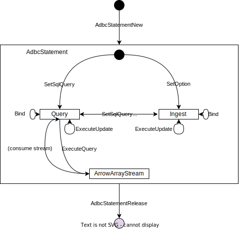
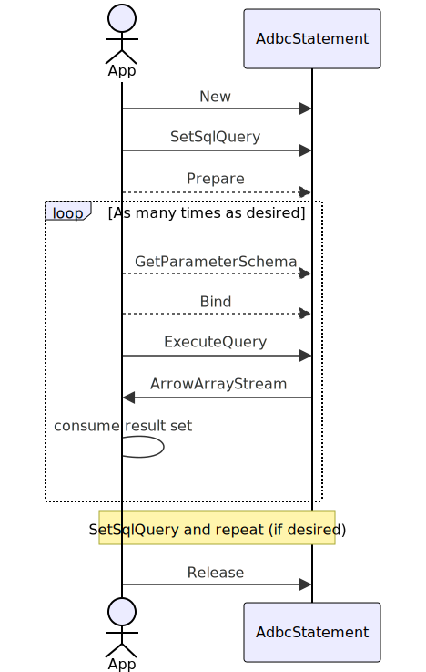
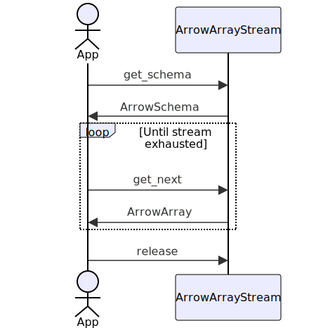
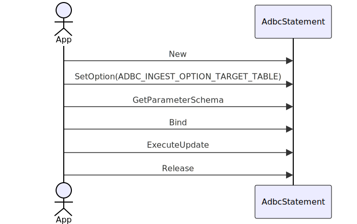
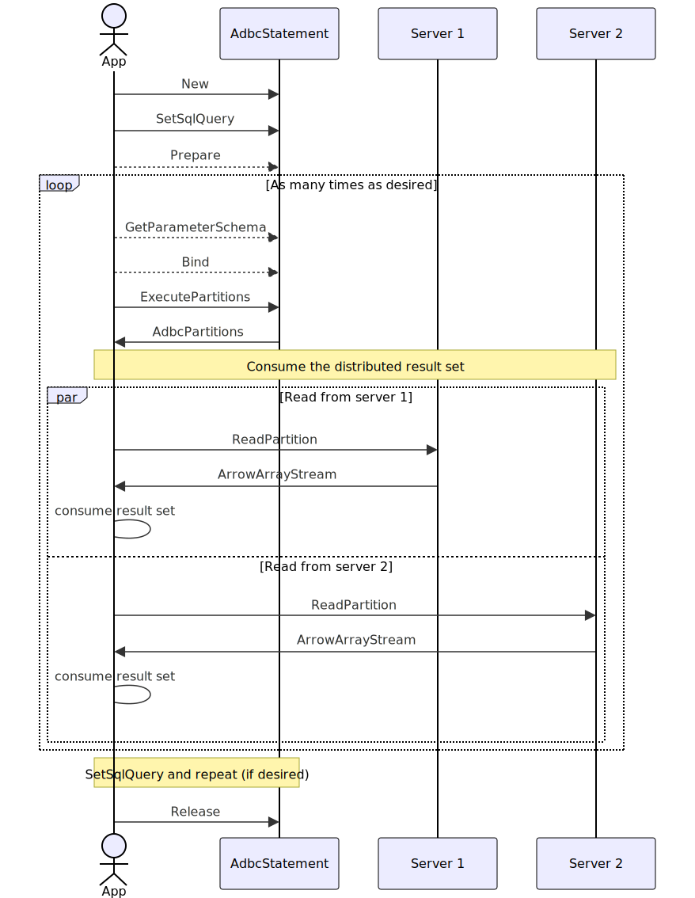

.. Licensed to the Apache Software Foundation (ASF) under one
.. or more contributor license agreements.  See the NOTICE file
.. distributed with this work for additional information
.. regarding copyright ownership.  The ASF licenses this file
.. to you under the Apache License, Version 2.0 (the
.. "License"); you may not use this file except in compliance
.. with the License.  You may obtain a copy of the License at
..
..   http://www.apache.org/licenses/LICENSE-2.0
..
.. Unless required by applicable law or agreed to in writing,
.. software distributed under the License is distributed on an
.. "AS IS" BASIS, WITHOUT WARRANTIES OR CONDITIONS OF ANY
.. KIND, either express or implied.  See the License for the
.. specific language governing permissions and limitations
.. under the License.

=================
ADBC API Standard
=================

This document summarizes the general featureset.

- For C/C++ details, see :external+cpp_adbc:doc:`adbc.h`.
- For Go details, see the `source <https://github.com/apache/arrow-adbc/blob/main/go/adbc/adbc.go>`__.
- For Java details, see the `source
  <https://github.com/apache/arrow-adbc/tree/main/java/core>`__, particularly
  the package :jpackage:`org.apache.arrow.adbc.core`.

Databases
=========

Databases hold state shared by multiple connections.  Generally, this
means common configuration and caches.  For in-memory databases, it
provides a place to hold ownership of the in-memory database.

- C/C++: :c:struct:`AdbcDatabase`
- Go: ``Driver``
- Java: :jtype:`org.apache.arrow.adbc.core.AdbcDatabase`

Connections
===========

A connection is a single, logical connection to a database.

- C/C++: :c:struct:`AdbcConnection`
- Go: ``Connection``
- Java: :jtype:`org.apache.arrow.adbc.core.AdbcConnection`

Autocommit
----------

By default, connections are expected to operate in autocommit mode;
that is, queries take effect immediately upon execution.  This can be
disabled in favor of manual commit/rollback calls, but not all
implementations will support this.

- C/C++: :c:macro:`ADBC_CONNECTION_OPTION_AUTOCOMMIT`
- Go: ``OptionKeyAutoCommit``
- Java: :jmember:`org.apache.arrow.adbc.core.AdbcConnection#setAutoCommit(boolean)`

Metadata
--------

ADBC exposes a variety of metadata about the database, such as what catalogs,
schemas, and tables exist, the Arrow schema of tables, and so on.

.. _specification-statistics:

Statistics
----------

.. note:: Since API revision 1.1.0

ADBC exposes table/column statistics, such as the (unique) row count, min/max
values, and so on.  The goal here is to make ADBC work better in federation
scenarios, where one query engine wants to read Arrow data from another
database.  Having statistics available lets the "outer" query planner make
better choices about things like join order, or even decide to skip reading
data entirely.

Statements
==========

Statements hold state related to query execution.  They represent both
one-off queries and prepared statements.  They can be reused, though
doing so will invalidate prior result sets from that statement.  (See
:doc:`../../cpp/concurrency`.)

- C/C++: :c:struct:`AdbcStatement`
- Go: ``Statement``
- Java: ``org.apache.arrow.adbc.core.AdbcStatement``

.. _specification-bulk-ingestion:

Bulk Ingestion
--------------

ADBC provides explicit facilities to ingest batches of Arrow data into
a database table.  For databases which support it, this can avoid
overheads from the typical bind-insert loop.  Also, this (mostly)
frees the user from knowing the right SQL syntax for their database.

- C/C++: :c:macro:`ADBC_INGEST_OPTION_TARGET_TABLE` and related
  options.
- Go: ``OptionKeyIngestTargetTable``
- Java: ``org.apache.arrow.adbc.core.AdbcConnection#bulkIngest(String, org.apache.arrow.adbc.core.BulkIngestMode)``

.. _specification-cancellation:

Cancellation
------------

.. note:: Since API revision 1.1.0

Queries (and operations that implicitly represent queries, like fetching
:ref:`specification-statistics`) can be cancelled.

Partitioned Result Sets
-----------------------

ADBC lets a driver explicitly expose partitioned and/or distributed
result sets to clients.  (This is similar to functionality in Flight
RPC/Flight SQL.)  Clients may take advantage of this to distribute
computations on a result set across multiple threads, processes, or
machines.

- C/C++: :c:func:`AdbcStatementExecutePartitions`
- Go: ``Statement.ExecutePartitions``
- Java: ``org.apache.arrow.adbc.core.AdbcStatement#executePartitioned()``

.. _specification-incremental-execution:

In principle, a vendor could return the results of partitioned execution as
they are available, instead of all at once.  Incremental execution allows
drivers to expose this.  When enabled, each call to ``ExecutePartitions`` will
return available endpoints to read instead of blocking to retrieve all
endpoints.

.. note:: Since API revision 1.1.0

Lifecycle & Usage
-----------------

Basic Usage
~~~~~~~~~~~

   Preparing the statement and binding parameters are optional.

Consuming Result Sets
~~~~~~~~~~~~~~~~~~~~~

   This is equivalent to reading from what many Arrow libraries call a
   RecordBatchReader.

Bulk Data Ingestion
~~~~~~~~~~~~~~~~~~~

   There is no need to prepare the statement.

Update-only Queries (No Result Set)
~~~~~~~~~~~~~~~~~~~~~~~~~~~~~~~~~~~

.. figure:: AdbcStatementUpdate.mmd.svg

   Preparing the statement and binding parameters are optional.

Partitioned Execution
~~~~~~~~~~~~~~~~~~~~~

   This is similar to fetching data in Arrow Flight RPC (by design). See
   :doc:`"Downloading Data" <arrow:format/Flight>`.

Error Handling
==============

The error handling strategy varies by language.

In C, most methods take a :c:struct:`AdbcError`.  In Go, most methods return
an error that can be cast to an ``AdbcError``.  In Java, most methods raise an
``AdbcException``.

In all cases, an error contains:

- A status code,
- An error message,
- An optional vendor code (a vendor-specific status code),
- An optional 5-character "SQLSTATE" code (a SQL-like vendor-specific code).

.. _specification-rich-error-metadata:

Rich Error Metadata
-------------------

.. note:: Since API revision 1.1.0

Drivers can expose additional rich error metadata.  This can be used to return
structured error information.  For example, a driver could use something like
the `Googleapis ErrorDetails`_.

In C, Go and Java, :c:struct:`AdbcError`, ``AdbcError``, and
``AdbcException`` respectively expose a list of additional metadata.  For C,
see the documentation of :c:struct:`AdbcError` to learn how the struct was
expanded while preserving ABI.

.. _Googleapis ErrorDetails: https://github.com/googleapis/googleapis/blob/master/google/rpc/error_details.proto

Changelog
=========

Version 1.1.0
-------------

The info key ADBC_INFO_DRIVER_ADBC_VERSION can be used to retrieve the
driver's supported ADBC version.

The canonical options "uri", "username", and "password" were added to make
configuration consistent between drivers.

:ref:`specification-cancellation` and the ability to both get and set options
of different types were added.  (Previously, you could set string options but
could not get option values or get/set values of other types.)  This can be
used to get and set the current active catalog and/or schema through a pair of
new canonical options.

:ref:`specification-bulk-ingestion` supports two additional modes:

- "adbc.ingest.mode.replace" will drop existing data, then behave like
  "create".
- "adbc.ingest.mode.create_append" will behave like "create", except if the
  table already exists, it will not error.

:ref:`specification-rich-error-metadata` has been added, allowing clients to
get additional error metadata.

The ability to retrive table/column :ref:`statistics
<specification-statistics>` was added.  The goal here is to make ADBC work
better in federation scenarios, where one query engine wants to read Arrow
data from another database.

:ref:`Incremental execution <specification-incremental-execution>` allows
streaming partitions of a result set as they are available instead of blocking
and waiting for query execution to finish before reading results.
